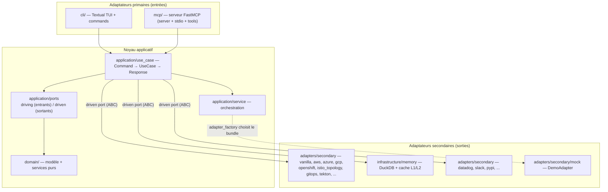

# Hexawyn — Architecture

> **Vision** : un agent Kubernetes piloté par IA, ancré sur une architecture
> **Hexagonale (Ports & Adapters)**. Le noyau métier est pur et testable ; les
> fournisseurs cloud, observabilité, stockage et messagerie sont des *adapters*
> interchangeables derrière des *ports*.

**Lecture rapide** :
- Niveau projet / onboarding → `README.md`
- Conventions de code (TDD, SOLID, règles) → `AGENTS.md`
- Code → `src/hexawyn/` (voir schéma ci-dessous)
- Use cases documentés (questions + diagrammes) → `docs/use-cases/`
- Diagrammes catégorisés → `docs/architecture/diagrams/`
- Garde-fou anti-dérive → `tool/check_docs.py` (obligatoire via `make docs-check`)

---

## 1. Vue d'ensemble — couches hexagonales



> **Règle d'or** : la flèche de dépendance pointe **toujours vers l'intérieur**.
> Le noyau (`domain` + `application`) ne connaît ni Kubernetes, ni SDK cloud,
> ni `httpx`/`click`/`fastapi`. Il ne parle qu'à des **ports (ABC)**.

---

## 2. Les couches

### `src/hexawyn/domain/`
Le **domaine pur** — aucune dépendance externe.
- `errors.py` — hiérarchie `HexawynError` (voir §4).
- `models/` — entités & value objects (dataclasses typées).
- `services/` — services de domaine (calculs métier, sans I/O).

### `src/hexawyn/application/`
Le **noyau applicatif** — orchestration, aucun adapter.
- `ports/driving/<use_case>/` — port **entrant** (ABC) ; 1 dossier par use case.
- `ports/driven/` — ports **sortants** (ABC) ; ~127 ports (k8s, logs, gitops,
  finops, observabilité, governance…).
- `service/` — orchestration (`adapter_factory.py`, `runtime_adapter.py` …) ;
  **aucun** try/catch, laisse propager `HexawynError`.
- `use_case/<domain>/<use_case>/` — implémentation `command.py`,
  `response.py`, `<use_case>_use_case.py` ; ~138 use cases répartis par domaine
  (`cluster`, `observability`, `keda`, `gitops`, `governance`, `finops`…).

### `src/hexawyn/adapters/`
Le **monde extérieur** — implémente les ports.
- `primary/` — `cli`, `mcp`, `gateway` (entrées).
- `secondary/` — fournisseurs concrets : `vanilla`, `aws`, `azure`, `gcp`,
  `openshift`, `datadog`, `istio_topology`, `gitops`, `tekton_*`,
  `kubearchive_http`, `kubernetes_*`, `slack`, `pypi`, `security_posture`,
  `pricing_plan`, `usage_meter`, `fleet_health`, `runtime_client`…
  Chaque adapter **rattrape** les exceptions infra et les traduit en
  `HexawynError` (plus aucune exception infra ne s'échappe).
- `secondary/mock/` — `DemoAdapter` (mode démo, jamais hardcodé).

### `src/hexawyn/mcp/`
Le serveur MCP (consommé par les agents de code).
- `server.py` — **racine de composition** : `build_*_adapter()` pour chaque
  port + `register_tools()` (auto-découverte de `tools/`).
- `stdio.py` — transport stdio (`python -m hexawyn.mcp.stdio`).
- `tools/` — ~158 tools MCP (1 fichier par use case).
- `providers/`, `adapters/` — glue MCP.

### `src/hexawyn/infrastructure/`
Le **socle technique** (jamais dans `domain/`).
- `config/` — `config_manager.py`, `llm_providers.py`.
- `logging/` — `setup.py` + `RedactingFormatter` (jamais de secret sur disque).
- `memory/` — **DuckDB** (`duckdb_client.py`, `sql/`, `migrations.py`),
  cache L1 (`cache_l1_repository.py`), répertoires (`incident_memory`,
  `quota`, `pipeline_run_history`, `topology_snapshot`), `encryption.py`,
  `sanitizer.py`.
- `license/`, `monitoring/`.

### `src/hexawyn/cli/`
L'interface terminal (Textual) : `main.py`, `tui.py`, `commands/`,
`screens/`, `widgets/`, `integrations/` (mcp, gemini, codex…).

### `src/hexawyn/runtime/`
L'exécution de l'agent (`adapters/anonymize`…) — outils & prompts, hors noyau.

### `src/hexawyn/utils/`
Utilitaires transverses (`logger.py`).

---

## 3. Règles d'import (interdits)

| Dans | Ne jamais importer |
|---|---|
| `domain/`      | `kubernetes`, `click`, `boto3`, `httpx`, `fastapi`, et tout `application`/`adapters`/`infrastructure` |
| `application/use_case/` | `adapters/`, `infrastructure/` — **uniquement des ports (ABC)** |
| `adapters/`    | `domain/` directement — toujours via `application/ports/` |
| `runtime/`     | SDK LLM directement — uniquement via le port LLM |

Enforcement déterministe : `make guard` (via `hexa_guard.py`, règles R1–R15).

---

## 4. Stratégie d'exceptions

Toute exception hérite de `HexawynError` (`src/hexawyn/domain/errors.py`),
avec un `context: dict[str, str]` optionnel. Sous-classes notables :
`ClusterUnreachableError`, `ResourceNotFoundError`,
`InsufficientPermissionsError`, `AdapterTimeoutError`,
`MetricsUnavailableError`, `TracesUnavailableError`, `InvestigationError`,
`DuckDBUnavailableError`, `SchemaMigrationError`, `EncryptionError`,
`QuotaExceededError`, `MutationGuardTriggeredError`, `CheckerNodeError`…

| Couche | Comportement |
|---|---|
| `adapters/secondary/` | attrape `ApiException`/`HTTPError`/`TimeoutError` → `HexawynError` |
| `application/service/`, `domain/services/` | **jamais** de try/catch — laisse propager |
| `adapters/primary/` | catch final pour l'affichage utilisateur |

---

## 5. Flow typique (de bout en bout)

```
Agent/CLI ──> MCP Tool ──> UseCase.execute(Command) ──> ServicePort (ABC)
                                   │                        │
                                   │                        ▼
                                   │              Adapter (secondaire)
                                   │                        │
                                   │                        ▼
                                   │               Kubernetes / DuckDB / LLM
                                   │────────────────────────┘
                                   ▼
                              Response ──> Agent/CLI
```

Sélection de l'adapter : `adapters/secondary/adapter_factory.py`
(`DEMO_MODE` → `DemoAdapter`, sinon détection `eks`/`aks`/`gke`/`vanilla`) —
**jamais** instancié directement dans le code applicatif.

---

## 6. Glossaire

| Terme | Définition |
|---|---|
| **Port** | Interface (ABC) déclarée par le noyau. `driving` = entrant (use case), `driven` = sortant (externe). |
| **Use case** | Unité métier (`command` → `response`). 1 dossier sous `application/ports/driving/`. |
| **Adapter** | Implémentation concrète d'un port (`vanilla`, `aws`, `demo`…). |
| **Driven port** | Ce dont le noyau *a besoin* du monde extérieur (k8s, logs, finops…). |
| **Driving port** | Ce que le monde extérieur *demande* au noyau (un use case). |
| **Composition root** | `mcp/server.py` — wiring ports → adapters (`build_*_adapter()`). |
| **DuckDB** | Store mémoire pour historique, search, cache L2 (VSS). |
| **Cache** | L1 en-mémoire (`cache_l1_repository.py`) ; L2 DuckDB (VSS). |
| **DemoAdapter** | Adapter simulé (`adapters/secondary/mock/`), activé en mode démo. |

---

## 7. Documentation liée

- `docs/use-cases/` — 138 use cases documentés (questions d'exemple + diagrammes
  Mermaid traversant les couches). Chaque fichier répond au garde-fou
  `tool/check_docs.py` (symboles réels, `sequenceDiagram`, coverage).
- `docs/architecture/diagrams/` — vues `components/`, `data/`, `cache/`,
  `graphs/`.
- `docs/guides/` — guides transverses (custom tools, scheduler, openshift…).
- `datasets/intent_examples.yaml` — descriptions + questions d'exemple par tool
  (source des `Examples:` exposés par le serveur MCP).
- `tool/check_docs.py` — garde-fou anti-dérive ; `make docs-check` doit rester
  **vert**.
