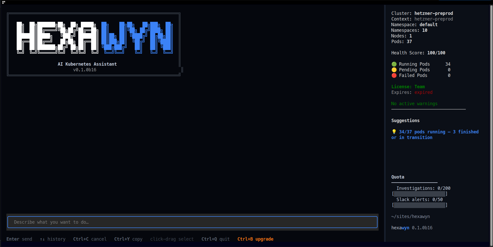
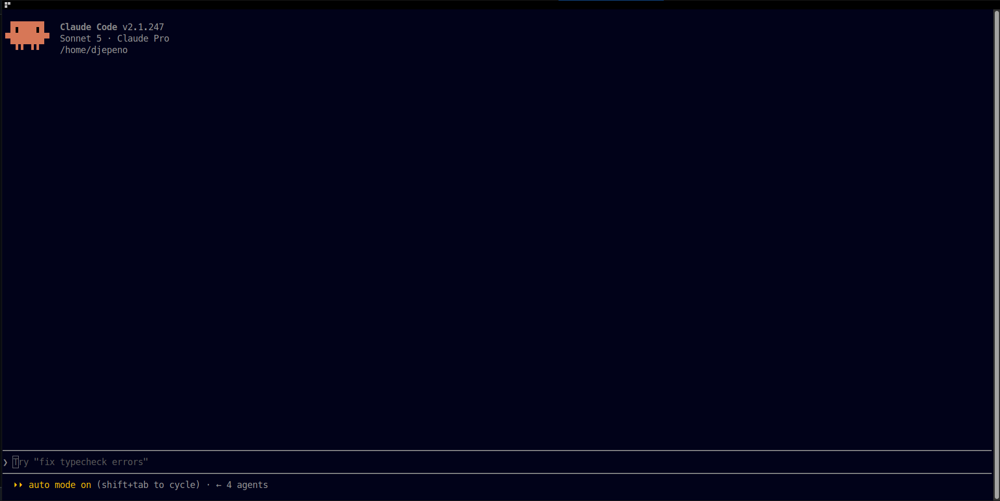
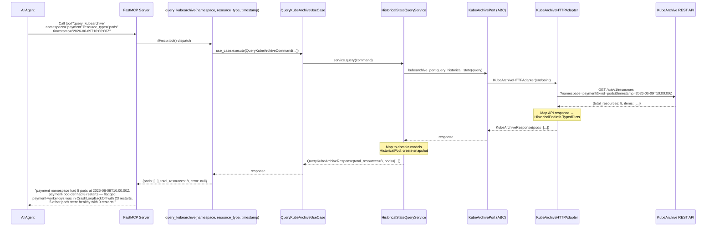

<p align="center">

[](LICENSE)
[](https://discord.gg/HH3WsrnNw)
[]()
[]()
[](https://codecov.io/gh/hexa-tools/hexawyn)
[](https://github.com/hexa-tools/hexawyn/actions/workflows/ci.yml)
[](https://github.com/hexa-tools/hexawyn/actions/workflows/security.yml)
[](https://hub.docker.com/r/hexatools/hexawyn)
[](https://www.python.org/)
[](docs/benchmark/README.md)

</p>

<p align="center">
  
</p>

# hexawyn

🧠 **Understand your Kubernetes cluster. Diagnose it from your terminal.**

Hexawyn is an AI-powered Kubernetes CLI for investigating failures, costs,
security, networking, workloads, and platform health — directly from your
terminal.

## Quality & Performance

- 🧪 **8,500+ tests passed**
- ⚡ **<90s full test suite**


## ☁️ Hexawyn Cloud

Run Hexawyn as a hosted platform for continuous Kubernetes investigation,
diagnostics, and operational intelligence.

The Cloud offering is continuously evaluated against a dedicated benchmark
covering real-world Kubernetes troubleshooting scenarios.

📊 [View the Cloud benchmark](docs/benchmark/README.md)


## Quick start


```bash
pipx install hexawyn        # or: pip install hexawyn
```


### macOS / Windows


```bash
pip install hexawyn
```


### Linux (Debian/Ubuntu and similar)

Debian/Ubuntu enforce [PEP 668](https://peps.python.org/pep-0668/) — the system
Python refuses global `pip` installs. Use `pipx` (recommended) or a dedicated
virtual environment:


```bash
# Option A — pipx (recommended for CLI apps)
pipx install hexawyn

# Option B — dedicated virtual environment
python3 -m venv ~/.hexawyn-venv
~/.hexawyn-venv/bin/pip install hexawyn
```


> Other Linux distributions allow plain `pip install hexawyn`, but a virtual
> environment or `pipx` is still best practice.

### Start the CLI

Once installed, start Hexawyn with:


```bash
hexa start
```





## You can also use Hexawyn with MCP

Already working with an AI coding agent?

You can connect Hexawyn to your agent through MCP and let it use the same
Kubernetes capabilities directly from your coding environment


```bash
hexa claude install        # Claude Code
hexa codex install         # Codex
hexa opencode install      # OpenCode
hexa cursor install        # Cursor
hexa gemini install        # Gemini CLI
hexa deepseek install      # DeepSeek Harness
```


Each client supports `hexa <client> status` / `hexa <client> uninstall`.
Installation is idempotent; uninstall removes only the `hexawyn` MCP server.

Requirements: the `hexa` CLI installed (see above) and the target coding agent
installed. The integration registers the server over stdio — no separate
process to manage.





## What it does

Hexawyn organizes its capabilities by **domain**. Each domain groups the
corresponding use cases and MCP tools exposed to your coding agent.

<details>
<summary>🔍 Diagnostics & Troubleshooting</summary>

- `adaptive_namespace_investigation`, `advanced_namespace_event_analytics`,
  `analyze_advanced_namespace_events`, `analyze_critical_namespace_events`,
  `chat_cli`, `chat_slack`, `conservative_namespace_overview`,
  `detect_cross_cluster_incident`, `detect_log_anomalies`,
  `detect_pod_anomalies`, `detect_recurring_incidents`, `detect_zombies`,
  `generate_incident_triage_report`, `get_namespace_events`, `get_pod_events`,
  `memory_saturation`, `query_kubearchive`, `summarize_namespace_events`,
  `trace_k8s_events`, `watch_pod_logs`
</details>

<details>
<summary>💰 FinOps</summary>

- `analyze_incident_cost`, `compare_service_cost`, `compute_budget_intelligence`,
  `compute_monthly_incident_report`, `compute_optimization_roi`,
  `compute_prediction_roi`, `compute_team_cost`, `cost_profiling`,
  `detect_over_provisioned_namespaces`, `estimate_cost_saving`,
  `estimate_rightsizing_savings`, `forecast_cost`, `project_budget`
</details>

<details>
<summary>🔐 cert_manager</summary>

- `certs_challenges_list`, `certs_detect`, `certs_get`, `certs_issuer_get`,
  `certs_issuers_list`, `certs_list`, `certs_requests_list`,
  `certs_status_explain`, `cluster_certificate_health`,
  `investigate_tls_certificate`, `tls_certificate_diagnosis`
</details>

<details>
<summary>🚩 Governance</summary>

- `pod_security_standards_audit`, `policy_audit`, `policy_detect`,
  `policy_explain_denial`, `policy_get`, `policy_list`,
  `policy_violations_list`
</details>

<details>
<summary>🌐 Networking</summary>

- `detect_network_segmentation_gaps`, `detect_unintended_external_exposure`,
  `east_west_network_segmentation`, `unintended_external_exposure`

<details>
<summary>🚏 Ingress</summary>

- `list_ingresses`
</details>
</details>

<details>
<summary>🔄 GitOps & Pipelines</summary>

- `analysis_runs_list`, `analyze_failed_pipeline`, `canary_comparison`,
  `detect_kustomize_patch_conflicts`, `detect_outdated_helm_releases`,
  `diff_helm_values`, `get_pipeline_run_status`, `gitops_app_get`,
  `gitops_apps_list`, `gitops_app_status`, `gitops_app_sync`, `gitops_detect`,
  `gitops_source_get`, `gitops_sources_list`, `list_pipeline_runs`,
  `list_pipeline_runs_in_namespace`, `list_task_runs`,
  `manual_change_outside_gitops`, `pipeline_for_service`,
  `pipeline_performance_baseline`, `pipeline_run_logs`, `pipeline_run_status`,
  `trace_pipeline_run_dag`, `version_regression`
</details>

<details>
<summary>📊 Observability</summary>

- `analyze_pod_logs`, `correlate_error_latency_spikes`, `deployment_latency`,
  `diagnose_latency_spike`, `error_attribution`, `etcd_logs`,
  `execute_prometheus_query`, `get_p99_latency`, `get_pod_logs`,
  `latency_diagnostic`, `metric_correlation`, `p99_latency`,
  `prometheus_query`, `redundant_calls`, `semantic_log_search`,
  `service_dependency_graph`, `slowest_traces`, `span_bottleneck_analysis`,
  `trace_log_correlation`
</details>

<details>
<summary>☸️ Cluster</summary>

- `check_cluster_operator_health`, `check_disruption_risks`,
  `check_machine_config_pool_status`, `check_resource_constraints`,
  `cluster_capacity_ceiling_forecast`, `cluster_headroom_simulation`,
  `compare_cluster_health`, `diff_cluster_resources`,
  `get_namespace_resource_allocation`, `get_node_status`, `get_quota_usage`,
  `get_resource_usage`, `global_health_check`, `hot_node_analysis`,
  `list_namespaces`, `live_topology_mapper`, `plan_spike_provisioning`,
  `resource_constraint`, `resource_yaml`, `run_consolidation`,
  `run_what_if_simulation`, `search_resources_by_labels`
</details>

<details>
<summary>🪥 Workloads</summary>

- `compute_mttr_trend`, `compute_slo_error_budget`, `describe_pod`,
  `generate_sla_report`, `generate_weekly_reliability_report`, `list_pods`,
  `report_night_interventions`, `report_platform_reliability`, `rollout_get`,
  `rollouts_detect`, `rollouts_list`, `rollout_status`, `slo_breach_prediction`
</details>

<details>
<summary>🌝 KEDA</summary>

- `keda_detect`, `keda_scaledjob_get`, `keda_scaledjobs_list`,
  `keda_scaledobject_get`, `keda_scaledobjects_list`, `keda_scaledobject_status`,
  `keda_scaledobject_triggers`, `keda_triggerauth_get`, `keda_triggerauth_list`
</details>

<details>
<summary>🟠 OpenShift</summary>

- `list_openshift_imagestreams`, `list_openshift_projects`,
  `list_openshift_routes`, `list_openshift_sccs`
</details>

<details>
<summary>🫗 Security</summary>

- `admin_endpoint_audit`, `audit_rbac_permissions`, `audit_secret_rotation`,
  `audit_tls_compliance`, `compute_security_posture`,
  `configuration_drift_detection`, `container_image_vulnerability`,
  `detect_container_image_drift`, `detect_missing_probes`,
  `detect_privileged_pods`, `report_critical_vulnerabilities`,
  `report_stale_credentials`, `report_unauthorized_access`,
  `scan_container_vulnerabilities`, `sensitive_data_audit`
</details>

<details>
<summary>🫗 Storage</summary>

- `snapshots_list`, `snapshot_get`
</details>


## 🧩 130+ Use Cases

Hexawyn covers **130+ Kubernetes use cases** across diagnostics, FinOps,
security, networking, observability, GitOps, workloads, and platform operations.

Each use case is documented with:

- 💬 real-world questions
- 🔄 architecture and execution flows
- 🧪 test coverage
- 🧱 domain and adapter boundaries

### Example — Query KubeArchive for historical resource state

**Diagram from [`docs/use-cases/40-query-kubearchive.md`](docs/use-cases/40-query-kubearchive.md).**



👉 Browse all [138 use cases](docs/use-cases/40-query-kubearchive.md) — each with questions, diagrams, and
test coverage.

## Architecture

Hexawyn is **hexagonal (Ports & Adapters)**: a pure testable core, providers
behind driven ports, and tools wired at the composition root.

```
domain/          pure business logic — zero external deps
application/     use cases + ports (driving/driven ABCs)
adapters/        primary (CLI, MCP) / secondary (k8s, cloud, duckdb, mock)
infrastructure/  DuckDB, config, logging, cache L1/L2
mcp/             FastMCP server — composition root
```

See [`ARCHITECTURE.md`](ARCHITECTURE.md) for the full map and
[`docs/adr/`](docs/adr/) for the decisions behind it. Architectural rules are
**enforced** by `hexa_guard.py` (`make guard`).


## Contributing

- [`CONTRIBUTING.md`](CONTRIBUTING.md) — how to contribute
- [`CODE_OF_CONDUCT.md`](CODE_OF_CONDUCT.md) — community & engineering conduct
- `make docs-check` and `make guard` must pass before opening a PR


### Cluster context

Hexawyn connects to the **active Kubernetes context** of your local
kubeconfig — it follows `kubectl config current-context`. Switch clusters with
kubectl and hexawyn (CLI and MCP) picks it up on the next call:


```bash
kubectl config get-contexts          # list available contexts
kubectl config current-context       # show the active one hexawyn will use
kubectl config use-context kind-hexawyn   # switch context
```


When several kubeconfig files are on `KUBECONFIG`, hexawyn merges them,
skips empty ones, and — if `KUBECONFIG` is not set — discovers a config under
`$HOME/.kube` on its own.

> The coding agents are **optional** MCP clients. Hexawyn does not require any
> of them.

## Documentation

- [`ARCHITECTURE.md`](ARCHITECTURE.md) — hexagonal layer map
- [`docs/use-cases/`](docs/use-cases/) — 138 use cases (questions + diagrams)
- [`docs/adr/`](docs/adr/) — architecture decision records
- [`docs/benchmark/README.md`](docs/benchmark/README.md) — benchmark results
- [`docs/issue-management.md`](docs/issue-management.md) — issue triage process
- [`AGENTS.md`](AGENTS.md) — conventions enforced by `hexa_guard.py`

Docs are guarded: `make docs-check` fails if a doc references a symbol that no
longer exists.


## Free Cloud Usage

Hexawyn is open source and can be run locally on your own infrastructure.

For users who want to use the hosted Cloud service, the CLI includes
**50 free credits** to explore Hexawyn without deploying the platform yourself.

Use them to run diagnostics, investigate incidents, analyze costs,
audit security, and explore the platform.

> **Open source by default. Hosted when you want it.**