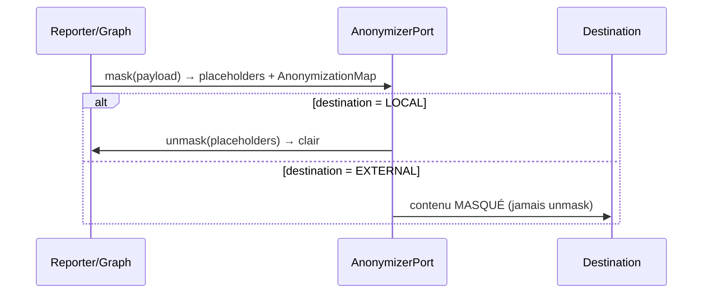

# Anonymization — Use Case Specification

## Overview

Hexawyn must never leak sensitive data (secrets, tokens, IPs) to external destinations:
Slack alerts, exports, and logs. Since the SLM runs locally, there is no external
LLM leak, but outbound channels must be sanitized.

## Domain



## Key Entities

| Entity | Role |
|--------|------|
| `SensitiveMatch` | A matched pattern (kind, original, placeholder) |
| `AnonymizationMap` | Collection of matches — never serialized to disk |
| `RedactionPolicy` | Which categories to mask |
| `Destination` | LOCAL (unmask allowed) vs SLACK/EXPORT/LOG (masked only) |

## Integration Points

| Path | Action |
|------|--------|
| Reporter prompt (SLM) | mask before prompt, unmask for local display |
| Slack alert adapter | mask, NEVER unmask |
| Export | mask, map excluded |
| Logs | ALWAYS mask (even if feature disabled) |

## Configuration

```
HEXAWYN_ANONYMIZE_ENABLED=false   # default OFF → current behavior unchanged
HEXAWYN_ANONYMIZE_MASK_NAMES=false # do NOT mask k8s resource names by default
```

## Security Rules

- unmask() is FORBIDDEN for any destination != LOCAL
- AnonymizationMap is NEVER serialized to disk or logs
- Logs are ALWAYS masked at minimum
