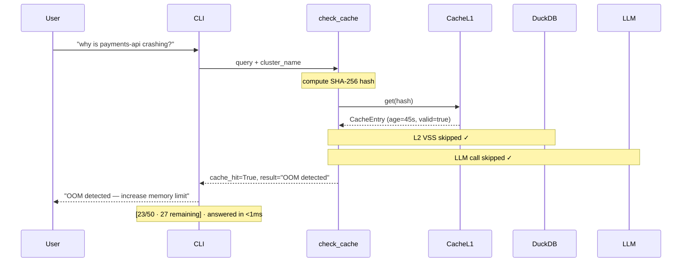

# Cache L1 — Exact Match Hit

Cache L1 uses SHA-256 hash of (normalized_query + cluster_name) stored in Python dict (in-memory). TTL: 5 minutes. Sub-millisecond response. No DuckDB, no K8s API, no LLM.

## Key Points

- L1 hit skips both L2 VSS and LLM call entirely
- TTL is 5 minutes — cluster state changes fast
- Hash is case-insensitive: "Why is Payments-API" == "why is payments-api"
- Different cluster = different hash (prod-eu ≠ prod-us)
- Demo mode results never stored in L1

## Test Coverage

| Test | File | Status |
|---|---|---|
| `test_l1_hit_returns_cache_hit_true` | `tests/unit/test_check_cache_node.py` | ✅ |
| `test_l1_hit_does_not_call_l2` | `tests/unit/test_check_cache_node.py` | ✅ |
| `test_same_query_same_cluster_same_hash` | `tests/unit/test_cache_manager.py` | ✅ |
| `test_case_insensitive_query` | `tests/unit/test_cache_manager.py` | ✅ |
| `test_is_valid_when_fresh` | `tests/unit/test_cache_model.py` | ✅ |
| `test_is_expired_when_old` | `tests/unit/test_cache_model.py` | ✅ |

## Related Files

- `src/hexawyn/domain/models/cache.py` — CacheEntry model
- `src/hexawyn/infrastructure/memory/cache_l1_repository.py` — in-memory store
- `src/hexawyn/infrastructure/config/cache_manager.py` — compute_query_hash, get_l1, set_l1
- `src/hexawyn/lang_graph/nodes/check_cache.py` — L1 check before L2
