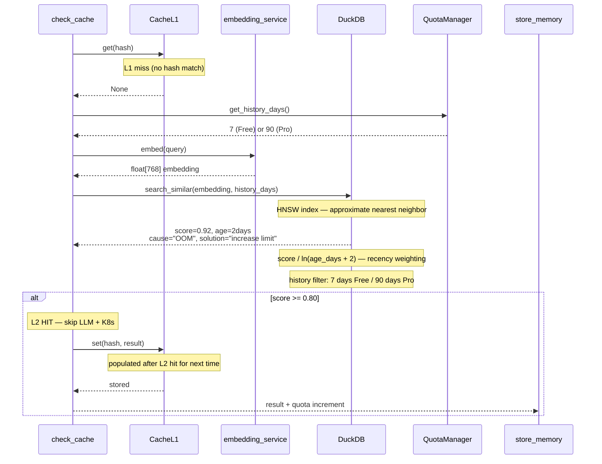

# Cache L2 — DuckDB VSS Semantic Match

Cache L2 uses vector similarity search (HNSW index, cosine >= 0.80) on DuckDB incidents table. Finds semantically similar past investigations. History window enforced by tier: 7 days Free, 90 days Pro. On L2 hit, result is automatically stored in L1 for next time.

## Key Points

- Cosine similarity threshold: 0.80 — lower scores are treated as cache miss
- Recency weighting: score divided by ln(age_days + 2) — recent matches ranked higher
- HNSW index enables fast approximate nearest neighbor search on 768-dimensional embeddings
- L2 hit automatically populates L1 — next identical query returns in <1ms
- Free tier sees 7 days of history, Pro tier sees 90 days (via history_days parameter)

## Test Coverage

| Test | File | Status |
|---|---|---|
| `test_l2_hit_stores_in_l1` | `tests/unit/test_check_cache_node.py` | ✅ |
| `test_l1_miss_falls_through_to_l2` | `tests/unit/test_check_cache_node.py` | ✅ |
| `test_finds_similar_embedding` | `tests/unit/test_duckdb_client.py` | ✅ |
| `test_default_history_days_is_free` | `tests/unit/test_duckdb_search.py` | ✅ |
| `test_pro_history_days_is_90` | `tests/unit/test_duckdb_search.py` | ✅ |
| `test_returns_entry_when_cached` | `tests/unit/test_cache_manager.py` | ✅ |

## Related Files

- `src/hexawyn/lang_graph/nodes/check_cache.py` — L2 fallback after L1 miss
- `src/hexawyn/infrastructure/memory/duckdb_client.py` — search_similar VSS function
- `src/hexawyn/infrastructure/memory/sql/search_similar.sql` — VSS query with recency
- `src/hexawyn/infrastructure/config/cache_manager.py` — set_l1 populates L1 on L2 hit
- `src/hexawyn/infrastructure/config/quota_manager.py` — get_history_days per tier
