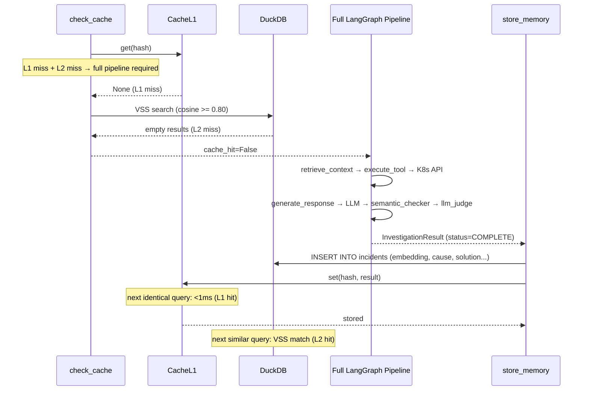

# Cache Miss — Full Pipeline Required

Neither L1 (exact match) nor L2 (semantic similarity >= 0.80) found a matching past investigation. Full 9-node pipeline must run: K8s API call + LLM generation + semantic checker + LLM judge. After completion, result stored in both DuckDB (L2) and Cache L1.

## Key Points

- Cache miss triggers the most expensive path: K8s API call + 2 LLM calls
- After successful investigation, both DuckDB and L1 are populated for future caching
- Subsequent identical query → L1 hit (<1ms)
- Subsequent similar query → L2 hit (VSS match, ~few ms)
- The result enriches the knowledge base, making future investigations faster

## Test Coverage

| Test | File | Status |
|---|---|---|
| `test_both_miss_returns_cache_hit_false` | `tests/unit/test_check_cache_node.py` | ✅ |
| `test_stores_result_in_l1` | `tests/unit/test_store_memory_cache.py` | ✅ |
| `test_finds_similar_embedding` | `tests/unit/test_duckdb_client.py` | ✅ |
| `test_returns_empty_list_for_empty_db` | `tests/unit/test_duckdb_client.py` | ✅ |
| `test_stores_entry_in_repository` | `tests/unit/test_cache_manager.py` | ✅ |

## Related Files

- `src/hexawyn/lang_graph/nodes/check_cache.py` — returns cache_hit=False on miss
- `src/hexawyn/lang_graph/graphs/investigation_graph.py` — full 9-node pipeline routing
- `src/hexawyn/lang_graph/nodes/store_memory.py` — DuckDB insert + L1 population
- `src/hexawyn/infrastructure/config/cache_manager.py` — set_l1 for L1 population
- `src/hexawyn/infrastructure/memory/duckdb_client.py` — VSS search + get_connection
