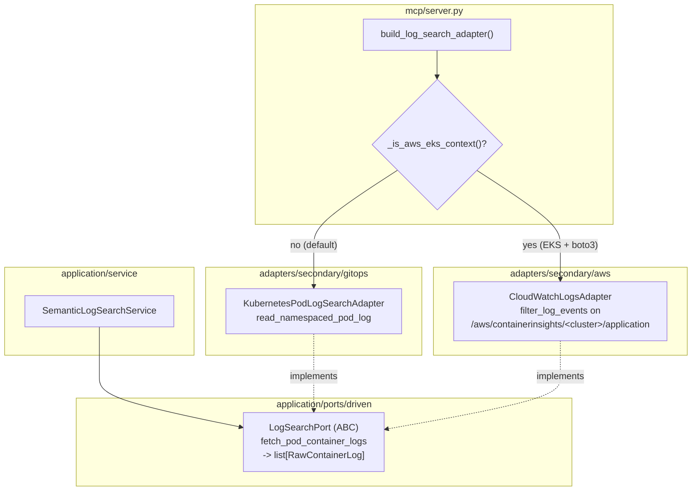

# CloudWatch Logs Backend — Provider-Aware Wiring (ECA-104, Step 4)

How semantic log search stays backend-agnostic. `SemanticLogSearchService`
depends only on the domain-typed `LogSearchPort` (raw lines per container),
never on `kubectl logs`. `server.py` selects CloudWatch Logs (Container
Insights) on EKS and the Kubernetes log adapter otherwise.

## Key Points

- **Clean port**: `LogSearchPort` returns `RawContainerLog` per container — no
  backend leak — so CloudWatch Logs implements it faithfully.
- **Container Insights source**: reads the `application` log group, filters by
  `$.kubernetes.pod_name` + `$.kubernetes.namespace_name`, and groups each
  event's `log` field by `container_name`.
- **Provider-aware**: `build_log_search_adapter()` returns CloudWatch on EKS,
  the Kubernetes adapter otherwise — same `_is_aws_eks_context()` used by
  metrics and traces.
- **Contract-faithful errors**: missing log group → `[]` (not an error, per the
  port); `AccessDeniedException` → `InsufficientPermissionsError`; missing
  credentials / endpoint / other API errors → `ClusterUnreachableError`.
- **Robust parsing**: non-JSON or non-object messages fall back to an
  `unknown` container; pagination via `nextToken`; per-container truncation at
  5000 lines.

## Test Coverage

| Test | File | Status |
|---|---|---|
| `test_groups_lines_by_container` | `tests/unit/test_cloudwatch_logs_adapter.py` | ✅ |
| `test_uses_container_insights_log_group_and_pod_filter` | `tests/unit/test_cloudwatch_logs_adapter.py` | ✅ |
| `test_non_json_message_falls_back_to_unknown_container` | `tests/unit/test_cloudwatch_logs_adapter.py` | ✅ |
| `test_json_non_object_message_falls_back_to_unknown_container` | `tests/unit/test_cloudwatch_logs_adapter.py` | ✅ |
| `test_paginates_with_next_token` | `tests/unit/test_cloudwatch_logs_adapter.py` | ✅ |
| `test_missing_log_group_returns_empty` | `tests/unit/test_cloudwatch_logs_adapter.py` | ✅ |
| `test_access_denied_raises_insufficient_permissions` | `tests/unit/test_cloudwatch_logs_adapter.py` | ✅ |
| `test_missing_credentials_raises_cluster_unreachable` | `tests/unit/test_cloudwatch_logs_adapter.py` | ✅ |
| `test_endpoint_connection_raises_cluster_unreachable` | `tests/unit/test_cloudwatch_logs_adapter.py` | ✅ |
| `test_other_client_error_raises_cluster_unreachable` | `tests/unit/test_cloudwatch_logs_adapter.py` | ✅ |
| `test_truncates_at_max_lines` | `tests/unit/test_cloudwatch_logs_adapter.py` | ✅ |
| `test_lazily_creates_boto3_client` | `tests/unit/test_cloudwatch_logs_adapter.py` | ✅ |
| `test_returns_kubernetes_adapter_when_not_eks` | `tests/unit/test_server.py` | ✅ |
| `test_returns_cloudwatch_logs_adapter_when_eks` | `tests/unit/test_server.py` | ✅ |

## Related Files

- `src/hexawyn/application/ports/driven/log_search_port.py` — the port
- `src/hexawyn/adapters/secondary/aws/cloudwatch_logs_adapter.py` — CloudWatch impl
- `src/hexawyn/adapters/secondary/gitops/kubernetes_pod_log_search_adapter.py` — k8s fallback
- `src/hexawyn/application/service/semantic_log_search_service.py` — consumer
- `src/hexawyn/mcp/server.py` — `build_log_search_adapter()` provider-aware
