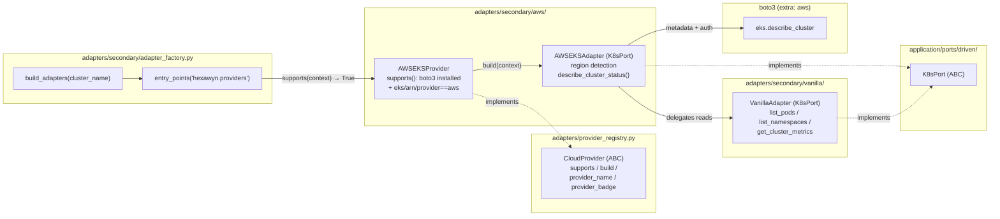

# AWS EKS Provider — Ports & Adapters (ECA-104, Step 1)

How an EKS cluster is auto-detected and wired. The adapter factory discovers
`AWSEKSProvider` via the `hexawyn.providers` entry-point group; the provider
builds an `AWSEKSAdapter` that **delegates** all `K8sPort` reads to a
`VanillaAdapter` (kubeconfig already carries EKS exec auth) and adds
AWS-specific behaviour (region detection, EKS metadata via boto3). The domain
layer is untouched — only a driven adapter is swapped.

## Key Points

- **Zero domain changes**: EKS support is a pure driven-adapter swap behind `K8sPort`.
- **Plugin discovery**: `AWSEKSProvider` is registered as a `hexawyn.providers`
  entry-point (`pyproject.toml`), so the factory needs no `if "eks"` branch.
- **Composition over duplication**: `AWSEKSAdapter` delegates k8s reads to
  `VanillaAdapter` (DRY) and only overrides context reporting + AWS metadata.
- **Optional dependency**: boto3 is imported lazily; `supports()` returns
  `False` when the `aws` extra is not installed, so the factory falls back to
  vanilla.
- **Error translation**: `NoCredentialsError` / `ClientError` /
  `EndpointConnectionError` never escape the adapter — they become
  `ClusterUnreachableError` with a setup hint.

## Test Coverage

| Test | File | Status |
|---|---|---|
| `test_region_detected_from_arn` | `tests/unit/test_eks_adapter.py` | ✅ |
| `test_region_detected_from_name_pattern` | `tests/unit/test_eks_adapter.py` | ✅ |
| `test_region_defaults_to_us_east_1` | `tests/unit/test_eks_adapter.py` | ✅ |
| `test_list_pods_delegates` | `tests/unit/test_eks_adapter.py` | ✅ |
| `test_defaults_to_vanilla_delegate_when_none_injected` | `tests/unit/test_eks_adapter.py` | ✅ |
| `test_get_cluster_context_reports_aws_provider` | `tests/unit/test_eks_adapter.py` | ✅ |
| `test_missing_credentials_raises_cluster_unreachable` | `tests/unit/test_eks_adapter.py` | ✅ |
| `test_client_error_raises_cluster_unreachable` | `tests/unit/test_eks_adapter.py` | ✅ |
| `test_endpoint_connection_error_raises_cluster_unreachable` | `tests/unit/test_eks_adapter.py` | ✅ |
| `test_lazily_creates_boto3_client_when_not_injected` | `tests/unit/test_eks_adapter.py` | ✅ |
| `test_supports_when_eks_in_name` | `tests/unit/test_aws_eks_provider.py` | ✅ |
| `test_does_not_support_when_boto3_missing` | `tests/unit/test_aws_eks_provider.py` | ✅ |
| `test_factory_selects_eks_provider_for_eks_cluster` | `tests/unit/test_aws_eks_provider.py` | ✅ |
| `test_factory_falls_back_to_vanilla_for_non_eks` | `tests/unit/test_aws_eks_provider.py` | ✅ |

## Related Files

- `src/hexawyn/adapters/secondary/aws/eks_adapter.py` — `AWSEKSAdapter` (K8sPort)
- `src/hexawyn/adapters/secondary/aws/aws_eks_provider.py` — `AWSEKSProvider` plugin
- `src/hexawyn/adapters/provider_registry.py` — `CloudProvider` contract
- `src/hexawyn/adapters/secondary/adapter_factory.py` — entry-point discovery
- `src/hexawyn/infrastructure/config/provider_detector.py` — boto3 availability
- `pyproject.toml` — `[tool.poetry.plugins."hexawyn.providers"]` registration
