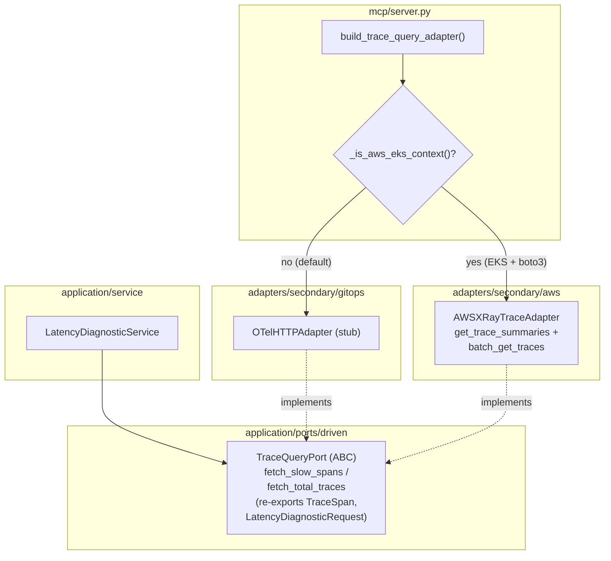

# AWS X-Ray Trace Backend — Provider-Aware Wiring (ECA-104, Step 3)

How latency diagnostics stay backend-agnostic. `latency_diagnostic_service`
depends only on the domain-typed `TraceQueryPort` (spans grouped by trace),
never on a tracing backend. `server.py` selects AWS X-Ray on EKS and the OTel
adapter otherwise. X-Ray is the span store behind Application Signals, so it is
the natural AWS source for raw spans.

## Key Points

- **Clean port**: `TraceQueryPort` speaks in `TraceSpan`/`LatencyDiagnosticRequest`
  domain types — no query language — so X-Ray implements it faithfully.
- **X-Ray = spans**: `get_trace_summaries` (filter `responsetime > threshold`)
  finds slow traces; `batch_get_traces` returns segment/subsegment documents
  flattened into spans. Application Signals is X-Ray-backed for raw spans.
- **Provider-aware**: `build_trace_query_adapter()` returns X-Ray on EKS,
  the OTel adapter otherwise — same `_is_aws_eks_context()` used by metrics.
- **Rule-5 compliant import**: the adapter imports `TraceSpan` /
  `LatencyDiagnosticRequest` from the port (which now re-exports them via
  `__all__`), never from `domain.models` directly.
- **Error translation**: `NoCredentialsError` / `ClientError` / `BotoCoreError`
  become `TracesUnavailableError`; boto exceptions never escape the adapter.
- **Pagination + batching**: trace summaries paginate via `NextToken`; trace ids
  are fetched in batches of 5 (X-Ray `batch_get_traces` limit).

## Test Coverage

| Test | File | Status |
|---|---|---|
| `test_parses_segments_and_subsegments_into_spans` | `tests/unit/test_xray_trace_adapter.py` | ✅ |
| `test_span_without_timestamps_defaults_to_zero_duration` | `tests/unit/test_xray_trace_adapter.py` | ✅ |
| `test_filter_expression_includes_service_and_threshold` | `tests/unit/test_xray_trace_adapter.py` | ✅ |
| `test_paginates_trace_summaries` | `tests/unit/test_xray_trace_adapter.py` | ✅ |
| `test_batches_trace_ids_by_five` | `tests/unit/test_xray_trace_adapter.py` | ✅ |
| `test_counts_summaries_without_threshold` | `tests/unit/test_xray_trace_adapter.py` | ✅ |
| `test_missing_credentials` | `tests/unit/test_xray_trace_adapter.py` | ✅ |
| `test_client_error` | `tests/unit/test_xray_trace_adapter.py` | ✅ |
| `test_endpoint_connection_error` | `tests/unit/test_xray_trace_adapter.py` | ✅ |
| `test_lazily_creates_boto3_client` | `tests/unit/test_xray_trace_adapter.py` | ✅ |
| `test_returns_otel_stub_when_not_eks` | `tests/unit/test_server.py` | ✅ |
| `test_returns_xray_adapter_when_eks` | `tests/unit/test_server.py` | ✅ |

## Related Files

- `src/hexawyn/application/ports/driven/trace_query_port.py` — the port (+ `__all__`)
- `src/hexawyn/adapters/secondary/aws/xray_trace_adapter.py` — X-Ray impl
- `src/hexawyn/adapters/secondary/gitops/otel_http_adapter.py` — OTel stub fallback
- `src/hexawyn/application/service/latency_diagnostic_service.py` — consumer
- `src/hexawyn/mcp/server.py` — `build_trace_query_adapter()` provider-aware
