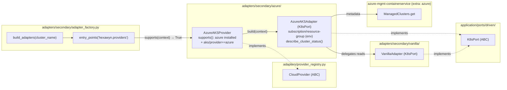

# Azure AKS Provider — Ports & Adapters (ECA-105, Step 1)

How an AKS cluster is auto-detected and wired. The adapter factory discovers
`AzureAKSProvider` via the `hexawyn.providers` entry-point group; the provider
builds an `AzureAKSAdapter` that **delegates** all `K8sPort` reads to a
`VanillaAdapter` (kubeconfig already carries AKS auth) and adds Azure-specific
behaviour (cluster metadata via the Container Service API). The domain layer is
untouched — only a driven adapter is swapped.

## Key Points

- **Zero domain changes**: AKS support is a pure driven-adapter swap behind `K8sPort`.
- **Plugin discovery**: `AzureAKSProvider` is registered as a `hexawyn.providers`
  entry-point (`pyproject.toml`), so the factory needs no `if "aks"` branch.
- **Composition over duplication**: `AzureAKSAdapter` delegates k8s reads to
  `VanillaAdapter` and only overrides context reporting + Azure metadata.
- **Config**: AKS kubeconfig contexts do not encode subscription/resource-group
  (unlike AWS ARNs or `gke_...`), so `subscription_id`/`resource_group` come
  from `AZURE_SUBSCRIPTION_ID`/`AZURE_RESOURCE_GROUP` (or injection). Missing
  config → `ClusterUnreachableError` with a clear hint.
- **Optional dependency**: azure libs are imported lazily; `supports()` returns
  `False` when the `azure` extra is not installed → factory falls back to vanilla.
- **Auth & errors**: `DefaultAzureCredential` (env, az CLI, managed identity).
  `ClientAuthenticationError` → `ClusterUnreachableError` (`az login` hint);
  `HttpResponseError` → `ClusterUnreachableError`.

## Test Coverage

| Test | File | Status |
|---|---|---|
| `test_list_pods_delegates` | `tests/unit/test_aks_adapter.py` | ✅ |
| `test_defaults_to_vanilla_delegate` | `tests/unit/test_aks_adapter.py` | ✅ |
| `test_reports_azure_provider` | `tests/unit/test_aks_adapter.py` | ✅ |
| `test_subscription_from_env` | `tests/unit/test_aks_adapter.py` | ✅ |
| `test_returns_typed_status` | `tests/unit/test_aks_adapter.py` | ✅ |
| `test_missing_config_raises` | `tests/unit/test_aks_adapter.py` | ✅ |
| `test_auth_error_raises_with_hint` | `tests/unit/test_aks_adapter.py` | ✅ |
| `test_http_error_raises_cluster_unreachable` | `tests/unit/test_aks_adapter.py` | ✅ |
| `test_lazily_creates_client` | `tests/unit/test_aks_adapter.py` | ✅ |
| `test_supports_when_aks_in_name` | `tests/unit/test_azure_aks_provider.py` | ✅ |
| `test_does_not_support_when_azure_not_installed` | `tests/unit/test_azure_aks_provider.py` | ✅ |
| `test_factory_selects_aks_provider` | `tests/unit/test_azure_aks_provider.py` | ✅ |

## Related Files

- `src/hexawyn/adapters/secondary/azure/aks_adapter.py` — `AzureAKSAdapter` (K8sPort)
- `src/hexawyn/adapters/secondary/azure/azure_aks_provider.py` — `AzureAKSProvider` plugin
- `src/hexawyn/adapters/provider_registry.py` — `CloudProvider` contract
- `src/hexawyn/adapters/secondary/adapter_factory.py` — entry-point discovery
- `pyproject.toml` — `[tool.poetry.plugins."hexawyn.providers"]` registration
