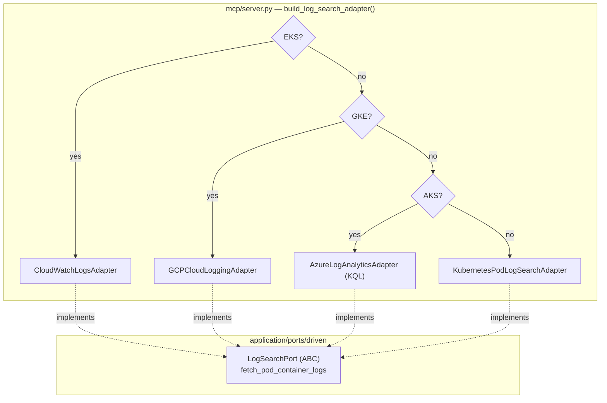

# Azure Log Analytics — Provider-Aware Logs (ECA-105, Step 4)

How semantic log search stays backend-agnostic on AKS.
`build_log_search_adapter()` returns the Azure Log Analytics adapter on AKS,
AWS CloudWatch Logs on EKS, GCP Cloud Logging on GKE, and the Kubernetes
adapter otherwise. Container logs are read from the `ContainerLogV2` table via
KQL — no `kubectl logs`.

## Key Points

- **KQL over ContainerLogV2**: filters by `PodName` + `PodNamespace`, projects
  `ContainerName` / `LogMessage`, and groups rows by container.
- **Workspace via config**: `workspace_id` from
  `AZURE_LOG_ANALYTICS_WORKSPACE_ID` (shared with the traces adapter).
- **Contract-faithful errors**: `HttpResponseError` 403 →
  `InsufficientPermissionsError`; `ClientAuthenticationError` /
  `LogsQueryStatus.FAILURE` / other `HttpResponseError` →
  `ClusterUnreachableError` (`az login` hint).
- **Robust grouping**: multi-line messages split per line; per-container
  truncation at 5000 lines; empty result → `[]`.

## Test Coverage

| Test | File | Status |
|---|---|---|
| `test_groups_lines_by_container` | `tests/unit/test_log_analytics_adapter.py` | ✅ |
| `test_query_uses_pod_namespace_and_timespan` | `tests/unit/test_log_analytics_adapter.py` | ✅ |
| `test_empty_result_returns_empty` | `tests/unit/test_log_analytics_adapter.py` | ✅ |
| `test_truncates_at_max_lines` | `tests/unit/test_log_analytics_adapter.py` | ✅ |
| `test_forbidden_raises_insufficient_permissions` | `tests/unit/test_log_analytics_adapter.py` | ✅ |
| `test_missing_credentials_raises_cluster_unreachable` | `tests/unit/test_log_analytics_adapter.py` | ✅ |
| `test_other_http_error_raises_cluster_unreachable` | `tests/unit/test_log_analytics_adapter.py` | ✅ |
| `test_query_failure_status_raises_cluster_unreachable` | `tests/unit/test_log_analytics_adapter.py` | ✅ |
| `test_returns_log_analytics_adapter_when_aks` | `tests/unit/test_server.py` | ✅ |

## Related Files

- `src/hexawyn/adapters/secondary/azure/log_analytics_adapter.py` — Azure logs adapter
- `src/hexawyn/adapters/secondary/aws/cloudwatch_logs_adapter.py` — AWS peer
- `src/hexawyn/adapters/secondary/gcp/cloud_logging_adapter.py` — GCP peer
- `src/hexawyn/mcp/server.py` — `build_log_search_adapter()` multi-provider
