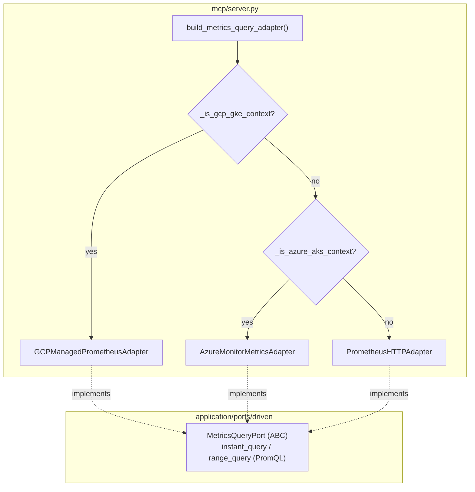

# Azure Monitor Managed Prometheus — Provider-Aware Metrics (ECA-105, Step 2)

How metrics stay provider-agnostic on AKS. `build_metrics_query_adapter()`
returns the Azure Monitor managed-Prometheus adapter on AKS, the GCP one on
GKE, and the vanilla Prometheus HTTP adapter otherwise. Azure Monitor's managed
service for Prometheus is PromQL-compatible, so it plugs straight into
`MetricsQueryPort` — the `ClusterResourceMetricsPort` wrapper and the free-form
`prometheus_query` tool work on AKS with zero extra code.

## Key Points

- **PromQL fits natively**: Azure Monitor managed Prometheus exposes a
  Prometheus-compatible `/api/v1/query` endpoint, so the adapter implements
  `MetricsQueryPort` honestly (no leaky abstraction).
- **Maximum reuse**: shares the Prometheus parsing helpers with
  `PrometheusHTTPAdapter` / `GCPManagedPrometheusAdapter`.
- **Endpoint via config**: the workspace query endpoint is not derivable from
  the cluster name → read from `AZURE_MONITOR_PROMETHEUS_URL`.
- **Auth**: a per-request Azure AD bearer token
  (`DefaultAzureCredential`, scope `.../prometheus.monitor.azure.com/.default`);
  `ClientAuthenticationError` → `PrometheusUnavailableError`.
- **Errors mirror Prometheus**: timeout → `AdapterTimeoutError`, transport /
  non-2xx → `PrometheusUnavailableError`, HTTP 400 → `PrometheusQueryError`.
- **Unified detection**: `_detect_provider()` drives `_is_aws/gcp/azure_*` —
  a stack override wins over auto-detection, otherwise the provider's
  `supports()`.

## Test Coverage

| Test | File | Status |
|---|---|---|
| `test_parses_instant_sample` | `tests/unit/test_monitor_metrics_adapter.py` | ✅ |
| `test_calls_query_endpoint_with_auth` | `tests/unit/test_monitor_metrics_adapter.py` | ✅ |
| `test_parses_range_sample` | `tests/unit/test_monitor_metrics_adapter.py` | ✅ |
| `test_timeout` / `test_http_error` / `test_http_400` | `tests/unit/test_monitor_metrics_adapter.py` | ✅ |
| `test_missing_credentials` | `tests/unit/test_monitor_metrics_adapter.py` | ✅ |
| `test_error_status_raises_prometheus_unavailable` | `tests/unit/test_monitor_metrics_adapter.py` | ✅ |
| `test_acquire_azure_token` | `tests/unit/test_monitor_metrics_adapter.py` | ✅ |
| `test_returns_azure_monitor_adapter_when_aks` | `tests/unit/test_server.py` | ✅ |
| `test_azure_override_forces_aks` | `tests/unit/test_server.py` | ✅ |

## Related Files

- `src/hexawyn/adapters/secondary/azure/monitor_metrics_adapter.py` — Azure metrics adapter
- `src/hexawyn/adapters/secondary/gitops/prometheus_http_adapter.py` — shared helpers
- `src/hexawyn/mcp/server.py` — `build_metrics_query_adapter()` + `_detect_provider()`
