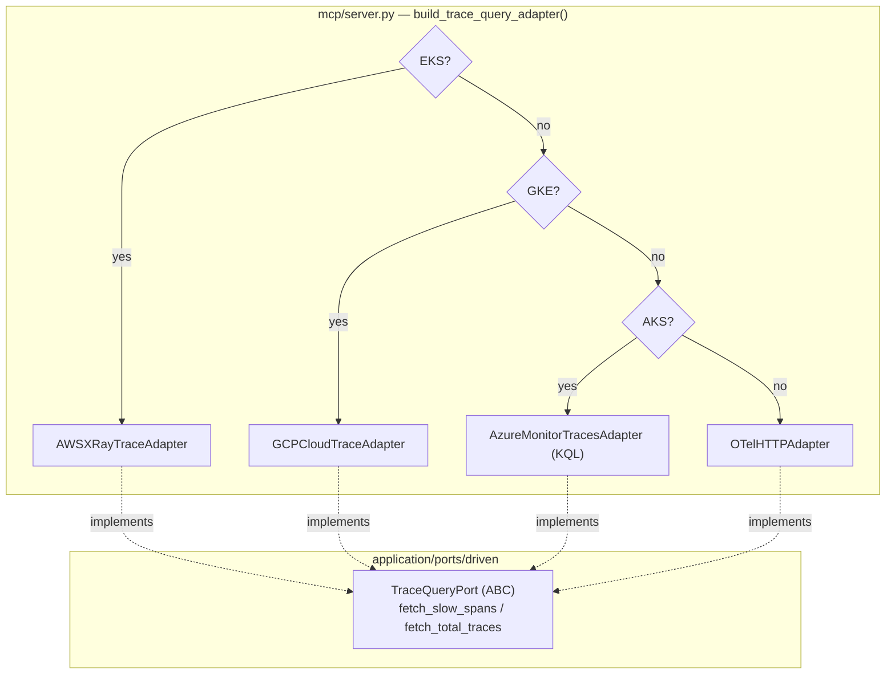

# Azure Monitor Traces — Provider-Aware Traces (ECA-105, Step 3)

How trace diagnostics stay backend-agnostic on AKS.
`build_trace_query_adapter()` returns the Azure Monitor traces adapter on AKS,
AWS X-Ray on EKS, GCP Cloud Trace on GKE, and the OTel adapter otherwise. Azure
Monitor (Application Insights) dependency spans are queried with KQL against a
Log Analytics workspace — a clean fit for `TraceQueryPort`.

## Key Points

- **KQL over Application Insights**: queries the `AppDependencies` table,
  filtering by `Target contains <service>` and `DurationMs > threshold`; rows
  are grouped by `OperationId` into per-trace span lists.
- **Totals via `dcount`**: `summarize Total = dcount(OperationId)` returns the
  distinct trace count in the window.
- **Workspace via config**: `workspace_id` comes from
  `AZURE_LOG_ANALYTICS_WORKSPACE_ID` (not derivable from the cluster name).
- **Robust parsing**: rows are mapped by column name; non-numeric durations
  default to 0.0 ms.
- **Status & errors**: `LogsQueryStatus.FAILURE` →
  `TracesUnavailableError`; `ClientAuthenticationError` →
  `TracesUnavailableError` (`az login` hint); `HttpResponseError` → same.

## Test Coverage

| Test | File | Status |
|---|---|---|
| `test_groups_rows_by_operation_id` | `tests/unit/test_monitor_traces_adapter.py` | ✅ |
| `test_query_includes_service_and_threshold` | `tests/unit/test_monitor_traces_adapter.py` | ✅ |
| `test_non_numeric_duration_defaults_to_zero` | `tests/unit/test_monitor_traces_adapter.py` | ✅ |
| `test_reads_count_value` / `test_returns_zero_when_empty` | `tests/unit/test_monitor_traces_adapter.py` | ✅ |
| `test_returns_zero_when_no_tables` | `tests/unit/test_monitor_traces_adapter.py` | ✅ |
| `test_query_failure_status_raises` | `tests/unit/test_monitor_traces_adapter.py` | ✅ |
| `test_auth_error_raises_with_hint` | `tests/unit/test_monitor_traces_adapter.py` | ✅ |
| `test_returns_azure_monitor_traces_adapter_when_aks` | `tests/unit/test_server.py` | ✅ |

## Related Files

- `src/hexawyn/adapters/secondary/azure/monitor_traces_adapter.py` — Azure traces adapter
- `src/hexawyn/adapters/secondary/aws/xray_trace_adapter.py` — AWS peer
- `src/hexawyn/adapters/secondary/gcp/cloud_trace_adapter.py` — GCP peer
- `src/hexawyn/mcp/server.py` — `build_trace_query_adapter()` multi-provider
