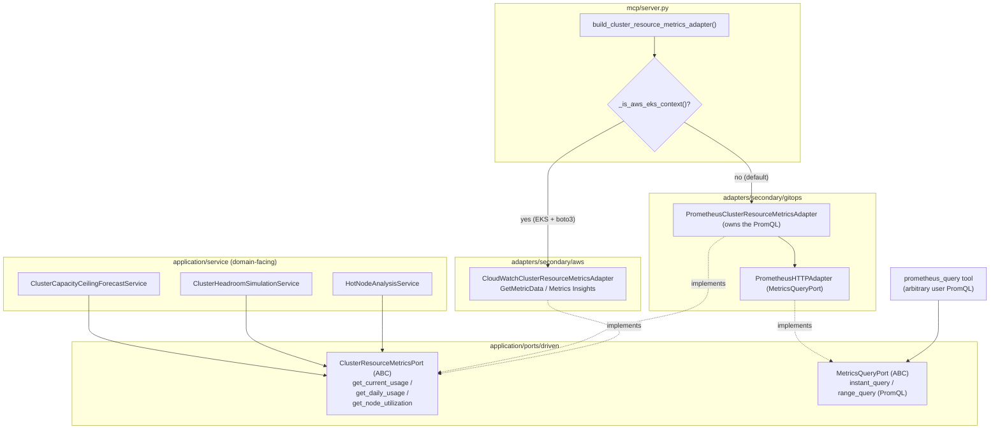

# Cluster Resource Metrics — Provider-Aware Wiring (ECA-104, Step 2)

How cluster CPU/memory metrics stay provider-agnostic. Three services
(capacity forecast, headroom simulation, hot-node analysis) depend on the
typed `ClusterResourceMetricsPort` — never on PromQL. `server.py` selects the
Prometheus implementation by default and the CloudWatch Container Insights
implementation on AWS EKS. The free-form `prometheus_query` tool keeps using
the raw-PromQL `MetricsQueryPort`, which CloudWatch intentionally does not
implement.

## Key Points

- **No leaky abstraction**: services speak in cores/GiB/utilization %, never
  PromQL — so CloudWatch can satisfy the same port honestly.
- **PromQL stays where it belongs**: `PrometheusClusterResourceMetricsAdapter`
  owns the PromQL constants that used to live in the services.
- **Provider-aware wiring**: `build_cluster_resource_metrics_adapter()` returns
  CloudWatch on EKS (boto3 + EKS context) and Prometheus otherwise.
- **`prometheus_query` untouched**: arbitrary user PromQL keeps using
  `MetricsQueryPort` → Prometheus only; CloudWatch deliberately does not
  pretend to run PromQL.
- **Error translation**: CloudWatch `NoCredentialsError` / `ClientError` /
  `BotoCoreError` become `MetricsUnavailableError` and never escape the adapter.

## Test Coverage

| Test | File | Status |
|---|---|---|
| `test_abstract_methods_are_defined` | `tests/unit/test_cluster_resource_metrics_port.py` | ✅ |
| `test_returns_cpu_and_memory_from_instant_queries` | `tests/unit/test_prometheus_cluster_resource_metrics_adapter.py` | ✅ |
| `test_groups_series_by_node_with_hour_step` | `tests/unit/test_prometheus_cluster_resource_metrics_adapter.py` | ✅ |
| `test_returns_latest_cpu_and_memory` | `tests/unit/test_cloudwatch_metrics_adapter.py` | ✅ |
| `test_groups_series_by_node_label` | `tests/unit/test_cloudwatch_metrics_adapter.py` | ✅ |
| `test_missing_credentials` | `tests/unit/test_cloudwatch_metrics_adapter.py` | ✅ |
| `test_client_error` | `tests/unit/test_cloudwatch_metrics_adapter.py` | ✅ |
| `test_endpoint_connection_error` | `tests/unit/test_cloudwatch_metrics_adapter.py` | ✅ |
| `test_lazily_creates_boto3_client` | `tests/unit/test_cloudwatch_metrics_adapter.py` | ✅ |
| `test_returns_prometheus_adapter_when_not_eks` | `tests/unit/test_server.py` | ✅ |
| `test_returns_cloudwatch_adapter_when_eks` | `tests/unit/test_server.py` | ✅ |
| `test_calls_get_daily_usage_once` | `tests/unit/test_cluster_capacity_ceiling_forecast_service.py` | ✅ |
| `test_calls_get_current_usage_once` | `tests/unit/test_cluster_headroom_simulation_service.py` | ✅ |
| `test_calls_get_node_utilization_once_with_window` | `tests/unit/test_hot_node_analysis_service.py` | ✅ |

## Related Files

- `src/hexawyn/application/ports/driven/cluster_resource_metrics_port.py` — the port
- `src/hexawyn/adapters/secondary/gitops/prometheus_cluster_resource_metrics_adapter.py` — Prometheus impl
- `src/hexawyn/adapters/secondary/aws/cloudwatch_metrics_adapter.py` — CloudWatch impl
- `src/hexawyn/application/service/cluster_capacity_ceiling_forecast_service.py`
- `src/hexawyn/application/service/cluster_headroom_simulation_service.py`
- `src/hexawyn/application/service/hot_node_analysis_service.py`
- `src/hexawyn/mcp/server.py` — `build_cluster_resource_metrics_adapter()` + `_is_aws_eks_context()`
