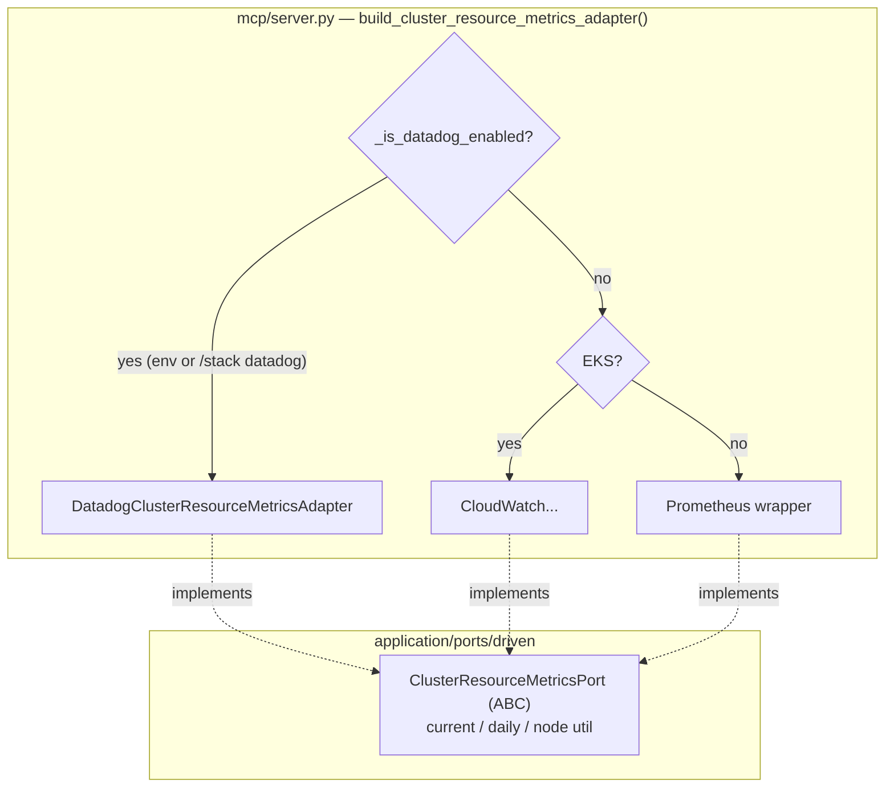

# Datadog Metrics — Observability Overlay (V1.0, Step 1)

How Datadog metrics plug in. Unlike AWS/GCP/Azure, **Datadog is not a
Kubernetes provider** — it's an observability overlay detected by
`DD_API_KEY` + `DD_APP_KEY` env vars (not the kubeconfig context). When enabled
it takes **priority** over the cloud/vanilla metrics backend, feeding the typed
`ClusterResourceMetricsPort` (Datadog uses its own query language, not PromQL,
so `prometheus_query` stays Prometheus-only).

## Key Points

- **Overlay, not a provider**: Datadog has no `K8sPort`/entry-point — the
  cluster stays vanilla/EKS/GKE/AKS; only observability switches to Datadog.
- **Env detection + priority**: `_is_datadog_enabled()` is true when a
  `/stack datadog` override is set, or (no override) when both Datadog keys are
  present. Checked **first**, so Datadog wins over a cloud backend (richer data).
- **Honest port choice**: Datadog's query API is not PromQL → it implements
  `ClusterResourceMetricsPort` (like AWS CloudWatch), not `MetricsQueryPort`.
- **Unit conversions**: `kubernetes.cpu.usage.total` (nanocores) → cores;
  `kubernetes.memory.usage` (bytes) → GiB; node utilization via ratio queries.
- **Read-only**: only `metrics_read` is needed.
- **Errors**: HTTP 429 → `AdapterTimeoutError`; 401/403 →
  `InsufficientPermissionsError`; other → `MetricsUnavailableError`.
- **Multi-site**: `DD_SITE` (e.g. `datadoghq.com` / `datadoghq.eu`) is honored.
- **Secret-safe config**: env var names are assembled from fragments in
  `datadog_config.py` so no secret-token literal appears in source.

## Test Coverage

| Test | File | Status |
|---|---|---|
| `test_converts_nanocores_and_bytes` | `tests/unit/test_datadog_metrics_adapter.py` | ✅ |
| `test_zero_when_all_points_none` | `tests/unit/test_datadog_metrics_adapter.py` | ✅ |
| `test_converts_series_values` | `tests/unit/test_datadog_metrics_adapter.py` | ✅ |
| `test_groups_by_host` / `test_skips_none_points` | `tests/unit/test_datadog_metrics_adapter.py` | ✅ |
| `test_rate_limit_raises_adapter_timeout` | `tests/unit/test_datadog_metrics_adapter.py` | ✅ |
| `test_forbidden_raises_insufficient_permissions` | `tests/unit/test_datadog_metrics_adapter.py` | ✅ |
| `test_build_metrics_api_constructs_config` | `tests/unit/test_datadog_metrics_adapter.py` | ✅ |
| `test_reads_env_values` / `test_defaults_site_to_com` | `tests/unit/test_datadog_config.py` | ✅ |
| `test_returns_datadog_adapter_when_enabled` | `tests/unit/test_server.py` | ✅ |
| `test_override_datadog_enables` | `tests/unit/test_server.py` | ✅ |

## Related Files

- `src/hexawyn/adapters/secondary/datadog/datadog_metrics_adapter.py` — Datadog metrics adapter
- `src/hexawyn/infrastructure/config/datadog_config.py` — env config (secret-safe)
- `src/hexawyn/mcp/server.py` — `build_cluster_resource_metrics_adapter()` + `_is_datadog_enabled()`
