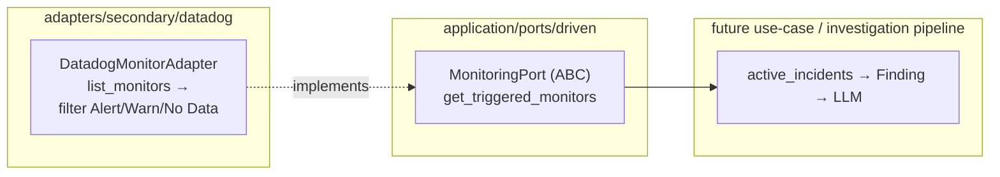

# Datadog Monitors — Active Incidents (V1.0, Step 4)

How active Datadog monitors feed into the hexawyn investigation pipeline.
`DatadogMonitorAdapter` implements the generic `MonitoringPort`, calling
`MonitorsApi.list_monitors()` and returning only monitors in **Alert**,
**Warn**, or **No Data** state — one active monitor = one potential incident.

## Key Points

- **Read-only**: only `monitors_read` scope is required; hexawyn never creates or
  mutates monitors.
- **Triggered filter**: monitors in `Alert`, `Warn`, or `No Data` state are
  returned; `OK`/`Ignored`/`Skipped`/`Unknown` are excluded.
- **Clean contract**: the adapter returns raw monitor dicts (`name`, `status`,
  `message`, `tags` as comma-separated string) — domain mapping to `Finding`
  belongs in a service, not the adapter (hexagonal purity).
- **`get_apm_services()`**: raises `NotImplementedError` — the port method
  exists but Datadog APM service metrics are outside this adapter's scope.
- **Auth**: same `key`/`app_key`/`site` pattern as all Datadog adapters.
- **Errors**: any `ApiException` → `MetricsUnavailableError`.

## Test Coverage

| Test | File | Status |
|---|---|---|
| `test_is_a_monitoring_port` | `tests/unit/test_datadog_monitor_adapter.py` | ✅ |
| `test_returns_alert_warn_no_data_only` | `tests/unit/test_datadog_monitor_adapter.py` | ✅ |
| `test_maps_monitor_fields` | `tests/unit/test_datadog_monitor_adapter.py` | ✅ |
| `test_raises_not_implemented` | `tests/unit/test_datadog_monitor_adapter.py` | ✅ |
| `test_api_error_raises_metrics_unavailable` | `tests/unit/test_datadog_monitor_adapter.py` | ✅ |
| `test_build_monitors_api_constructs_config` | `tests/unit/test_datadog_monitor_adapter.py` | ✅ |
| `test_lazily_builds_monitors_api` | `tests/unit/test_datadog_monitor_adapter.py` | ✅ |

## Related Files

- `src/hexawyn/adapters/secondary/datadog/datadog_monitor_adapter.py` — Monitors adapter
- `src/hexawyn/application/ports/driven/monitoring_port.py` — the port
- `src/hexawyn/adapters/secondary/datadog/datadog_metrics_adapter.py` — same auth pattern
