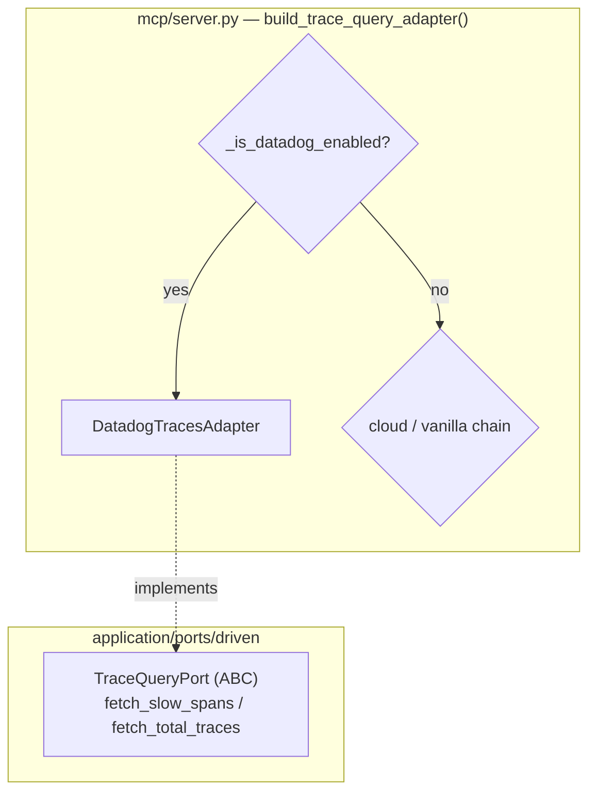

# Datadog Traces — Provider-Aware APM (V1.0, Step 2)

How Datadog APM spans plug in as the trace backend, taking priority over
cloud-native and OTel adapters. The Spans API (`list_spans`) is queried by
service + duration threshold; spans are grouped by `trace_id` into
`TraceQueryPort`'s expected shape.

## Key Points

- **Priority**: Datadog is checked first in `build_trace_query_adapter()`, so
  when DD keys are present (or `/stack datadog`) it supersedes X-Ray, Cloud
  Trace, Azure Monitor, and the OTel stub.
- **API**: `SpansApi.list_spans()` with a filter `service:X @duration:>Nms`;
  the response data is iterated and grouped by `trace_id` for `fetch_slow_spans`,
  while `fetch_total_traces` counts distinct `trace_id` values.
- **Robust parsing**: fields are accessed via dot-notation on the response
  objects; non-numeric `duration` attributes default to `0.0` ms.
- **Errors**: 429 → `AdapterTimeoutError`; 401/403 →
  `InsufficientPermissionsError`; other → `TracesUnavailableError`.
- **Secret-safe**: `_build_spans_api` and `_build_metrics_api` both share the
  `key`/`app_key` parameter naming (not `api_key`).

## Test Coverage

| Test | File | Status |
|---|---|---|
| `test_groups_spans_by_trace_id` | `tests/unit/test_datadog_traces_adapter.py` | ✅ |
| `test_filter_includes_service_and_duration` | `tests/unit/test_datadog_traces_adapter.py` | ✅ |
| `test_non_numeric_duration_defaults_to_zero` | `tests/unit/test_datadog_traces_adapter.py` | ✅ |
| `test_counts_distinct_trace_ids` | `tests/unit/test_datadog_traces_adapter.py` | ✅ |
| `test_rate_limit_raises_adapter_timeout` | `tests/unit/test_datadog_traces_adapter.py` | ✅ |
| `test_forbidden_raises_insufficient_permissions` | `tests/unit/test_datadog_traces_adapter.py` | ✅ |
| `test_build_spans_api_constructs_config` | `tests/unit/test_datadog_traces_adapter.py` | ✅ |
| `test_returns_datadog_traces_adapter_when_enabled` | `tests/unit/test_server.py` | ✅ |

## Related Files

- `src/hexawyn/adapters/secondary/datadog/datadog_traces_adapter.py` — Datadog traces adapter
- `src/hexawyn/adapters/secondary/datadog/datadog_metrics_adapter.py` — metrics companion
- `src/hexawyn/mcp/server.py` — `build_trace_query_adapter()` Datadog-first
