# Domain Services Layer — Pure Business Logic

All domain services implemented as of Phase 4. Each service is stateless, uses zero external dependencies, and obeys the exception strategy (no try/catch — errors propagate naturally). Services depend only on domain models and constants.

```mermaid
flowchart TB
    subgraph Models["Domain Models"]
        ClusterCtx["ClusterContext<br/>ClusterScore<br/>ClusterHealth"]
        Event["ClassifiedEvent<br/>EventSeverity<br/>EventCategory"]
        Investigation["InvestigationResult<br/>InvestigationStatus<br/>Severity"]
        Scoring["RcaScoringConfig<br/>RcaConfidenceScore<br/>FailureImpactScore"]
        Log["LogAnalysisContext<br/>LogAnalysisResult"]
        Certificate["CertificateInfo<br/>CertificateStatus"]
        Cache["CacheEntry"]
        Quota["UsageQuota<br/>SlackQuota"]
    end

    subgraph Constants["Domain Constants"]
        direction LR
        LogCfg["LogAnalysisConstants"]
        EventCfg["EventAnalysisConstants"]
        ScoreCfg["ScoringConstants"]
        PodCfg["PodPrioritizationConstants"]
        QuotaCfg["QuotaConstants"]
        LicenseCfg["LicenseConstants"]
        SemanticCfg["SemanticSearchConstants"]
    end

    subgraph Services["Domain Services — never catch, let errors propagate"]
        subgraph LogAnalysis["log_analysis/"]
            Strategy["LogAnalysisStrategy (ABC)<br/>SmartSummaryStrategy<br/>StreamingStrategy<br/>HybridStrategy<br/>StrategySelector"]
            AdaptiveLP["AdaptiveLogProcessor<br/>token budget + pod prioritization"]
        end

        subgraph FailureAnalysis["failure_analysis/"]
            Scorer["RcaScorer<br/>calculate_confidence()<br/>calculate_impact()<br/>assess_severity()"]
        end

        subgraph EventAnalysis["event_analysis/"]
            Classifier["ProgressiveEventAnalyzer<br/>Level 1: get_overview()<br/>Level 2: get_detailed_analysis()<br/>Level 3: get_correlation_analysis()"]
        end

        subgraph AnomalyDetection["anomaly_detection/"]
            ZScore["ZScoreAnomalyDetector<br/>detect() with configurable threshold"]
        end

        subgraph CertificateSvc["certificate/"]
            CertChecker["CertificateChecker<br/>check() expiry status<br/>assess() full report"]
        end
    end

    subgraph Application["Application Layer"]
        Ports["Driven Ports (ABCs)<br/>K8sPort, MetricsPort, LogsPort..."]
    end

    Strategy --> LogCfg
    Strategy --> Log
    AdaptiveLP --> LogCfg
    AdaptiveLP --> PodCfg
    Scorer --> ScoreCfg
    Scorer --> Scoring
    Classifier --> EventCfg
    Classifier --> Event
    ZScore --> EventCfg
    CertChecker --> Certificate

    Services --> Ports
    Models --> Services
    Constants --> Services
```

## Key Points

- **Zero external dependencies**: domain/services/ imports only stdlib + domain/models/ + domain/models/constants.py
- **Config-driven**: all thresholds, weights, and limits come from frozen dataclasses in constants.py — no magic numbers
- **Open/Closed**: Strategy pattern with ABC enables new strategies without modifying existing code
- **Three-level disclosure**: ProgressiveEventAnalyzer mirrors operator workflow (overview → detail → correlation)
- **Exception strategy**: services never catch — HexawynError propagates to primary adapters (CLI, MCP)

## Test Coverage

| Test | File | Status |
|---|---|---|
| `test_default_budget` | `tests/unit/log_analysis/test_analyzer.py` | ✅ |
| `test_supports_large_logs` | `tests/unit/log_analysis/test_strategy.py` | ✅ |
| `test_max_confidence_when_all_factors_present` | `tests/unit/failure_analysis/test_scorer.py` | ✅ |
| `test_clear_outlier_detected` | `tests/unit/anomaly_detection/test_statistical.py` | ✅ |
| `test_healthy_certificate` | `tests/unit/certificate/test_checker.py` | ✅ |
| `test_cascade_detection` | `tests/unit/event_analysis/test_classifier.py` | ✅ |
| `test_defaults` | `tests/unit/test_constants.py` | ✅ |
| `test_all_members_present` | `tests/unit/test_event.py` | ✅ |
| `test_full_construction` | `tests/unit/test_scoring.py` | ✅ |
| `test_default_values` | `tests/unit/test_log.py` | ✅ |
| `test_minimal_construction` | `tests/unit/test_certificate.py` | ✅ |

## Related Files

- `src/hexawyn/domain/models/` — 15 model files (dataclasses + enums)
- `src/hexawyn/domain/models/constants.py` — 7 frozen dataclasses, single source of truth
- `src/hexawyn/domain/services/log_analysis/` — Strategy pattern + AdaptiveLogProcessor
- `src/hexawyn/domain/services/failure_analysis/` — RCA scoring (config-driven)
- `src/hexawyn/domain/services/event_analysis/` — Progressive disclosure (3 levels)
- `src/hexawyn/domain/services/anomaly_detection/` — Z-score anomaly detection
- `src/hexawyn/domain/services/certificate/` — Certificate health checker
- `src/hexawyn/domain/errors.py` — 17 HexawynError subclasses
