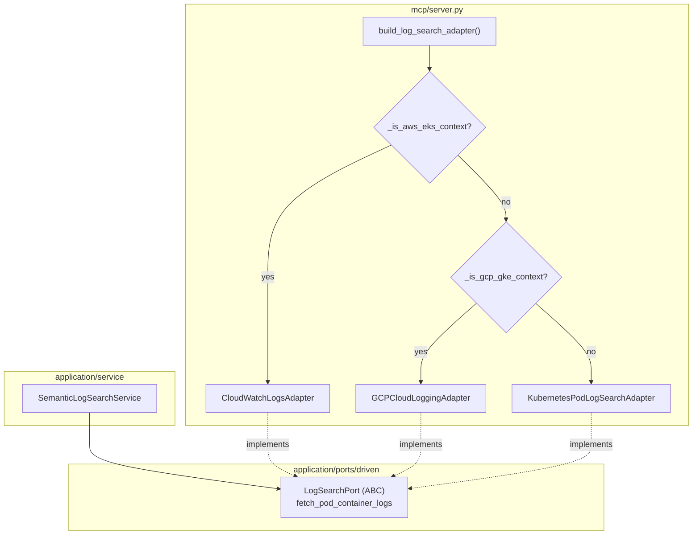

# GCP Cloud Logging — Provider-Aware Logs (ECA-106, Step 4)

How semantic log search stays backend-agnostic on GKE.
`build_log_search_adapter()` returns the GCP Cloud Logging adapter on GKE, AWS
CloudWatch Logs on EKS, and the Kubernetes adapter otherwise. Cloud Logging's
`list_entries` returns pod/container logs natively — no `kubectl logs`.

## Key Points

- **Native source**: `list_entries` filtered by `resource.type="k8s_container"`,
  `resource.labels.pod_name`, `resource.labels.namespace_name`, and a timestamp
  window; entries are grouped by `resource.labels.container_name`.
- **Contract-faithful errors**: `PermissionDenied` →
  `InsufficientPermissionsError`; `DefaultCredentialsError` / other
  `GoogleAPICallError` → `ClusterUnreachableError` with a `gcloud auth` hint.
- **Robust grouping**: multi-line payloads are split per line; missing/non-dict
  labels fall back to an `unknown` container; per-container truncation at 5000
  lines.
- **Provider chaining**: builder prefers AWS → GCP → Kubernetes, with
  `_is_gcp_gke_context()` honoring the stack override.

## Test Coverage

| Test | File | Status |
|---|---|---|
| `test_groups_lines_by_container` | `tests/unit/test_cloud_logging_adapter.py` | ✅ |
| `test_uses_resource_names_and_filter` | `tests/unit/test_cloud_logging_adapter.py` | ✅ |
| `test_fallback_to_unknown_container` | `tests/unit/test_cloud_logging_adapter.py` | ✅ |
| `test_non_dict_labels_fallback_to_unknown` | `tests/unit/test_cloud_logging_adapter.py` | ✅ |
| `test_truncates_at_max_lines` | `tests/unit/test_cloud_logging_adapter.py` | ✅ |
| `test_access_denied_raises_insufficient_permissions` | `tests/unit/test_cloud_logging_adapter.py` | ✅ |
| `test_missing_credentials_raises_cluster_unreachable` | `tests/unit/test_cloud_logging_adapter.py` | ✅ |
| `test_other_api_error_raises_cluster_unreachable` | `tests/unit/test_cloud_logging_adapter.py` | ✅ |
| `test_lazily_creates_client` | `tests/unit/test_cloud_logging_adapter.py` | ✅ |
| `test_returns_cloud_logging_adapter_when_gke` | `tests/unit/test_server.py` | ✅ |

## Related Files

- `src/hexawyn/adapters/secondary/gcp/cloud_logging_adapter.py` — Cloud Logging adapter
- `src/hexawyn/adapters/secondary/aws/cloudwatch_logs_adapter.py` — AWS peer
- `src/hexawyn/adapters/secondary/gitops/kubernetes_pod_log_search_adapter.py` — vanilla fallback
- `src/hexawyn/mcp/server.py` — `build_log_search_adapter()` multi-provider
