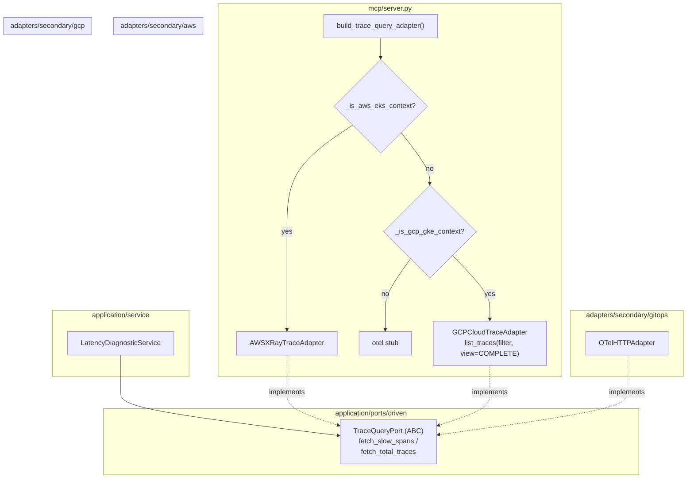

# GCP Cloud Trace — Provider-Aware Traces (ECA-106, Step 3)

How trace diagnostics stay backend-agnostic. `build_trace_query_adapter()`
returns the GCP Cloud Trace adapter on GKE, AWS X-Ray on EKS, and the OTel
adapter otherwise. The Google Cloud Trace v1 read API (`list_traces`) provides
full spans per trace — a direct fit for `TraceQueryPort`.

## Key Points

- **Cloud Trace v1 = read API**: uses `list_traces` with `COMPLETE` view for
  slow spans and `MINIMAL` view for totals — the v2 API is write-only.
- **Clean filter**: `span:{service} latency:{threshold}ms` selects relevant
  traces; all spans are returned and mapped to `TraceSpan` objects.
- **Duration calculation**: proto-plus `start_time`/`end_time` are `datetime`
  timedeltas → milliseconds; missing timestamps default to 0.0 ms.
- **Provider chaining**: the builder prefers AWS → GCP → OTel, with
  `_is_gcp_gke_context()` honoring the stack override.
- **Auth & errors**: Application Default Credentials;
  `DefaultCredentialsError`/`GoogleAPICallError` → `TracesUnavailableError`.

## Test Coverage

| Test | File | Status |
|---|---|---|
| `test_maps_traces_to_spans` | `tests/unit/test_cloud_trace_adapter.py` | ✅ |
| `test_returns_empty_when_no_traces` | `tests/unit/test_cloud_trace_adapter.py` | ✅ |
| `test_filter_includes_service_and_latency` | `tests/unit/test_cloud_trace_adapter.py` | ✅ |
| `test_span_without_timestamps_defaults_to_zero` | `tests/unit/test_cloud_trace_adapter.py` | ✅ |
| `test_counts_traces_without_latency_filter` | `tests/unit/test_cloud_trace_adapter.py` | ✅ |
| `test_missing_credentials` | `tests/unit/test_cloud_trace_adapter.py` | ✅ |
| `test_api_error` | `tests/unit/test_cloud_trace_adapter.py` | ✅ |
| `test_lazily_creates_client` | `tests/unit/test_cloud_trace_adapter.py` | ✅ |
| `test_returns_cloud_trace_adapter_when_gke` | `tests/unit/test_server.py` | ✅ |

## Related Files

- `src/hexawyn/adapters/secondary/gcp/cloud_trace_adapter.py` — Cloud Trace adapter
- `src/hexawyn/adapters/secondary/aws/xray_trace_adapter.py` — AWS peer
- `src/hexawyn/mcp/server.py` — `build_trace_query_adapter()` multi-provider
