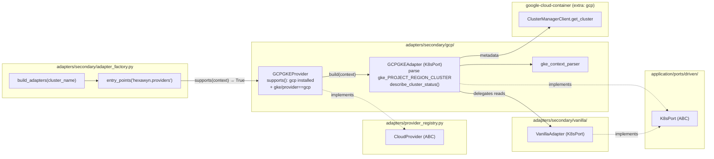

# GCP GKE Provider — Ports & Adapters (ECA-106, Step 1)

How a GKE cluster is auto-detected and wired. The adapter factory discovers
`GCPGKEProvider` via the `hexawyn.providers` entry-point group; the provider
builds a `GCPGKEAdapter` that **delegates** all `K8sPort` reads to a
`VanillaAdapter` (kubeconfig already carries GKE auth) and adds GCP-specific
behaviour (project/region parsing, cluster metadata via the Cloud Container
API). The domain layer is untouched — only a driven adapter is swapped.

## Key Points

- **Zero domain changes**: GKE support is a pure driven-adapter swap behind `K8sPort`.
- **Plugin discovery**: `GCPGKEProvider` is registered as a `hexawyn.providers`
  entry-point (`pyproject.toml`), so the factory needs no `if "gke"` branch.
- **Composition over duplication**: `GCPGKEAdapter` delegates k8s reads to
  `VanillaAdapter` and only overrides context reporting + GCP metadata.
- **Context parsing**: `gke_context_parser` extracts project/region/cluster
  from the `gke_PROJECT_REGION_CLUSTER` kubeconfig convention.
- **Optional dependency**: google-cloud libs are imported lazily; `supports()`
  returns `False` when the `gcp` extra is not installed → factory falls back to
  vanilla.
- **Auth & errors**: Application Default Credentials (`gcloud auth`, service
  account, Workload Identity). `DefaultCredentialsError` /
  `GoogleAPICallError` never escape — they become `ClusterUnreachableError`
  with a `gcloud auth` hint.

## Test Coverage

| Test | File | Status |
|---|---|---|
| `test_parses_project_region_cluster` | `tests/unit/test_gke_context_parser.py` | ✅ |
| `test_returns_none_without_gke_prefix` | `tests/unit/test_gke_context_parser.py` | ✅ |
| `test_list_pods_delegates` | `tests/unit/test_gke_adapter.py` | ✅ |
| `test_defaults_to_vanilla_delegate` | `tests/unit/test_gke_adapter.py` | ✅ |
| `test_reports_gcp_provider_and_project` | `tests/unit/test_gke_adapter.py` | ✅ |
| `test_returns_typed_status` | `tests/unit/test_gke_adapter.py` | ✅ |
| `test_missing_credentials_raises_with_hint` | `tests/unit/test_gke_adapter.py` | ✅ |
| `test_api_error_raises_cluster_unreachable` | `tests/unit/test_gke_adapter.py` | ✅ |
| `test_lazily_creates_client_when_not_injected` | `tests/unit/test_gke_adapter.py` | ✅ |
| `test_supports_when_gke_in_name` | `tests/unit/test_gcp_gke_provider.py` | ✅ |
| `test_does_not_support_when_google_not_installed` | `tests/unit/test_gcp_gke_provider.py` | ✅ |
| `test_factory_selects_gke_provider_for_gke_cluster` | `tests/unit/test_gcp_gke_provider.py` | ✅ |

## Related Files

- `src/hexawyn/adapters/secondary/gcp/gke_adapter.py` — `GCPGKEAdapter` (K8sPort)
- `src/hexawyn/adapters/secondary/gcp/gcp_gke_provider.py` — `GCPGKEProvider` plugin
- `src/hexawyn/adapters/secondary/gcp/gke_context_parser.py` — context parsing
- `src/hexawyn/adapters/provider_registry.py` — `CloudProvider` contract
- `src/hexawyn/adapters/secondary/adapter_factory.py` — entry-point discovery
- `pyproject.toml` — `[tool.poetry.plugins."hexawyn.providers"]` registration
