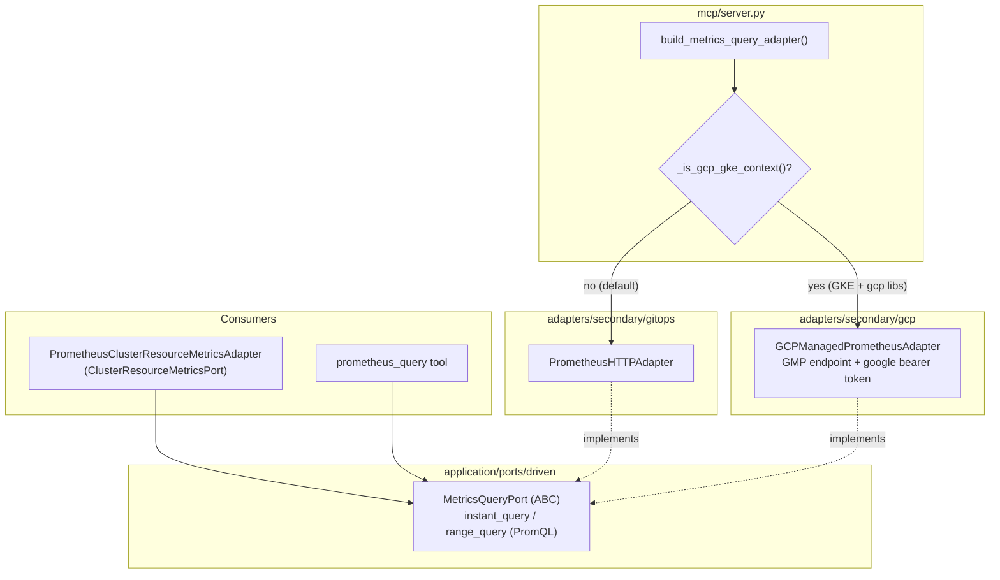

# GCP Managed Prometheus — Provider-Aware Metrics (ECA-106, Step 2)

How metrics stay provider-agnostic on GKE. `build_metrics_query_adapter()`
returns the GCP Managed Prometheus adapter on GKE and the vanilla Prometheus
HTTP adapter otherwise. Because Managed Prometheus is PromQL-compatible, it
plugs straight into the existing `MetricsQueryPort` — so the
`ClusterResourceMetricsPort` wrapper and the free-form `prometheus_query` tool
work on GKE with zero extra code.

## Key Points

- **PromQL fits natively**: Managed Prometheus exposes a Prometheus-compatible
  `/api/v1/query` API, so `GCPManagedPrometheusAdapter` implements
  `MetricsQueryPort` honestly — no leaky abstraction (unlike AWS CloudWatch).
- **Maximum reuse**: parsing helpers (`_to_instant_sample`, `_to_range_sample`,
  `_error_detail`, params builders) are shared with `PrometheusHTTPAdapter`.
- **Free wins**: the `ClusterResourceMetricsPort` wrapper and the
  `prometheus_query` tool both work on GKE with no further changes.
- **Auth**: a refreshed Google bearer token is injected per request via
  Application Default Credentials; `DefaultCredentialsError` →
  `PrometheusUnavailableError`.
- **Errors mirror Prometheus**: timeout → `AdapterTimeoutError`, transport →
  `PrometheusUnavailableError`, HTTP 400 → `PrometheusQueryError`.
- **Provider-aware & override-friendly**: `_is_gcp_gke_context()` honors a
  `vanilla`/`gcp` stack override before auto-detecting via `GCPGKEProvider`.

## Test Coverage

| Test | File | Status |
|---|---|---|
| `test_parses_instant_sample` | `tests/unit/test_managed_prometheus_adapter.py` | ✅ |
| `test_calls_query_endpoint_with_auth_and_params` | `tests/unit/test_managed_prometheus_adapter.py` | ✅ |
| `test_parses_range_sample` | `tests/unit/test_managed_prometheus_adapter.py` | ✅ |
| `test_timeout_raises_adapter_timeout` | `tests/unit/test_managed_prometheus_adapter.py` | ✅ |
| `test_http_error_raises_prometheus_unavailable` | `tests/unit/test_managed_prometheus_adapter.py` | ✅ |
| `test_http_400_raises_query_error` | `tests/unit/test_managed_prometheus_adapter.py` | ✅ |
| `test_error_status_raises_prometheus_unavailable` | `tests/unit/test_managed_prometheus_adapter.py` | ✅ |
| `test_missing_credentials_raises_prometheus_unavailable` | `tests/unit/test_managed_prometheus_adapter.py` | ✅ |
| `test_acquire_google_token_refreshes_credentials` | `tests/unit/test_managed_prometheus_adapter.py` | ✅ |
| `test_returns_managed_prometheus_adapter_when_gke` | `tests/unit/test_server.py` | ✅ |
| `test_override_gcp_forces_gke` | `tests/unit/test_server.py` | ✅ |

## Related Files

- `src/hexawyn/adapters/secondary/gcp/managed_prometheus_adapter.py` — GMP adapter
- `src/hexawyn/adapters/secondary/gitops/prometheus_http_adapter.py` — shared helpers
- `src/hexawyn/adapters/secondary/gitops/prometheus_cluster_resource_metrics_adapter.py` — wrapper
- `src/hexawyn/mcp/server.py` — `build_metrics_query_adapter()` + `_is_gcp_gke_context()`
