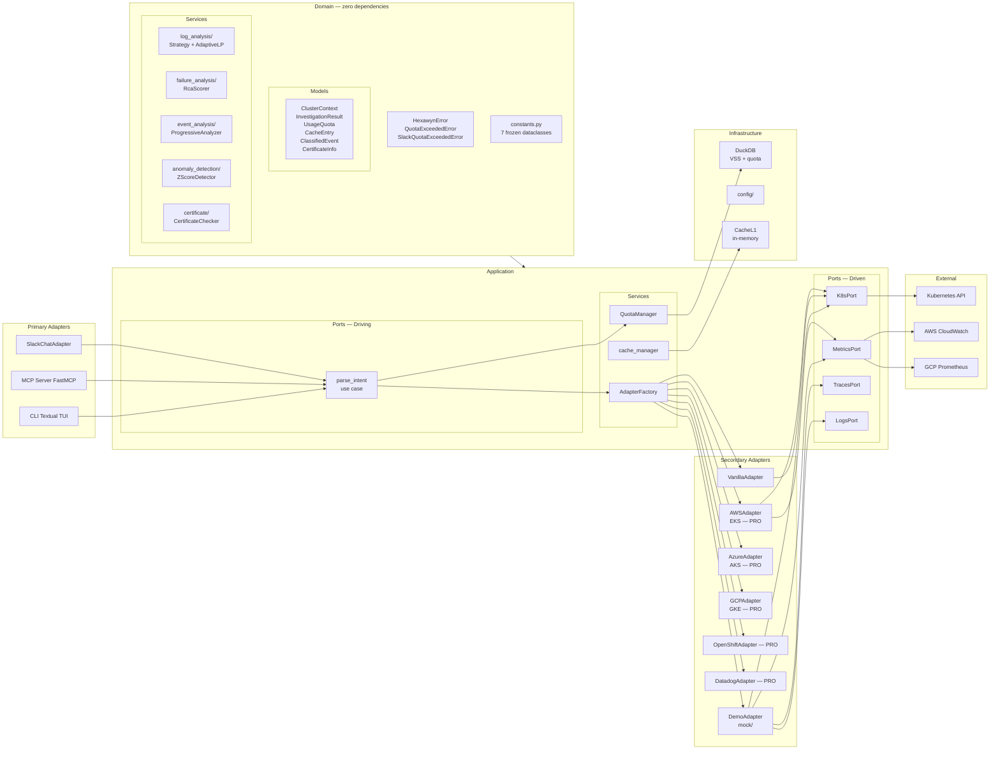

# Hexagonal Architecture — Ports & Adapters

Layers shown from inside out: Domain (zero deps) → Application Ports → Primary Adapters (inbound) → Secondary Adapters (outbound). Arrows show dependency direction. hexa_guard rules R2, R4, R5, R10 annotated.

## hexa_guard Rules Enforced

| Rule | Description | Enforced |
|---|---|---|
| R1 | No k8s/boto3/fastapi in domain/ or application/ports/ | ✅ `hexa_guard.py` line 92-99 |
| R2 | No source file without a test | ✅ `hexa_guard.py` lines 112-124 |
| R4 | Domain imports nothing external | ✅ `hexa_guard.py` lines 154-162 |
| R5 | Adapters go through ports only (never import domain directly) | ✅ `hexa_guard.py` lines 175-183 |
| R6 | No try/catch in application/service/ or domain/services/ | ✅ `hexa_guard.py` lines 190-201 |
| R10 | DemoAdapter only in adapters/secondary/mock/ | ✅ `hexa_guard.py` lines 283-289 |
| R11 | DEMO_MODE never hardcoded — read from env | ✅ `hexa_guard.py` lines 295-307 |

## Key Points

- **Domain** is at the center: pure Python, zero external dependencies. Contains models (15 files), services (5 packages), errors (17 classes), and constants (7 frozen dataclasses)
- **Domain services** implement business logic: log analysis strategies, RCA scoring, event classification, anomaly detection, certificate checking — all config-driven via constants.py, no magic numbers
- **Application ports** define abstractions (K8sPort, MetricsPort, RuntimePort, etc.) that secondary adapters implement
- **AdapterFactory** selects the right secondary adapter: DemoAdapter for demo mode, provider-specific (AWS/Azure/GCP) for real clusters, VanillaAdapter as fallback
- **hexa_guard.py** enforces all architectural rules at every file write — violations block immediately
- **Cache L1** is infrastructure: in-memory dict, session-scoped, sub-millisecond response time
- **Infrastructure/logging/** provides RotatingFileHandler (10MB/5 backups) + StreamHandler + log_tool_execution decorator

## Test Coverage

| Test | File | Status |
|---|---|---|
| `test_demo_mode_returns_demo_adapter` | `tests/unit/test_adapter_factory.py` | ✅ |
| `test_implements_all_ports` | `tests/unit/test_demo_adapter.py` | ✅ |
| `test_k8s_port_is_abstract` | `tests/unit/test_ports.py` | ✅ |
| `test_supports_large_logs` | `tests/unit/log_analysis/test_strategy.py` | ✅ |
| `test_max_confidence_when_all_factors_present` | `tests/unit/failure_analysis/test_scorer.py` | ✅ |
| `test_cascade_detection` | `tests/unit/event_analysis/test_classifier.py` | ✅ |
| `test_clear_outlier_detected` | `tests/unit/anomaly_detection/test_statistical.py` | ✅ |
| `test_healthy_certificate` | `tests/unit/certificate/test_checker.py` | ✅ |
| `test_defaults` | `tests/unit/test_constants.py` | ✅ |

## Related Files

- `src/hexawyn/domain/models/` — 15 model files + constants.py (7 frozen dataclasses)
- `src/hexawyn/domain/services/log_analysis/` — Strategy pattern + AdaptiveLogProcessor
- `src/hexawyn/domain/services/failure_analysis/` — RCA scoring (config-driven)
- `src/hexawyn/domain/services/event_analysis/` — Progressive disclosure (3 levels)
- `src/hexawyn/domain/services/anomaly_detection/` — Z-score anomaly detection
- `src/hexawyn/domain/services/certificate/` — Certificate health checker
- `src/hexawyn/application/ports/driven/` — K8sPort, MetricsPort, TracesPort, LogsPort, RuntimePort...
- `src/hexawyn/adapters/secondary/adapter_factory.py` — build_adapters()
- `src/hexawyn/adapters/secondary/mock/demo_adapter.py` — DemoAdapter (mock/)
- `src/hexawyn/adapters/secondary/vanilla/vanilla_adapter.py` — VanillaAdapter fallback
- `src/hexawyn/infrastructure/logging/tool_decorator.py` — log_tool_execution + RotatingFileHandler
- `hexa_guard.py` — 11 rules auto-enforced at every file write
