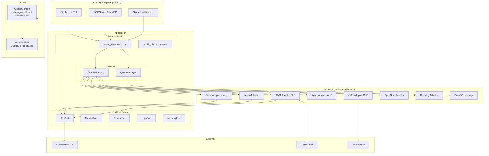

# Hexagonal Architecture — Ports & Adapters

High-level view of hexawyn's hexagonal architecture showing how domain logic, application ports, and adapters interact.

## Key Points

- Domain has ZERO external dependencies — pure Python only (enforced by hexa_guard R1)
- Adapters NEVER import domain directly — always go through application/ports/ (enforced by hexa_guard R5)
- AdapterFactory selects the right secondary adapter based on cluster name and installed packages
- DemoAdapter lives in mock/ only — never referenced in production code paths (enforced by hexa_guard R10)
- All SQL lives in .sql files under infrastructure/memory/sql/ — never inline in Python
