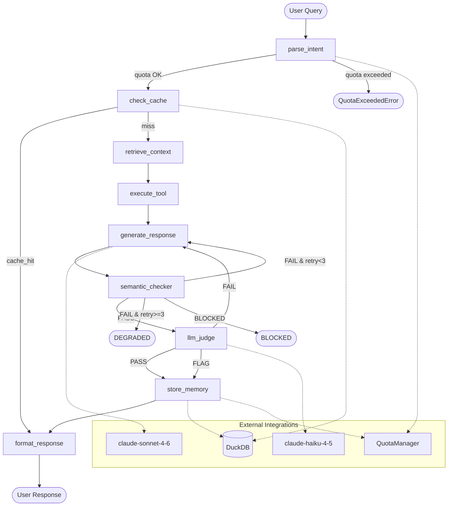

# LangGraph Flow — 9-Node Investigation Pipeline

The full LangGraph pipeline showing all 9 nodes, conditional routing, and integration points with DuckDB and QuotaManager.

## Key Points

- **9 nodes**: parse_intent, check_cache, retrieve_context, execute_tool, generate_response, semantic_checker, llm_judge, store_memory, format_response
- **Check cache first**: DuckDB VSS is queried BEFORE any LLM call — cache hits skip 5 expensive nodes
- **Max 3 retries**: generate_response can retry up to 3 times if checker fails — after 3 failures, format_response returns DEGRADED status
- **BLOCKED is a hard stop**: mutation guard violations immediately route to format_response
- **FLAG goes to store_memory**: results with caveats are stored but marked for review
