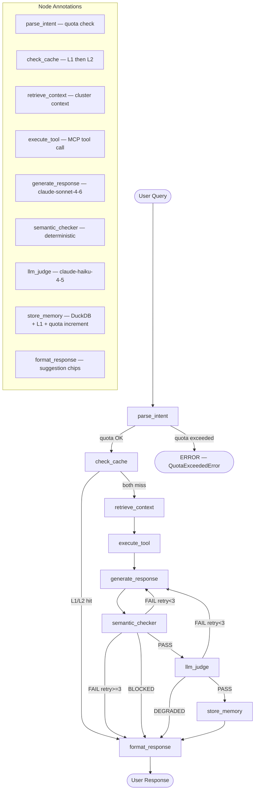

# LangGraph Investigation Graph — 9 Nodes

Complete 9-node investigation pipeline with conditional routing. Each node is annotated with its responsibility and the external service it calls. Conditional edges handle cache hit/miss, checker validation, and retry logic.

## Key Points

- **9 nodes**: parse_intent → check_cache → retrieve_context → execute_tool → generate_response → semantic_checker → llm_judge → store_memory → format_response
- **Quota at entry**: parse_intent checks quota FIRST — if exceeded, no downstream nodes execute (saves K8s + LLM cost)
- **Cache before compute**: check_cache runs L1 (in-memory hash) then L2 (DuckDB VSS) — cache hits skip 5+ expensive nodes
- **Max 3 retries**: generate_response can retry up to 3 times on checker FAIL — after 3 failures, returns DEGRADED status
- **BLOCKED is a hard stop**: mutation guard violations immediately route to format_response (never reaches LLM or K8s)
- **FLAG goes to store_memory**: results with caveats are stored but marked for review (not shown in simplified diagram)

## Node Details

| Node | Calls | Description |
|---|---|---|
| parse_intent | QuotaManager | Checks monthly quota (50 Free / unlimited Pro). Raises QuotaExceededError if exceeded |
| check_cache | CacheL1, DuckDB VSS | L1 exact hash match → L2 semantic similarity. cache_hit=True skips 5 nodes |
| retrieve_context | kubeconfig | Reads cluster name, namespace, provider from kubeconfig |
| execute_tool | K8s API (or DemoAdapter) | Calls MCP tool (describe_pod, list_pods, etc.) — real or mock |
| generate_response | claude-sonnet-4-6 | LLM generates investigation answer from tool output |
| semantic_checker | deterministic | Validates response against tool output (no hallucination check) |
| llm_judge | claude-haiku-4-5 | Semantic validation — cheaper model, checks quality |
| store_memory | DuckDB, CacheL1, QuotaManager | INSERT into incidents, populate L1, increment quota |
| format_response | — | Formats answer + generates 4 suggestion chips |

## Test Coverage

| Test | File | Status |
|---|---|---|
| `test_compiles_without_error` | `tests/unit/test_investigation_graph.py` | ✅ |
| `test_graph_has_nine_nodes` | `tests/unit/test_investigation_graph.py` | ✅ |
| `test_route_checker_pass_goes_to_judge` | `tests/unit/test_investigation_graph.py` | ✅ |
| `test_route_checker_blocked_goes_to_format` | `tests/unit/test_investigation_graph.py` | ✅ |
| `test_route_checker_fail_under_max_retries_retries` | `tests/unit/test_investigation_graph.py` | ✅ |
| `test_route_judge_degraded_goes_to_format` | `tests/unit/test_investigation_graph.py` | ✅ |

## Related Files

- `src/hexawyn/lang_graph/graphs/investigation_graph.py` — graph definition + routing
- `src/hexawyn/lang_graph/nodes/parse_intent.py` — quota check
- `src/hexawyn/lang_graph/nodes/check_cache.py` — L1/L2 cache
- `src/hexawyn/lang_graph/nodes/store_memory.py` — DuckDB + L1 + quota
- `src/hexawyn/lang_graph/nodes/semantic_checker.py` — deterministic validation
- `src/hexawyn/lang_graph/nodes/llm_judge.py` — semantic validation
