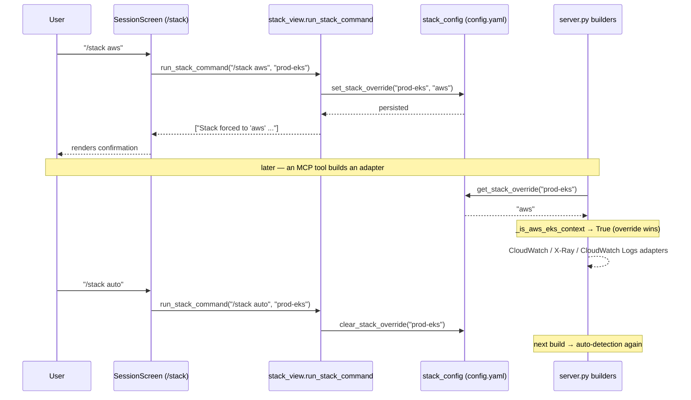

# `/stack` — View & Override the Observability Backend (CLI)

How a user inspects and forces the observability stack per Kubernetes context
from the TUI. By default the stack is auto-detected (EKS → AWS, else
Prometheus/OTel/k8s); `/stack` shows the active stack and lets the user pin
`aws` or `vanilla`, persisted in `~/.hexawyn/config.yaml` and honored by the
provider-aware builders in `server.py`.

## Key Points

- **Two concepts kept separate**: `/ctx` selects the *cluster*; `/stack` selects
  the *observability backend* for that cluster.
- **Auto by default**: with no override, `_is_aws_eks_context()` falls back to
  `AWSEKSProvider.supports()` (boto3 installed + EKS name/ARN/provider).
- **Override wins & persists**: `/stack aws|gcp|vanilla` writes `stack_overrides` in
  `~/.hexawyn/config.yaml`; `server.py` reads it before auto-detecting, so it
  works across the CLI and MCP-server processes.
- **`/stack auto`** clears the override, restoring auto-detection.
- **Credentials unchanged**: `/stack` only picks the backend — AWS auth still
  comes from the standard boto3 chain (env / `~/.aws` / IAM role), never the repo.
- **Text subcommands**: `/stack`, `/stack aws`, `/stack gcp`, `/stack vanilla`, `/stack auto`;
  forcing `aws` without the extra installed warns to `pip install 'hexawyn[aws]'`.

## Test Coverage

| Test | File | Status |
|---|---|---|
| `test_persists_override` | `tests/unit/test_stack_config.py` | ✅ |
| `test_removes_override` | `tests/unit/test_stack_config.py` | ✅ |
| `test_override_aws_wins_even_if_not_supported` | `tests/unit/test_stack_resolver.py` | ✅ |
| `test_auto_falls_back_to_vanilla` | `tests/unit/test_stack_resolver.py` | ✅ |
| `test_shows_active_stack_and_installed_providers` | `tests/unit/test_stack_view.py` | ✅ |
| `test_force_aws_warns_when_boto3_missing` | `tests/unit/test_stack_view.py` | ✅ |
| `test_auto_clears_override` | `tests/unit/test_stack_view.py` | ✅ |
| `test_unknown_argument_returns_usage` | `tests/unit/test_stack_view.py` | ✅ |
| `test_override_aws_forces_eks_context` | `tests/unit/test_server.py` | ✅ |
| `test_override_vanilla_forces_non_eks` | `tests/unit/test_server.py` | ✅ |
| `test_slash_stack_is_recognized` | `tests/unit/test_session_screen.py` | ✅ |
| `test_renders_run_stack_command_output` | `tests/unit/test_session_screen.py` | ✅ |

## Related Files

- `src/hexawyn/infrastructure/config/stack_config.py` — persist/read override
- `src/hexawyn/infrastructure/config/stack_resolver.py` — pure stack resolution
- `src/hexawyn/cli/presentation/stack_view.py` — `/stack` orchestration + view
- `src/hexawyn/cli/screens/session.py` — `/stack` dispatch (glue)
- `src/hexawyn/mcp/server.py` — `_is_aws_eks_context()` honors the override
