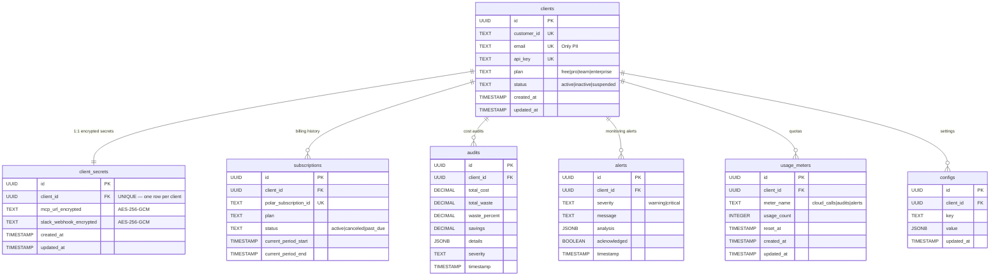
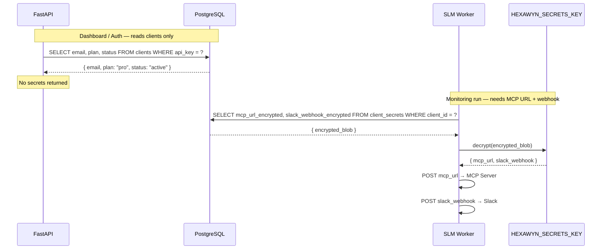

# PostgreSQL Schema — Central API (VPS)

The hexawyn backend stores client identity and subscription state in PostgreSQL. **Only one piece of PII is stored: the email address.** All infrastructure data (MCP Server URLs, Slack webhooks) is encrypted at rest in a separate table — decrypted only by the SLM worker at call time.

---

## Data Flow: Who Reads What

---

## Encryption Details

| Property | Value |
|---|---|
| Algorithm | AES-256-GCM (same as DuckDB encryption) |
| Key source | `HEXAWYN_SECRETS_KEY` environment variable (VPS only) |
| Key derivation | PBKDF2-HMAC-SHA256, 600k iterations |
| Library | `cryptography` (Python) |
| Decryption point | SLM worker only — never in API responses |

---

## Key Points

- **One PII field:** `clients.email` is the only user-identifiable data in PostgreSQL
- **Secrets isolation:** `client_secrets` is a separate table — never joined in dashboard queries
- **Encryption at rest:** `mcp_url` and `slack_webhook` are AES-256-GCM encrypted blobs in the database
- **Decryption on demand:** Only the SLM worker (server-side, no user access) decrypts secrets when calling MCP Servers
- **No `config` JSONB:** Removed — no arbitrary per-client data storage
- **Cascade delete:** Deleting a client cascades to all related rows (subscriptions, audits, alerts, secrets, etc.)

## Test Coverage

| Test | File | Status |
|---|---|---|
| `test_clients_table_has_no_infra_data` | `tests/unit/test_postgresql_schema.py` | ✅ |
| `test_client_secrets_encrypted_at_rest` | `tests/unit/test_client_secrets.py` | ✅ |
| `test_worker_decrypts_secrets_on_demand` | `tests/unit/test_client_secrets.py` | ✅ |
| `test_dashboard_never_returns_secrets` | `tests/unit/test_dashboard.py` | ✅ |
| `test_subscription_created_webhook` | `tests/unit/test_polar_webhooks.py` | ✅ |

## Related Files

- `src/hexawyn/infrastructure/db/schema.sql` — PostgreSQL schema (to be created)
- `src/hexawyn/infrastructure/db/client_secrets.py` — encryption/decryption logic (to be created)
- `src/hexawyn/webhooks/polar.py` — Polar.sh webhook handlers (to be created)
- `src/hexawyn/infrastructure/config/secrets_key.py` — `HEXAWYN_SECRETS_KEY` loader (to be created)
- [ECA-124](https://onlinebook-red-line.atlassian.net/browse/ECA-124) — tracking ticket
