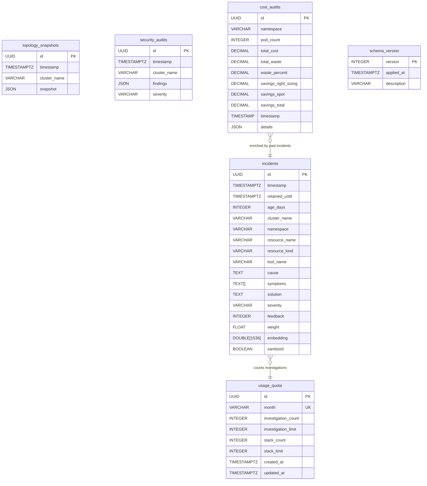

# DuckDB Schema — Memory Layer

hexawyn uses DuckDB for persistent local memory on the user's machine (`~/.hexawyn/memory.duckdb`). It stores past investigations, vector similarity search (VSS), quota tracking, topology snapshots, security audits, and cost snapshots. All SQL lives in `.sql` files under `infrastructure/memory/sql/` — never inline in Python.



---

## Table Details

### 1. `incidents` — Past investigations
Stores every investigation result with 1536-dimensional embeddings for VSS (Vector Similarity Search). This is the core memory table — every time the LLM diagnoses an issue, the result is stored here for future recall.

| Champ | Type | Usage |
|---|---|---|
| `embedding` | `FLOAT[1536]` | HNSW index with cosine similarity — fast approximate nearest neighbor |
| `retained_until` | `TIMESTAMPTZ` | 90 days default TTL — expired rows filtered by `WHERE retained_until > now()` |
| `age_days` | `INTEGER` (VIRTUAL) | `DATEDIFF('day', timestamp, now())` — used for recency scoring |
| `weight` | `FLOAT` | Multiplier for VSS score — incremented on cache hits to boost popular results |
| `sanitized` | `BOOLEAN` | PII flag — sanitized records excluded from VSS results |
| `symptoms` | `TEXT[]` | Array of observed symptoms (e.g., `['OOMKill', 'CPUThrottling']`) |
| `feedback` | `INTEGER` | User feedback score — positive reinforcement for accurate diagnoses |

**Domain model:** `InvestigationResult` (`domain/models/investigation.py`)

**Why it matters:** This is the memory of hexawyn. Without it, every investigation starts from scratch. With it, the LLM gets context from past similar incidents in the same cluster — faster, more accurate diagnoses.

---

### 2. `topology_snapshots` — Cluster state at a point in time
A full snapshot of the Kubernetes cluster topology saved as JSON. Captured periodically (on investigation or on schedule) to enable time-travel debugging and drift detection.

```json
{
  "nodes": 6,
  "pods": 142,
  "services": 18,
  "namespaces": ["prod", "staging", "monitoring"],
  "deployments": {"prod": 12, "staging": 5}
}
```

| Champ | Type | Usage |
|---|---|---|
| `snapshot` | `JSON` | Full cluster topology (nodes, pods, services, deployments, namespaces) |

**Domain model:** `TopologySnapshot` (`domain/models/topology_snapshot.py`)
- `node_count`, `pod_count`, `service_count`, `namespace_count` — computed properties extracted from JSON

**Why it matters:**
- **Time-travel:** "What did my cluster look like 3 days ago before the incident?"
- **Drift detection:** Compare two snapshots → "3 new services appeared in prod namespace since yesterday"
- **Audit trail:** Prove cluster state at any point in time for compliance

---

### 3. `security_audits` — Security posture over time
Results of security audits: RBAC misconfigurations, secret rotation status, certificate expiry. Stored as structured JSON with severity classification.

```json
{
  "rbac": {"overly_permissive_roles": 3, "unused_service_accounts": 7},
  "secrets": {"expired_tokens": 2, "unencrypted": 1},
  "certificates": {"expiring_soon": 1, "days_left": 12}
}
```

| Champ | Type | Usage |
|---|---|---|
| `findings` | `JSON` | Structured security findings grouped by category (rbac, secrets, certificates) |
| `severity` | `VARCHAR` | Overall severity: `low`, `medium`, `high`, `critical` |

**Domain model:** `SecurityAudit` (`domain/models/security_audit.py`)
- `is_critical` — `True` when severity is `critical`
- `total_issues` — sum of all numeric issue counts across categories
- `category_summary` — `{"rbac": 3, "secrets": 3, "certificates": 1}`

**Why it matters:**
- **Compliance:** Auditors need to see security posture history over time
- **Trending:** "RBAC issues doubled since last audit → someone is loosening permissions"
- **Proactive:** Certificate expiring in 12 days → alert before outage

---

### 4. `usage_quota` — Monthly usage tracking
Tracks monthly usage counts for investigations and Slack alerts. One row per month — upserted atomically.

| Champ | Type | Usage |
|---|---|---|
| `month` | `VARCHAR UNIQUE` | `"2026-06"` format — natural monthly partitioning |
| `investigation_count` | `INTEGER` | Incremented on each investigation (shared CLI + Slack) |
| `investigation_limit` | `INTEGER` | 50 (Free), 200 (Dev), 500 (Startup), -1 (unlimited) |
| `slack_count` | `INTEGER` | Incremented on each Slack alert |
| `slack_limit` | `INTEGER` | 5 (Free), 50 (Dev), -1 (unlimited) |

**Domain model:** `UsageQuota`, `SlackQuota` (`domain/models/quota.py`)

**Why it matters:** Enforces the freemium model. When `investigation_count >= investigation_limit`, the user gets `QuotaExceededError` and an upsell prompt.

---

### 5. `cost_audits` — Namespace-level cost snapshots
Hourly cost snapshots per namespace. Computes estimated cost based on resource requests (CPU cores × $/core, GB RAM × $/GB). Independent from cloud billing API data (which comes from ECA-126).

| Champ | Type | Usage |
|---|---|---|
| `namespace` | `VARCHAR` | Kubernetes namespace |
| `pod_count` | `INTEGER` | Number of pods in the namespace at snapshot time |
| `total_cost` | `DECIMAL(12,2)` | Estimated total cost for the namespace |
| `total_waste` | `DECIMAL(12,2)` | Waste = idle resources (requested but unused) |
| `waste_percent` | `DECIMAL(5,2)` | Waste as percentage of total cost |
| `savings_right_sizing` | `DECIMAL(12,2)` | Potential savings by right-sizing pods |
| `savings_spot` | `DECIMAL(12,2)` | Potential savings by switching to spot instances |
| `savings_total` | `DECIMAL(12,2)` | Total potential savings (`right_sizing + spot`) |
| `details` | `JSON` | Additional context (cluster name, region, instance types) |

**Domain model:** `CostAudit` (`domain/models/cost_audit.py`)
- `effective_cost` = `total_cost - total_waste`
- `savings_percent` = `(savings_total / total_cost) * 100`
- `is_waste_high` — `True` when `waste_percent > 20%`

**Why it matters:**
- **Cost anomaly detection:** Alert when namespace spend jumps 30% week-over-week
- **Waste visibility:** "You're spending $500/mo on idle resources in `ml-training`"
- **Rightsizing:** Recommends reducing overprovisioned pods (request >> actual usage)
- **Forecast:** Linear projection of end-of-month cost based on current burn rate

---

### 6. `schema_version` — Migration tracking
Tracks applied schema migrations. Standard flyway-style pattern.

| Champ | Type | Usage |
|---|---|---|
| `version` | `INTEGER PK` | Migration version number (1, 2, 3...) |
| `description` | `VARCHAR` | Human-readable migration description |

**No domain model** — infrastructure concern only.

---

## VSS Search Query (Recency-Weighted)

```sql
SELECT id, timestamp, age_days, cluster_name, namespace,
       resource_name, resource_kind, tool_name, cause,
       solution, severity, weight,
       array_cosine_similarity(embedding, ?::DOUBLE[1536]) * weight
           / ln(age_days + 2) AS score
FROM incidents
WHERE cluster_name = ?
  AND timestamp > now() - INTERVAL '7' DAY
  AND retained_until > now()
  AND sanitized = false
ORDER BY score DESC
LIMIT 5;
```

## HNSW Index

```sql
CREATE INDEX IF NOT EXISTS idx_incidents_embedding
ON incidents USING HNSW (embedding)
WITH (metric = 'cosine');
```

---

## Domain Model ↔ Table Mapping

| Table | Domain Model | File |
|---|---|---|
| `incidents` | `InvestigationResult` | `domain/models/investigation.py` |
| `topology_snapshots` | `TopologySnapshot` | `domain/models/topology_snapshot.py` |
| `security_audits` | `SecurityAudit` | `domain/models/security_audit.py` |
| `usage_quota` | `UsageQuota`, `SlackQuota` | `domain/models/quota.py` |
| `cost_audits` | `CostAudit` | `domain/models/cost_audit.py` |
| `schema_version` | — | (infrastructure) |

5 tables sur 6 ont un objet métier. `schema_version` est purement infrastructure.

---

## Key Points

- **Local-first:** DuckDB file lives on the user's machine — zero server cost, zero data egress
- **text-embedding-3-small:** 1536-dimensional embeddings for VSS via HNSW index with cosine similarity
- **Recency weighting:** `score / ln(age_days + 2)` — today's incidents score ~3x higher than 30-day-old incidents
- **History limits by tier:** Free = 7 days, Dev = 30 days, Startup = 90 days, Scale-up+ = unlimited
- **TTL enforcement:** `retained_until` defaults to 90 days — expired rows filtered and purgeable via `hexa db purge`
- **Storage warning:** UX chip suggests purge when `memory.duckdb` exceeds 1 GB
- **Cost is estimated (not billed):** `cost_audits` uses CPU/memory request × standard pricing. Real cloud billing is in ECA-126
- **All SQL in .sql files:** Schema, indexes, queries, and migrations live in `infrastructure/memory/sql/`

## Test Coverage

| Test | File | Status |
|---|---|---|
| `test_creates_in_memory_db` | `tests/unit/test_duckdb_client.py` | ✅ |
| `test_finds_similar_embedding` | `tests/unit/test_duckdb_client.py` | ✅ |
| `test_respects_min_score` | `tests/unit/test_duckdb_client.py` | ✅ |
| `test_filters_by_cluster_name` | `tests/unit/test_duckdb_client.py` | ✅ |
| `test_get_quota_returns_usage_quota_when_row_exists` | `tests/unit/test_quota_repository.py` | ✅ |
| `test_purge_expired_deletes_old_rows` | `tests/unit/test_duckdb_storage.py` | ✅ |
| `test_cost_audit_minimal_construction` | `tests/unit/test_cost_audit_model.py` | ✅ |
| `test_topology_snapshot_node_count` | `tests/unit/test_topology_snapshot_model.py` | ✅ |
| `test_security_audit_total_issues` | `tests/unit/test_security_audit_model.py` | ✅ |

## Related Files

- `src/hexawyn/infrastructure/memory/duckdb_client.py` — connection, VSS search, schema init, purge
- `src/hexawyn/infrastructure/memory/quota_repository.py` — usage_quota read/write
- `src/hexawyn/infrastructure/memory/sql/schema.sql` — all CREATE TABLE statements (6 tables)
- `src/hexawyn/infrastructure/memory/sql/search_similar.sql` — VSS query with recency
- `src/hexawyn/infrastructure/memory/sql/indexes.sql` — HNSW index
- `src/hexawyn/infrastructure/memory/sql/purge_expired.sql` — purge expired incidents
- `src/hexawyn/domain/models/investigation.py` — InvestigationResult
- `src/hexawyn/domain/models/topology_snapshot.py` — TopologySnapshot
- `src/hexawyn/domain/models/security_audit.py` — SecurityAudit
- `src/hexawyn/domain/models/quota.py` — UsageQuota, SlackQuota
- `src/hexawyn/domain/models/cost_audit.py` — CostAudit
