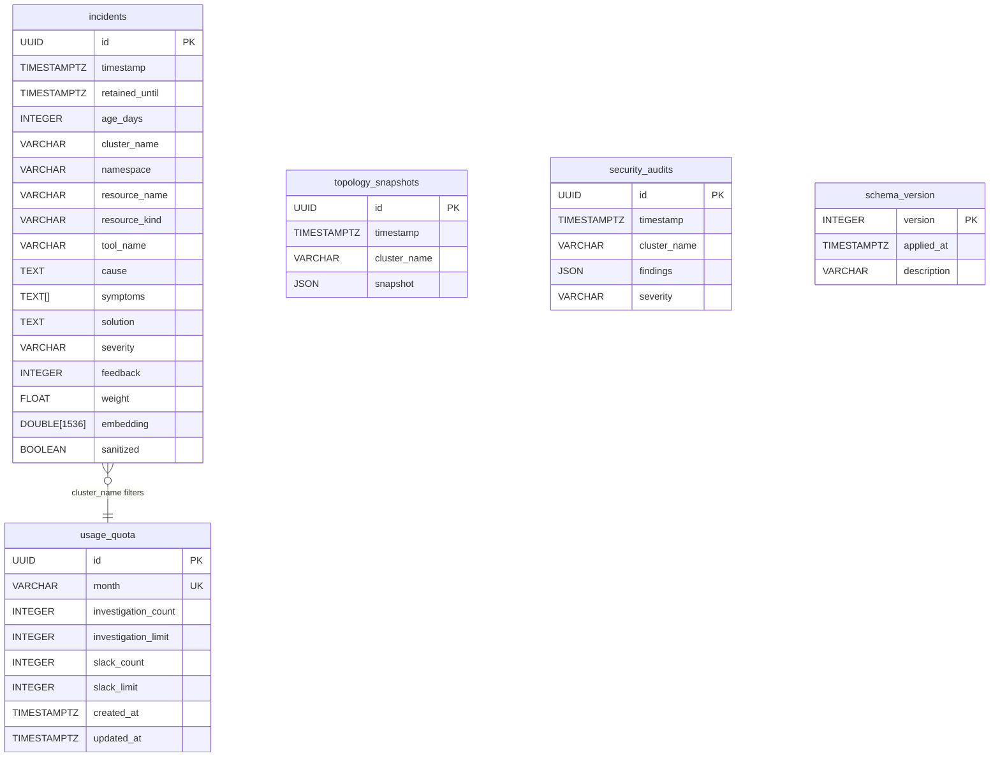

# DuckDB Schema — Memory Layer

hexawyn uses DuckDB for persistent memory: storing past investigations, vector similarity search (VSS), quota tracking, topology snapshots, and security audits. All SQL lives in `.sql` files under `infrastructure/memory/sql/` — never inline in Python.



## Table Details

### incidents
Stores all investigation results with 1536-dimensional embeddings for VSS search.

- **embedding**: HNSW index with cosine similarity metric — fast approximate nearest neighbor search
- **retained_until**: 90 days default TTL — older incidents filtered by `retained_until > now()`
- **age_days**: Generated column — `DATEDIFF('day', timestamp, now())` — used for recency scoring
- **weight**: Multiplier for VSS score — incremented on cache hits to reinforce popular results
- **sanitized**: PII removal flag — sanitized records excluded from VSS results

### usage_quota
Tracks monthly usage for investigations (shared CLI + Slack) and Slack alerts.

- **month**: UNIQUE constraint — one row per month, upserted via ON CONFLICT
- **investigation_limit**: 50 for Free tier, -1 for Pro (unlimited)
- **slack_limit**: 5 for Free tier, -1 for Pro (unlimited)
- **investigation_count** and **slack_count**: incremented atomically via upsert SQL

### topology_snapshots
Snapshots of the Kubernetes cluster topology at a point in time. Stored as JSON.

### security_audits
Results of security audits (RBAC, secret rotation, certificate health). Stored as JSON with severity.

### schema_version
Tracks applied migrations for `infrastructure/memory/sql/migrations/`. Standard flyway-style pattern.

## VSS Search Query (Recency-Weighted)

```sql
SELECT id, timestamp, age_days, cluster_name, namespace,
       resource_name, resource_kind, tool_name, cause,
       solution, severity, weight,
       array_cosine_similarity(embedding, ?::DOUBLE[1536]) * weight
           / ln(age_days + 2) AS score
FROM incidents
WHERE cluster_name = ?
  AND timestamp > now() - INTERVAL '7' DAY
  AND retained_until > now()
  AND sanitized = false
ORDER BY score DESC
LIMIT 5;
```

## HNSW Index

```sql
CREATE INDEX IF NOT EXISTS idx_incidents_embedding
ON incidents USING HNSW (embedding)
WITH (metric = 'cosine');
```

## Key Points

- **text-embedding-3-small**: 1536-dimensional embeddings for VSS via HNSW index with cosine similarity
- **Recency weighting**: `score / ln(age_days + 2)` — today's incidents score ~3x higher than 30-day-old incidents
- **History limits**: Free tier = 7 days (`INTERVAL '7' DAY`), Pro tier = 90 days
- **TTL**: `retained_until` defaults to 90 days — older incidents filtered by `retained_until > now()`
- **Quota upsert**: usage_quota uses ON CONFLICT upsert — single row per month, counts incremented atomically
- **All SQL in .sql files**: schema, indexes, queries, and migrations live in `infrastructure/memory/sql/`

## Test Coverage

| Test | File | Status |
|---|---|---|
| `test_creates_in_memory_db` | `tests/unit/test_duckdb_client.py` | ✅ |
| `test_finds_similar_embedding` | `tests/unit/test_duckdb_client.py` | ✅ |
| `test_respects_min_score` | `tests/unit/test_duckdb_client.py` | ✅ |
| `test_filters_by_cluster_name` | `tests/unit/test_duckdb_client.py` | ✅ |
| `test_filters_by_namespace` | `tests/unit/test_duckdb_client.py` | ✅ |
| `test_get_quota_returns_usage_quota_when_row_exists` | `tests/unit/test_quota_repository.py` | ✅ |

## Related Files

- `src/hexawyn/infrastructure/memory/duckdb_client.py` — connection, VSS search, schema init
- `src/hexawyn/infrastructure/memory/quota_repository.py` — usage_quota read/write
- `src/hexawyn/infrastructure/memory/sql/schema.sql` — all CREATE TABLE statements
- `src/hexawyn/infrastructure/memory/sql/search_similar.sql` — VSS query with recency
- `src/hexawyn/infrastructure/memory/sql/indexes.sql` — HNSW index
- `src/hexawyn/infrastructure/memory/sql/get_quota.sql` — quota lookup query
