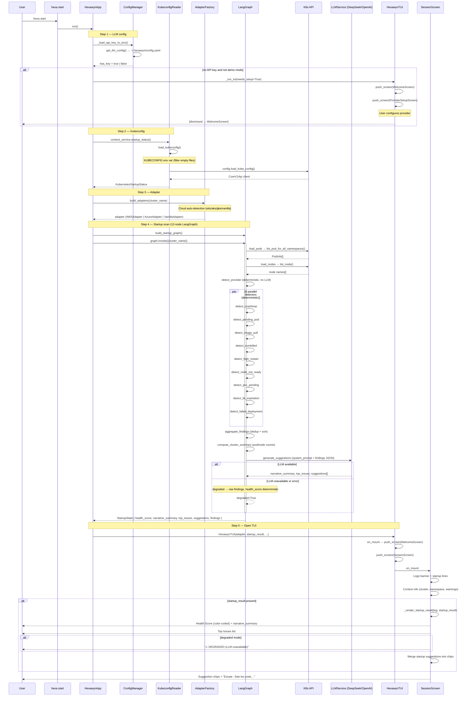

# CLI Launch — Startup Graph Pipeline

When the user launches `hexa start`, the app checks LLM configuration, loads the kubeconfig, runs the 12-node LangGraph startup pipeline to scan the cluster, then opens the Textual TUI with the scan results. The LLM is called only once at the end (generate_suggestions) with graceful degradation if unavailable.

## Key Points

- LLM is configured BEFORE kubeconfig — if no key and not demo, the ProviderSetupScreen is shown first
- The startup graph has 12 nodes but only ONE calls the LLM (generate_suggestions)
- All 9 detectors are deterministic (regex-based, no AI) and run in parallel after provider detection
- If the LLM is unavailable, the graph enters `degraded` mode — health score is computed deterministically and raw findings are shown
- Kubeconfig empty files (0 bytes) are filtered out before loading to avoid `ConfigException`
- startup_result is rendered immediately in SessionScreen via `_render_startup_result()` — health score (color-coded), narrative, top issues

## Test Coverage

| Test | File | Status |
|---|---|---|
| `test_startup_graph_compiles` | `tests/unit/test_startup_graph.py` | ✅ |
| `test_startup_graph_run_with_vanilla_adapter` | `tests/unit/test_startup_graph.py` | ✅ |
| `test_load_pods_node` | `tests/unit/test_startup_graph.py` | ✅ |
| `test_detect_provider_vanilla` | `tests/unit/test_detect_provider.py` | ✅ |
| `test_degraded_when_llm_unavailable` | `tests/unit/test_startup_graph.py` | ✅ |
| `test_kubeconfig_filters_empty_files` | `tests/unit/test_kubeconfig_reader.py` | ❌ (TBD) |

## Related Files

- `src/hexawyn/cli/app.py` — HexawynApp.run() orchestrates startup
- `src/hexawyn/lang_graph/graphs/cli_launch/startup_graph.py` — 12-node graph definition
- `src/hexawyn/lang_graph/nodes/generate_startup_suggestions.py` — only LLM call
- `src/hexawyn/lang_graph/services/llm_service.py` — OpenAI-compatible LLM client
- `src/hexawyn/infrastructure/config/kubeconfig_reader.py` — kubeconfig loading (filters empty files)
- `src/hexawyn/infrastructure/config/config_manager.py` — LLM config from ~/.hexawyn/
- `src/hexawyn/adapters/secondary/adapter_factory.py` — cloud auto-detection
- `src/hexawyn/cli/tui.py` — SessionScreen._render_startup_result() displays scan output
