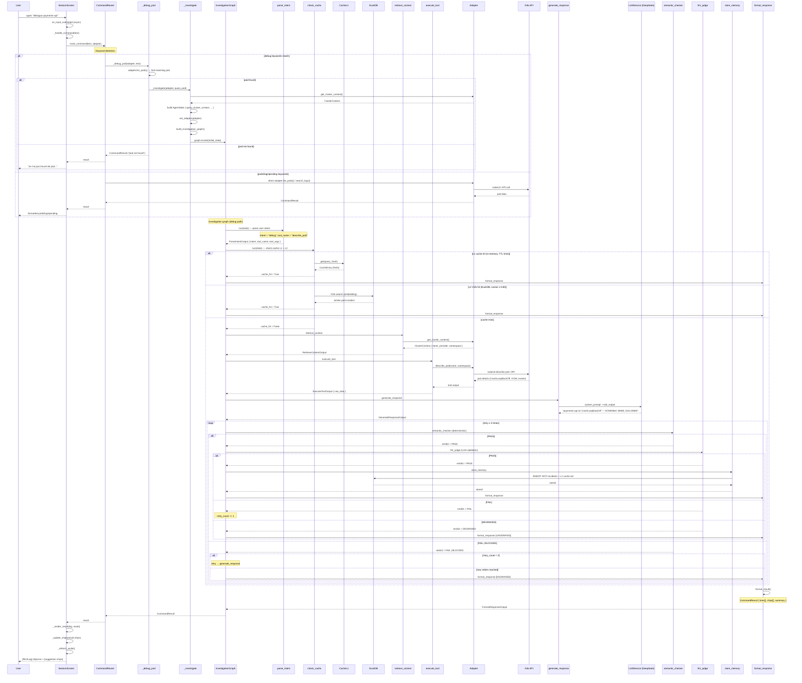

# Daily Debug — Investigation Pipeline (Wired ✅)

When the user types a debug command like "débogue payments-api", `_debug_pod()` finds the pod then delegates to `_investigate()`, which builds the 9-node LangGraph investigation graph, injects the adapter via `set_adapter()`, and invokes the full pipeline: parse_intent → check_cache → retrieve_context → execute_tool → generate_response → semantic_checker → llm_judge → store_memory → format_response. The LLM (DeepSeek) analyzes the pod and returns a diagnosis with suggestion chips.

## Key Points

- Debug commands route through `_debug_pod()` → `_investigate()` → 9-node investigation graph with LLM
- `_investigate()` builds `AgentState`, calls `set_adapter(adapter)`, then `graph.invoke()`
- The adapter is injected into LangGraph via `set_adapter()` so nodes can access K8s API
- Pods/logs/pending commands still use direct adapter calls (fast path, no LLM)
- Cache L1 (in-memory, TTL 5min) checked first — hit skips LLM entirely
- Cache L2 (DuckDB VSS, cosine ≥ 0.80) checked second — hit reuses past analysis
- The LLM is called twice: `generate_response` (main analysis) and `llm_judge` (semantic validation)
- Retry loop: up to 3 retries if `semantic_checker` or `llm_judge` returns FAIL
- BLOCKED stops the pipeline immediately (hard stop, no retries)
- DEGRADED skips `store_memory` and returns with `[UNVERIFIED]` label
- Successful investigation stores result in DuckDB and populates L1 cache for future reuse

## Test Coverage

| Test | File | Status |
|---|---|---|
| `test_investigation_graph_compiles` | `tests/unit/test_investigation_graph.py` | ✅ |
| `test_debug_keyword_routes_to_graph` | `tests/unit/test_investigation_graph.py` | ✅ |
| `test_cache_hit_returns_early` | `tests/unit/test_investigation_graph.py` | ✅ |
| `test_cache_miss_proceeds` | `tests/unit/test_investigation_graph.py` | ✅ |
| `test_checker_pass_triggers_judge` | `tests/unit/test_investigation_graph.py` | ✅ |
| `test_checker_fail_retries` | `tests/unit/test_investigation_graph.py` | ✅ |
| `test_max_retries_triggers_degraded` | `tests/unit/test_investigation_graph.py` | ✅ |
| `test_blocked_triggers_hard_stop` | `tests/unit/test_investigation_graph.py` | ✅ |
| `test_judge_pass_stores_memory` | `tests/unit/test_investigation_graph.py` | ✅ |
| `test_l1_hit_returns_cache_hit_true` | `tests/unit/test_check_cache_node.py` | ✅ |
| `test_semantic_checker_pass` | `tests/unit/test_semantic_checker.py` | ❌ (TBD) |

## Related Files

- `src/hexawyn/cli/command_router.py` — `_debug_pod()` → `_investigate()` → graph.invoke()
- `src/hexawyn/cli/tui.py` — SessionScreen._handle_command() → _render_result() + _update_chips()
- `src/hexawyn/lang_graph/graphs/findings/investigation_graph.py` — 9-node graph with conditional edges
- `src/hexawyn/lang_graph/services/k8s_service.py` — set_adapter() injects adapter into nodes
- `src/hexawyn/lang_graph/nodes/parse_intent.py` — LLM intent detection
- `src/hexawyn/lang_graph/nodes/check_cache.py` — L1 + L2 cache check
- `src/hexawyn/lang_graph/nodes/retrieve_context.py` — cluster context
- `src/hexawyn/lang_graph/nodes/execute_tool.py` — kubectl / API calls via adapter
- `src/hexawyn/lang_graph/nodes/generate_response.py` — LLM response generation
- `src/hexawyn/lang_graph/nodes/semantic_checker.py` — deterministic validation
- `src/hexawyn/lang_graph/nodes/llm_judge.py` — LLM semantic validation
- `src/hexawyn/lang_graph/nodes/store_memory.py` — DuckDB insert + L1 populate
- `src/hexawyn/lang_graph/nodes/format_response.py` — formatted output + chips
- `src/hexawyn/lang_graph/services/llm_service.py` — OpenAI-compatible LLM client
