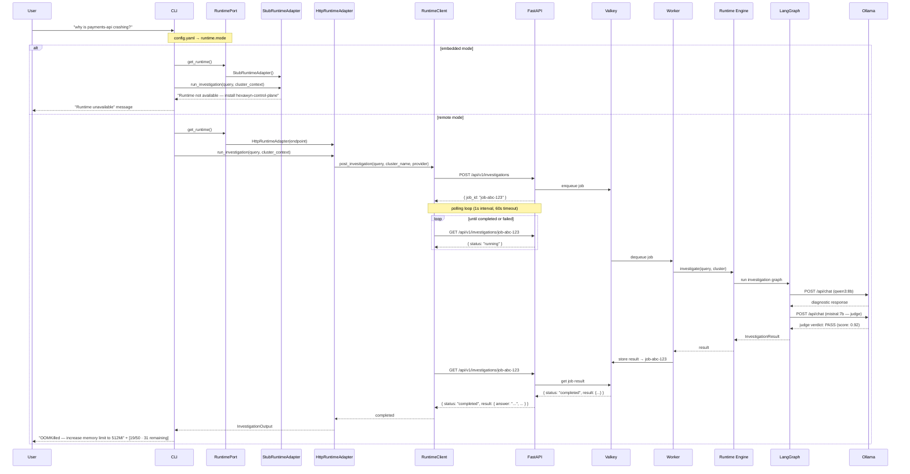

# Full Investigation — Happy Path (RuntimePort Architecture)

The user asks a question in the CLI. The CLI calls `get_runtime()` which resolves the RuntimePort implementation based on `config.yaml`. Two modes: **embedded** (stub, local-only) and **remote** (HTTP to hexawyn-control-plane). The remote flow covers: CLI → RuntimeClient → POST /investigations → FastAPI → Valkey → Worker → LangGraph → Ollama → polling → InvestigationResult → CLI.

## Key Points

- The CLI never imports LangGraph or any LLM library — it only speaks to `RuntimePort`
- `runtime.mode: embedded` → `StubRuntimeAdapter` (dev, no control-plane needed)
- `runtime.mode: remote` → `HttpRuntimeAdapter` → `RuntimeClient` (httpx, polling)
- The control-plane (FastAPI + Valkey + Worker) owns all AI logic including LangGraph
- The CLI and control-plane evolve independently thanks to the HTTP contract
- Polling waits for "completed" or "failed" status (60s timeout, 1s interval)

## Test Coverage

| Test | File | Status |
|---|---|---|
| `test_runtime_port_is_abstract` | `tests/unit/test_runtime_port.py` | ✅ |
| `test_post_investigation_returns_job_id` | `tests/unit/test_runtime_client.py` | ✅ |
| `test_poll_investigation_waits_for_completed` | `tests/unit/test_runtime_client.py` | ✅ |
| `test_run_investigation_posts_and_polls` | `tests/unit/test_http_runtime_adapter.py` | ✅ |
| `test_run_investigation_failed_status` | `tests/unit/test_http_runtime_adapter.py` | ✅ |
| `test_run_startup_scan_not_supported` | `tests/unit/test_http_runtime_adapter.py` | ✅ |
| `test_defaults_to_embedded` | `tests/unit/test_config_manager.py` | ✅ |

## Related Files

- `src/hexawyn/application/ports/driven/runtime_port.py` — RuntimePort ABC + types
- `src/hexawyn/application/service/runtime_adapter.py` — get_runtime() + StubRuntimeAdapter
- `src/hexawyn/application/service/http_runtime_adapter.py` — HttpRuntimeAdapter
- `src/hexawyn/adapters/secondary/runtime_client.py` — RuntimeClient (HTTP + polling)
- `src/hexawyn/infrastructure/config/config_manager.py` — get_runtime_mode() + get_runtime_endpoint()
