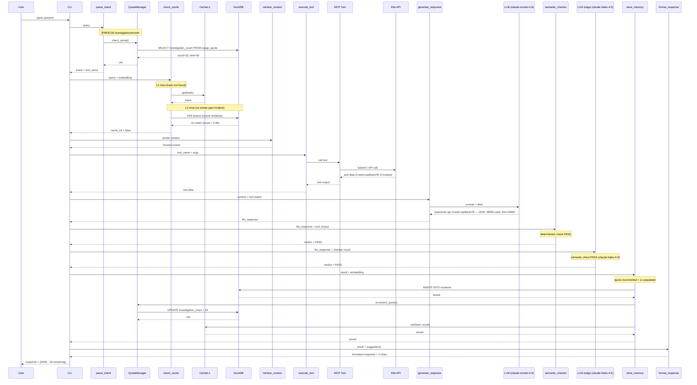

# Full Investigation — Happy Path

User asks a question in the CLI. No cache hit (L1 or L2). Full 9-node LangGraph pipeline runs: quota check → cache miss → tool call → LLM → semantic checker → LLM judge → DuckDB store → quota increment → L1 cache populate → CLI response with chips.

## Key Points

- Quota is checked BEFORE any investigation starts — if exceeded, the entire pipeline is skipped
- Cache L1 (in-memory hash) checked first, then L2 (DuckDB VSS cosine >= 0.80)
- The LLM is only called for response generation (claude-sonnet-4-6) and semantic judging (claude-haiku-4-5)
- Quota is incremented AND L1 is populated AFTER a successful investigation in store_memory
- Demo mode bypasses both quota check and quota increment entirely

## Test Coverage

| Test | File | Status |
|---|---|---|
| `test_checks_quota_in_normal_mode` | `tests/unit/test_quota_langgraph.py` | ✅ |
| `test_increments_quota_after_successful_investigation` | `tests/unit/test_quota_langgraph.py` | ✅ |
| `test_l1_miss_falls_through_to_l2` | `tests/unit/test_check_cache_node.py` | ✅ |
| `test_both_miss_returns_cache_hit_false` | `tests/unit/test_check_cache_node.py` | ✅ |
| `test_stores_result_in_l1` | `tests/unit/test_store_memory_cache.py` | ✅ |
| `test_finds_similar_embedding` | `tests/unit/test_duckdb_client.py` | ✅ |
| `test_is_not_exceeded_when_under_limit` | `tests/unit/test_quota_model.py` | ✅ |

## Related Files

- `src/hexawyn/lang_graph/nodes/parse_intent.py` — quota check before investigation
- `src/hexawyn/lang_graph/nodes/check_cache.py` — L1 + L2 cache check
- `src/hexawyn/lang_graph/nodes/store_memory.py` — quota increment + L1 store
- `src/hexawyn/lang_graph/nodes/generate_response.py` — LLM response generation
- `src/hexawyn/lang_graph/nodes/semantic_checker.py` — deterministic validation
- `src/hexawyn/lang_graph/nodes/llm_judge.py` — LLM semantic validation
- `src/hexawyn/infrastructure/config/quota_manager.py` — quota orchestration
- `src/hexawyn/infrastructure/memory/duckdb_client.py` — VSS search
