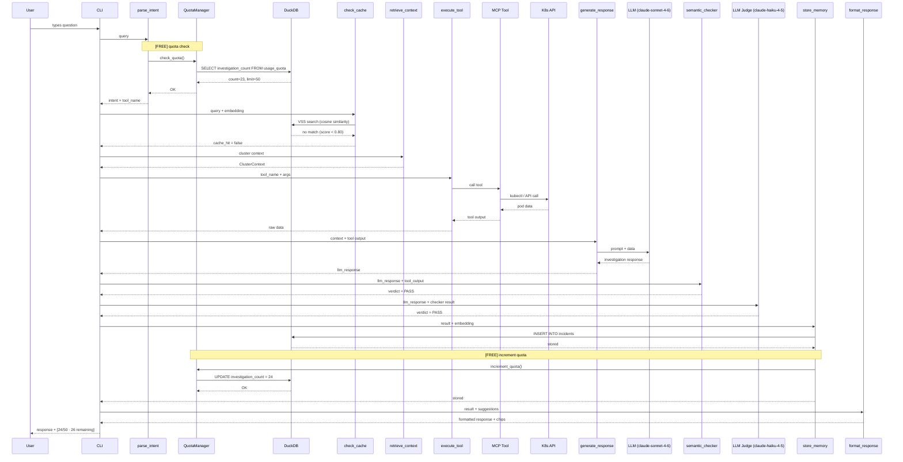

# Full Investigation — Happy Path

User asks a question, no cache hit, the full 9-node LangGraph pipeline runs, result is stored in DuckDB, and quota is incremented.

## Key Points

- Quota is checked BEFORE any investigation starts — if exceeded, the entire pipeline is skipped
- Cache hit/miss is determined by cosine similarity threshold (0.80) against DuckDB VSS
- The LLM is only called for response generation (claude-sonnet-4-6) and semantic judging (claude-haiku-4-5)
- Quota is incremented AFTER a successful investigation in store_memory
- Demo mode bypasses both quota check and quota increment entirely
