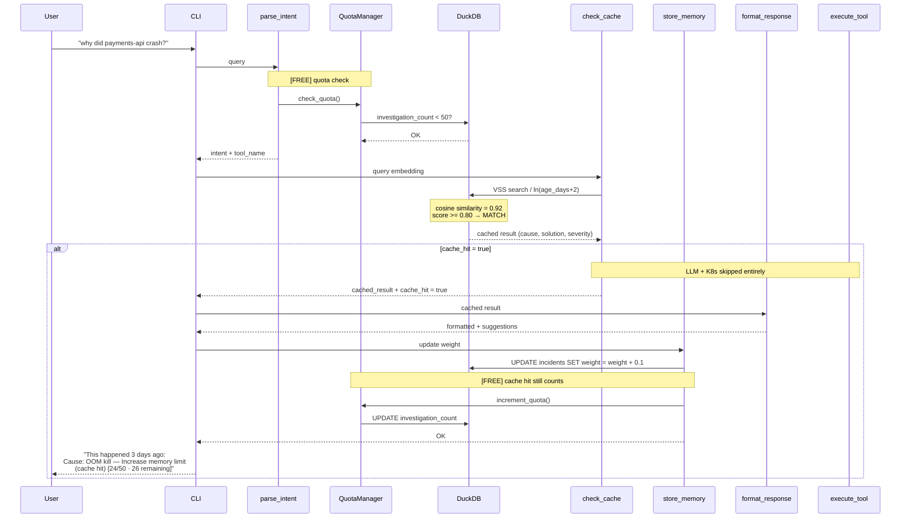

# Cache Hit — DuckDB VSS Match

User asks a question that matches a past investigation in DuckDB (cosine similarity >= 0.80). The LLM is never called — the cached result is returned instantly. Quota IS still incremented: a cache hit counts as an investigation consumed.

## Key Points

- Cache hits skip retrieve_context, execute_tool, generate_response, semantic_checker, and llm_judge — saving 5 nodes
- Cache hits still consume 1 investigation from the monthly quota (same pool as full investigations)
- The cached result's weight is incremented by 0.1, reinforcing popular investigations
- Results show "this happened X days ago" using age_days from DuckDB
- Recency scoring (`/ ln(age_days + 2)`) ensures older incidents are ranked lower
