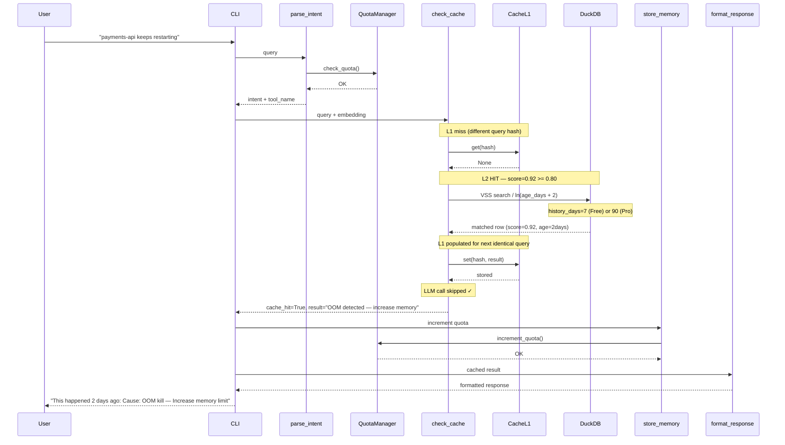

# Cache L2 Hit — DuckDB VSS Semantic Match

User asks a question semantically similar to a past investigation (cosine similarity >= 0.80). DuckDB VSS returns the past result. LLM is not called. Result is stored in L1 for next time. History window: 7 days Free, 90 days Pro.

## Key Points

- L2 hit skips 4 LangGraph nodes: retrieve_context, execute_tool, generate_response, llm_judge
- Cosine similarity threshold is 0.80 — lower scores treated as miss
- Recency scoring (`/ ln(age_days + 2)`) ensures recent matches rank higher
- L2 hit automatically populates L1 for sub-millisecond next lookup
- Free tier sees 7 days of history, Pro tier sees 90 days

## Test Coverage

| Test | File | Status |
|---|---|---|
| `test_l2_hit_stores_in_l1` | `tests/unit/test_check_cache_node.py` | ✅ |
| `test_l1_miss_falls_through_to_l2` | `tests/unit/test_check_cache_node.py` | ✅ |
| `test_finds_similar_embedding` | `tests/unit/test_duckdb_client.py` | ✅ |
| `test_returns_entry_when_cached` | `tests/unit/test_cache_manager.py` | ✅ |
| `test_stores_entry_in_repository` | `tests/unit/test_cache_manager.py` | ✅ |

## Related Files

- `src/hexawyn/lang_graph/nodes/check_cache.py` — L2 fallback after L1 miss
- `src/hexawyn/infrastructure/memory/duckdb_client.py` — search_similar VSS
- `src/hexawyn/infrastructure/config/cache_manager.py` — set_l1 for L1 population
- `src/hexawyn/infrastructure/memory/sql/search_similar.sql` — SQL query with recency
