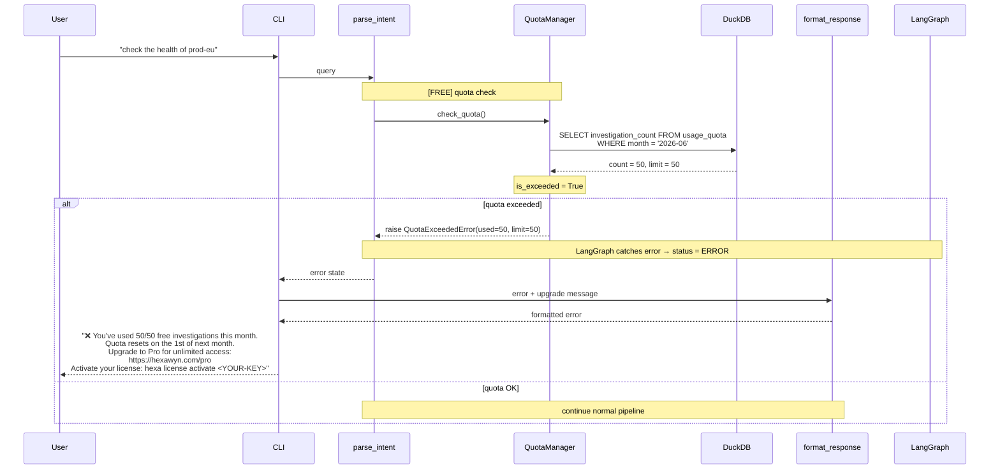

# Quota Exceeded — Free Tier Blocked

Free tier user has used all 50 investigations this month. The investigation is blocked immediately at parse_intent — no LangGraph nodes beyond the first are executed. The user sees a clear upgrade message.

## Key Points

- Quota is checked at parse_intent — the FIRST LangGraph node. No expensive operations (LLM, K8s API) are triggered before this check
- QuotaExceededError is raised as a HexawynError subclass — caught by the LangGraph error handler
- The error message includes: current usage (50/50), reset date, upgrade URL, and license activation command
- Pro tier (limit=-1) never raises QuotaExceededError — `is_exceeded` always returns False
- Slack alerts have a separate quota (5/month Free) via SlackQuotaExceededError
