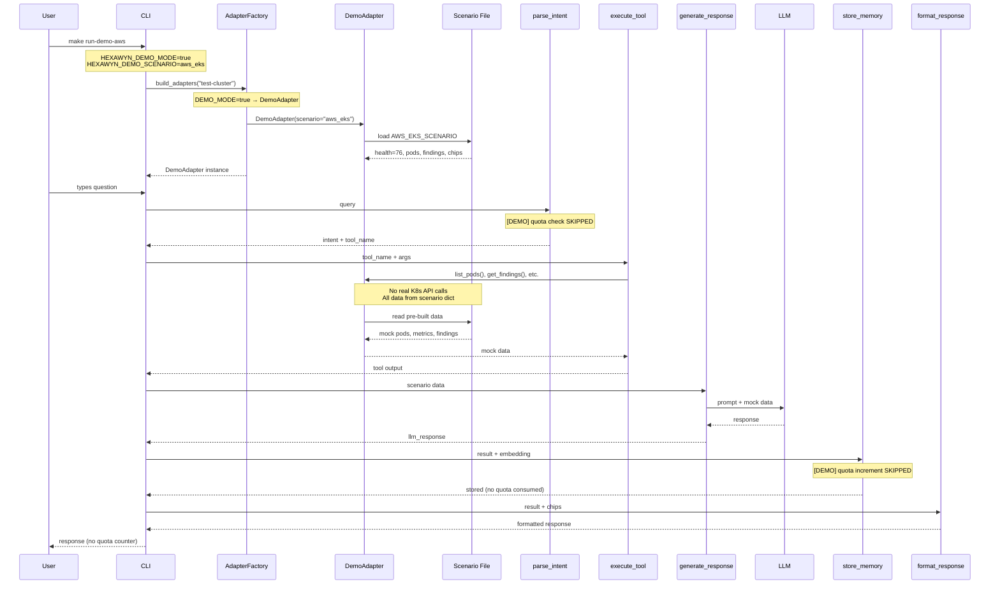

# Demo Mode — Mock Adapter, No Quota

HEXAWYN_DEMO_MODE=true activates DemoAdapter. No real K8s API calls are made, no quota is consumed, and all data comes from pre-built scenario files. Perfect for demos, testing, and evaluation without a cluster.

## Key Points

- Demo mode is activated by the single env var `HEXAWYN_DEMO_MODE=true` — checked at AdapterFactory and LangGraph nodes
- 5 pre-built scenarios: aws_eks (score 76), azure_aks (98), gcp_gke (84), openshift (71), datadog (79)
- Demo mode bypasses ALL quota operations — investigations are never counted against the monthly limit
- No real K8s API calls are made — all data comes from scenario Python files in `adapters/secondary/mock/scenarios/`
- LLM is still called with mock data — realistic responses with zero infrastructure cost
