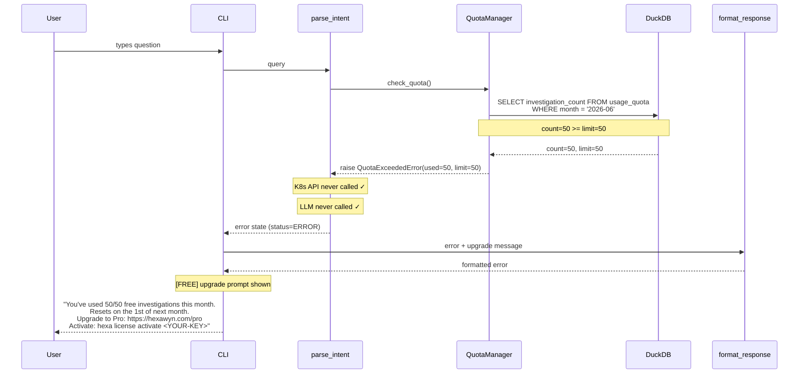

# Quota Exceeded — Free Tier Blocked

Free tier user has used all 50 investigations this month. Investigation is blocked immediately at parse_intent node. No K8s call, no LLM call. User sees upgrade message with reset date.

## Key Points

- Quota is checked at parse_intent — the FIRST LangGraph node, before any expensive operations
- QuotaExceededError is raised as a HexawynError subclass — caught by LangGraph error handler
- The error message includes: current usage (50/50), reset date, upgrade URL, activation command
- Pro tier (limit=-1) never raises QuotaExceededError — is_exceeded always returns False
- Slack alerts use a separate quota pool (5/month Free) — independent from this flow

## Test Coverage

| Test | File | Status |
|---|---|---|
| `test_raises_when_limit_reached` | `tests/unit/test_quota_manager.py` | ✅ |
| `test_is_exceeded_when_count_equals_limit` | `tests/unit/test_quota_model.py` | ✅ |
| `test_is_exceeded_when_count_over_limit` | `tests/unit/test_quota_model.py` | ✅ |
| `test_remaining_is_unlimited_when_pro` | `tests/unit/test_quota_model.py` | ✅ |
| `test_can_be_caught_as_hexawyn_error` | `tests/unit/test_quota_errors.py` | ✅ |
| `test_raises_quota_exceeded_when_limit_reached` | `tests/unit/test_quota_langgraph.py` | ✅ |

## Related Files

- `src/hexawyn/domain/errors.py` — QuotaExceededError
- `src/hexawyn/domain/models/quota.py` — UsageQuota with is_exceeded property
- `src/hexawyn/infrastructure/config/quota_manager.py` — check_quota()
- `src/hexawyn/lang_graph/nodes/parse_intent.py` — calls check_quota()
- `src/hexawyn/infrastructure/memory/quota_repository.py` — usage_quota table access
