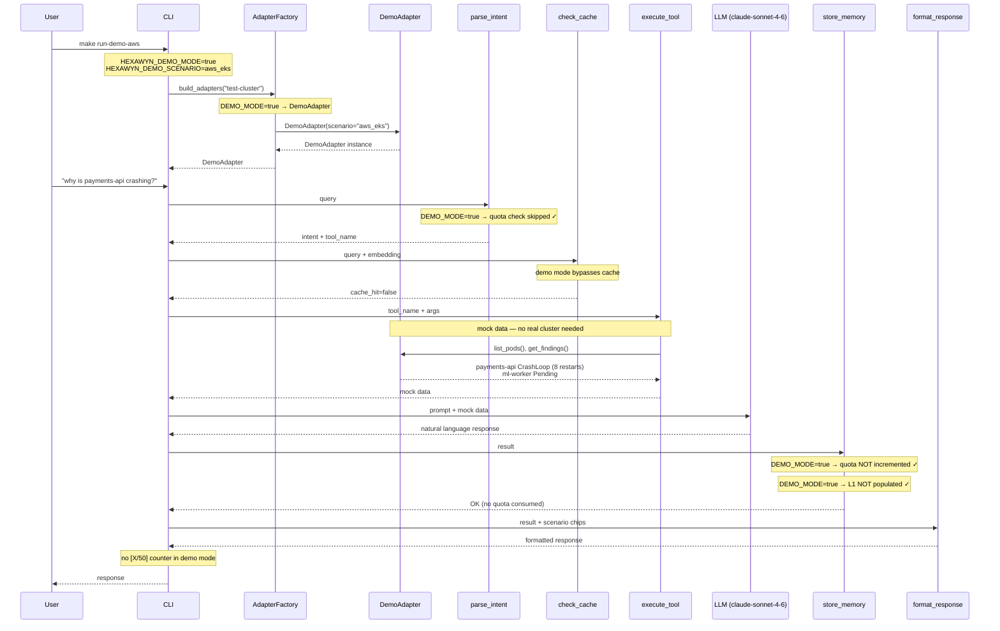

# Demo Mode — Mock Adapter, No Quota, No Real Cluster

HEXAWYN_DEMO_MODE=true activates DemoAdapter. No real K8s API calls are made. No quota is consumed. Demo results are never stored in L1 or DuckDB. LLM is still called to generate natural language responses from mock data.

## Key Points

- Demo mode is activated by `HEXAWYN_DEMO_MODE=true` — checked at AdapterFactory AND in LangGraph nodes
- 5 pre-built scenarios: aws_eks (76), azure_aks (98), gcp_gke (84), openshift (71), datadog (79)
- Demo mode bypasses ALL quota operations — investigations never counted against monthly limit
- No real K8s API calls — all data from scenario Python files in `adapters/secondary/mock/scenarios/`
- LLM is still called with mock data — realistic responses with zero infrastructure cost

## Test Coverage

| Test | File | Status |
|---|---|---|
| `test_demo_mode_returns_demo_adapter` | `tests/unit/test_adapter_factory.py` | ✅ |
| `test_does_not_check_quota_in_demo_mode` | `tests/unit/test_quota_langgraph.py` | ✅ |
| `test_does_not_increment_quota_in_demo_mode` | `tests/unit/test_quota_langgraph.py` | ✅ |
| `test_does_not_store_in_l1_in_demo_mode` | `tests/unit/test_store_memory_cache.py` | ✅ |
| `test_scenario_has_required_keys[scenario0]` | `tests/unit/test_scenarios.py` | ✅ |
| `test_implements_all_ports` | `tests/unit/test_demo_adapter.py` | ✅ |

## Related Files

- `src/hexawyn/adapters/secondary/adapter_factory.py` — build_adapters() returns DemoAdapter
- `src/hexawyn/adapters/secondary/mock/demo_adapter.py` — DemoAdapter implements all 4 ports
- `src/hexawyn/adapters/secondary/mock/scenarios/` — 5 pre-built scenario files
- `src/hexawyn/lang_graph/nodes/parse_intent.py` — demo mode detection (quota skip)
- `src/hexawyn/lang_graph/nodes/store_memory.py` — demo mode detection (quota + L1 skip)
