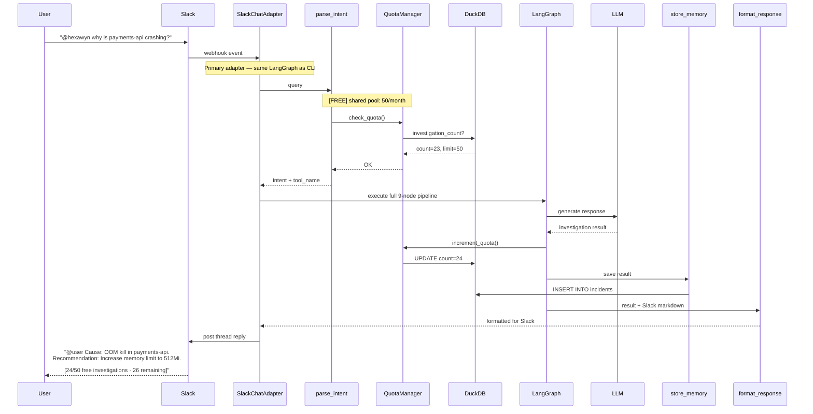

# Slack Chat — Same LangGraph, Different Adapter

User asks a question via Slack using an `@hexawyn` mention. The Slack chat adapter is just a different primary adapter — it runs the exact same LangGraph pipeline as the CLI. Quota is shared: a Slack question counts toward the same 50/month Free tier limit.

## Key Points

- Slack Chat and CLI share the SAME investigation quota pool — 50/month total across both channels
- The Slack adapter is a primary adapter (inbound) — it feeds into the same LangGraph pipeline as the CLI
- Responses are formatted in Slack markdown (not Textual widgets)
- Quota display is appended to every response: `[24/50 free investigations · 26 remaining]`
- Demo mode also applies to Slack — no quota consumed when `HEXAWYN_DEMO_MODE=true`
