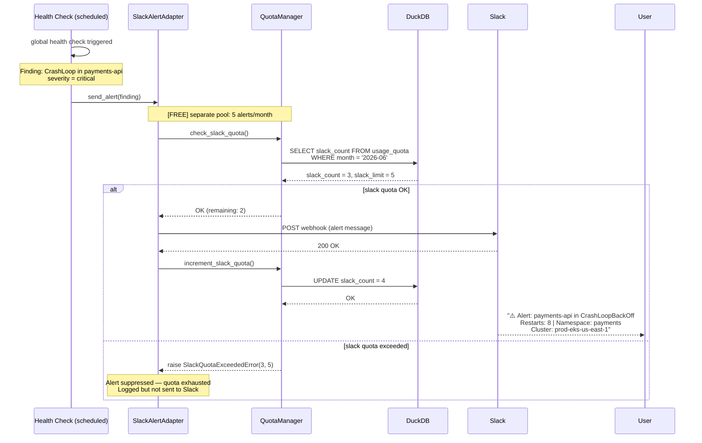

# Slack Alert — Automatic Push Notification

hexawyn detects a critical finding (e.g., CrashLoop, OOM kill, SLO breach) during a scheduled health check and automatically sends a Slack alert. Slack alerts use a SEPARATE quota — 5 alerts/month on Free tier, unlimited on Pro.

## Key Points

- Slack alerts are PUSH notifications — hexawyn sends them automatically when critical findings are detected (no user trigger)
- Slack alerts use a SEPARATE quota pool from investigations — 5/month Free, unlimited Pro
- SlackQuotaExceededError is raised when the 5-alert limit is reached — the alert is suppressed but logged
- Alerts only fire for `severity=critical` findings — degraded and warning levels do not trigger Slack
- Pro tier users have unlimited Slack alerts and Slack chat — both pools use limit=-1
