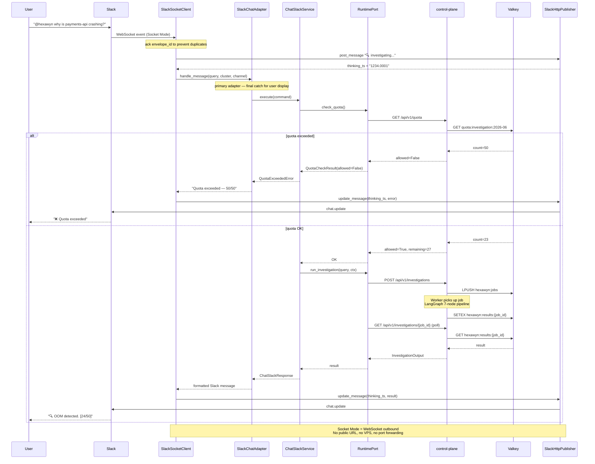

# Slack Chat — Socket Mode (Local, No VPS)

User mentions @hexawyn in Slack. The Socket Mode client receives the event via WebSocket (no public URL), sends an acknowledgment to prevent duplicates, posts a thinking message, delegates to the control-plane via RuntimePort for quota check and investigation, then updates the thinking message with the result.

## Key Points

- **Socket Mode** — WebSocket initiated by hexawyn → Slack, works locally, no public URL needed
- **Envelope acknowledgment** — `{"envelope_id": "..."}` sent back via WebSocket to prevent duplicate events
- **Spinner UX** — "🔍 hexawyn is investigating..." posted first, then replaced via `chat.update`
- **SLACK_APP_TOKEN** (xapp-...) for WebSocket auth, **SLACK_BOT_TOKEN** (xoxb-...) for chat API
- **Quota via control-plane** — `GET /api/v1/quota` reads Valkey counter, no local DuckDB
- **cluster auto-detection** — `--cluster` flag, falls back to kubectl current-context, then `kubectl config current-context`
- **LangGraph** lives in control-plane (private repo) — Slack adapter calls it via `RuntimePort` (HTTP)

## Test Coverage

| Test | File | Status |
|---|---|---|
| `test_handles_app_mention` | `tests/unit/test_slack_socket_client.py` | ✅ |
| `test_handles_url_verification` | `tests/unit/test_slack_socket_client.py` | ✅ |
| `test_continues_when_thinking_message_fails` | `tests/unit/test_slack_socket_client.py` | ✅ |
| `test_calls_apps_connections_open` | `tests/unit/test_slack_socket_client.py` | ✅ |
| `test_strips_bot_mention_from_query` | `tests/unit/test_slack_socket_client.py` | ✅ |
| `test_handle_message_quota_exceeded_returns_upgrade_message` | `tests/unit/test_slack_chat_adapter.py` | ✅ |
| `test_check_quota_returns_allowed_when_under_limit` | `tests/unit/test_api.py` (control-plane) | ✅ |
| `test_increment_quota_returns_200` | `tests/unit/test_api.py` (control-plane) | ✅ |
| `test_execute_raises_quota_exceeded_when_limit_reached` | `tests/unit/test_chat_slack_service.py` | ✅ |
| `test_update_message_calls_chat_update_endpoint` | `tests/unit/test_slack_http_publisher.py` | ✅ |

## Related Files

| File | Role |
|---|---|
| `src/hexawyn/adapters/primary/slack/slack_socket_client.py` | Socket Mode WebSocket client + ack |
| `src/hexawyn/adapters/primary/slack/slack_chat_adapter.py` | Primary adapter, final catch |
| `src/hexawyn/application/service/chat_slack_service.py` | Orchestrates quota + runtime |
| `src/hexawyn/adapters/secondary/slack/slack_http_publisher.py` | post_message + update_message |
| `src/hexawyn/application/ports/driven/runtime_port.py` | check_quota + run_investigation |
| `src/hexawyn/application/service/http_runtime_adapter.py` | HTTP calls to control-plane |
| `src/hexawyn/cli/commands/slack_command.py` | CLI: `hexa slack listen [--cluster]` |

| File (control-plane) | Role |
|---|---|
| `src/hexawyn/api/routers/quota.py` | GET /api/v1/quota, POST /api/v1/quota/increment |
| `src/hexawyn/api/routers/investigations.py` | POST/GET /api/v1/investigations |
| `src/hexawyn/infrastructure/valkey.py` | Valkey: quota counter + job queue + cache |
