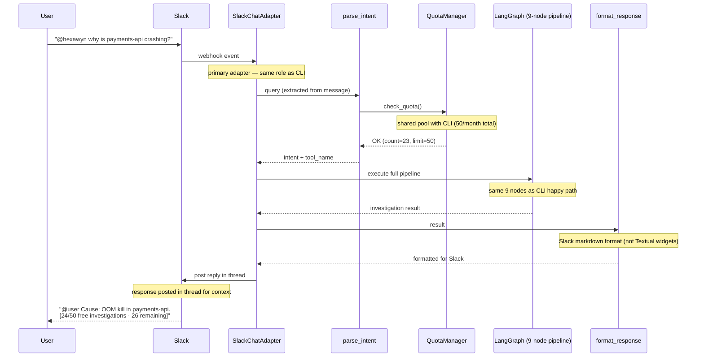

# Slack Chat — Same LangGraph, Different Primary Adapter

User asks a question via Slack (@hexawyn mention). SlackChatAdapter receives the message and feeds it into the same LangGraph pipeline as the CLI. Quota is shared with CLI investigations (same 50/month pool). Response is posted back in the Slack thread.

## Key Points

- Slack Chat and CLI share the SAME investigation quota pool — 50/month total across both channels
- The Slack adapter is a primary adapter (inbound) — same LangGraph pipeline as CLI
- Responses are formatted in Slack markdown (not Textual widgets like the CLI)
- Quota display is appended to every response: `[24/50 free investigations · 26 remaining]`
- Demo mode also applies to Slack via the same env var

## Test Coverage

| Test | File | Status |
|---|---|---|
| `test_checks_quota_in_normal_mode` | `tests/unit/test_quota_langgraph.py` | ✅ |
| `test_passes_when_under_limit` | `tests/unit/test_quota_manager.py` | ✅ |
| `test_raises_when_limit_reached` | `tests/unit/test_quota_manager.py` | ✅ |
| `test_free_tier_shows_count_and_remaining` | `tests/unit/test_quota_manager.py` | ✅ |

## Related Files

- `src/hexawyn/lang_graph/nodes/parse_intent.py` — shared quota check entry point
- `src/hexawyn/lang_graph/nodes/store_memory.py` — shared quota increment
- `src/hexawyn/infrastructure/config/quota_manager.py` — check_quota, increment_quota
- `src/hexawyn/domain/models/quota.py` — UsageQuota model
