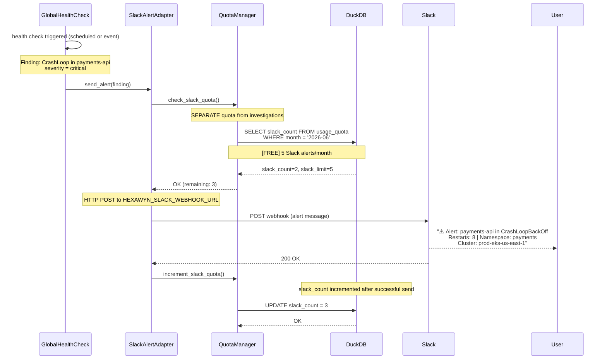

# Slack Alert — Automatic Push Notification (Separate Quota)

hexawyn detects a critical finding during a health check and automatically sends a Slack alert. Uses a SEPARATE quota from investigations (5 Slack alerts/month Free, unlimited Pro). No user interaction required — fully automatic.

## Key Points

- Slack alerts are PUSH notifications — hexawyn sends automatically when critical findings are detected (no user trigger)
- Slack alerts use a SEPARATE quota pool from investigations — 5/month Free, unlimited Pro
- SlackQuotaExceededError is raised when the 5-alert limit is reached — alert is suppressed but logged
- Alerts only fire for `severity=critical` findings — degraded and warning levels do not trigger Slack
- Pro tier users have unlimited Slack alerts and Slack chat — both pools use limit=-1

## Test Coverage

| Test | File | Status |
|---|---|---|
| `test_passes_when_under_slack_limit` | `tests/unit/test_quota_manager.py` | ✅ |
| `test_raises_when_slack_limit_reached` | `tests/unit/test_quota_manager.py` | ✅ |
| `test_slack_quota_exceeded` | `tests/unit/test_quota_model.py` | ✅ |
| `test_slack_quota_not_exceeded` | `tests/unit/test_quota_model.py` | ✅ |
| `test_increment_slack_calls_upsert` | `tests/unit/test_quota_repository.py` | ✅ |

## Related Files

- `src/hexawyn/domain/errors.py` — SlackQuotaExceededError
- `src/hexawyn/domain/models/quota.py` — SlackQuota model
- `src/hexawyn/infrastructure/config/quota_manager.py` — check_slack_quota, increment_slack_quota
- `src/hexawyn/infrastructure/memory/quota_repository.py` — slack_count column
- `src/hexawyn/infrastructure/memory/sql/upsert_slack_quota.sql` — upsert query
