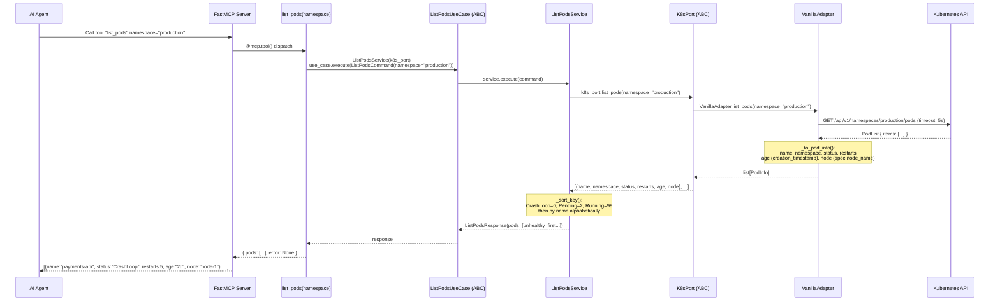
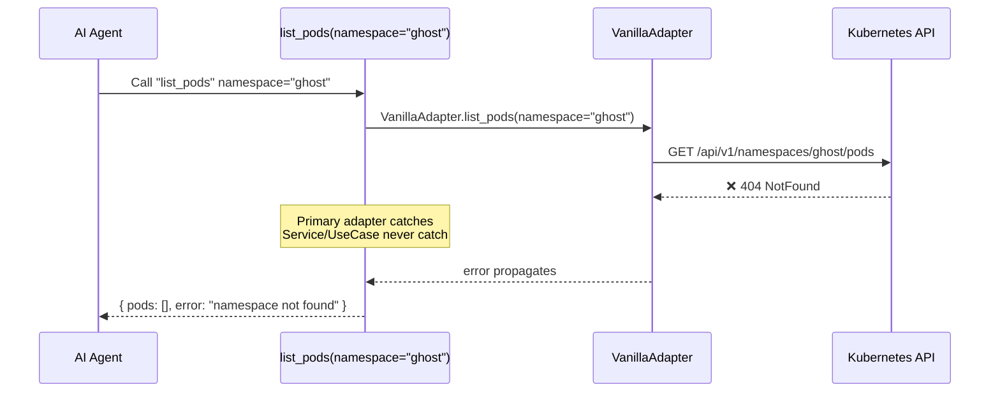
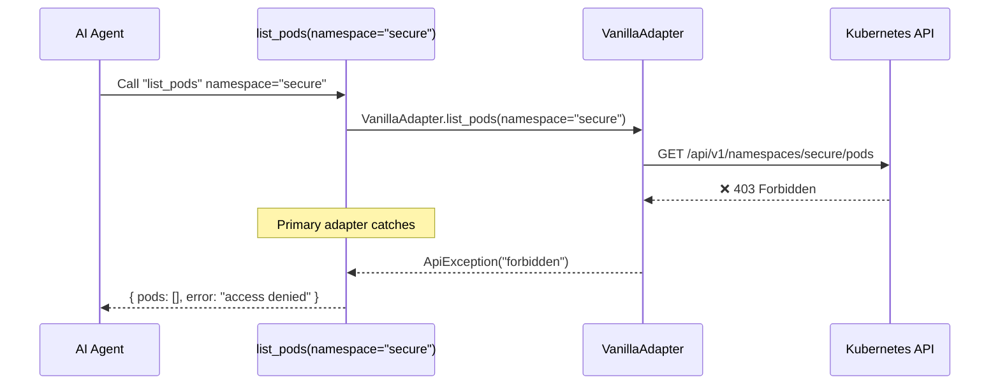
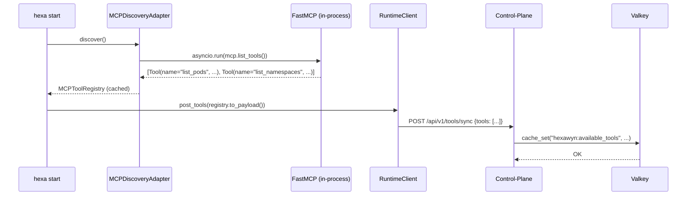

# Use Case 6 — List Pods in Namespace

An AI agent asks to list all pods in a given namespace with health status. The flow goes through: MCP Tool → ListPodsUseCase (ABC) → ListPodsService → K8sPort (driven port) → VanillaAdapter/DemoAdapter → Kubernetes API. Pods are sorted unhealthy first (CrashLoop → Pending → Running), then alphabetically. Tools are auto-discovered at startup and synced to the control-plane.

### Flow 1 — Happy Path: List Pods in a Namespace

### Flow 2 — Error: Namespace Not Found

### Flow 3 — Error: RBAC Access Denied

### Flow 4 — Startup: Tool Auto-Discovery + Sync

## Key Points

- **Auto-discovery** — `register_tools()` scans `mcp/tools/*.py`, no manual imports needed
- **Sorting** — unhealthy first (CrashLoop=0, Pending=2, Running=99), then alphabetically
- **PodInfo = {name, namespace, status, restarts, age, node}** — age from creation_timestamp, node from spec.node_name
- **UseCase = ABC, Service = impl** — same pattern as all other use cases
- **Primary adapter catches** — MCP tool handles ClusterUnreachable, RBAC, NotFound

## Test Coverage

| Test | File | Status |
|---|---|---|
| `test_execute_sorts_unhealthy_first` | `tests/unit/test_list_pods_service.py` | ✅ |
| `test_crashloop_before_running` | `tests/unit/test_list_pods_service.py` | ✅ |
| `test_list_pods_tool_is_registered` | `tests/unit/test_server.py` | ✅ |
| `test_list_pods_returns_pods_for_namespace` | `tests/unit/test_server.py` | ✅ |
| `test_list_pods_empty_namespace` | `tests/unit/test_server.py` | ✅ |
| `test_list_pods_handles_error` | `tests/unit/test_server.py` | ✅ |
| `test_list_pods_returns_real_kubernetes_pods` | `tests/unit/test_vanilla_adapter.py` | ✅ |

## Related Files

- `src/hexawyn/application/ports/driven/k8s_port.py` — PodInfo TypedDict + K8sPort ABC
- `src/hexawyn/application/ports/driving/list_pods/` — Command, Response
- `src/hexawyn/application/use_case/list_pods/` — ListPodsUseCase (ABC)
- `src/hexawyn/application/service/list_pods_service.py` — ListPodsService (sorting)
- `src/hexawyn/adapters/secondary/vanilla/vanilla_adapter.py` — VanillaAdapter
- `src/hexawyn/adapters/secondary/mock/demo_adapter.py` — DemoAdapter
- `src/hexawyn/mcp/tools/list_pods.py` — MCP tool
