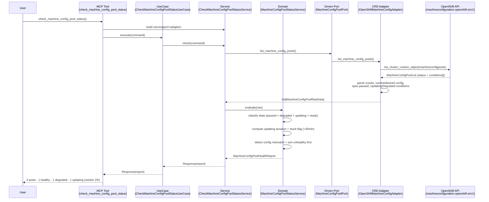
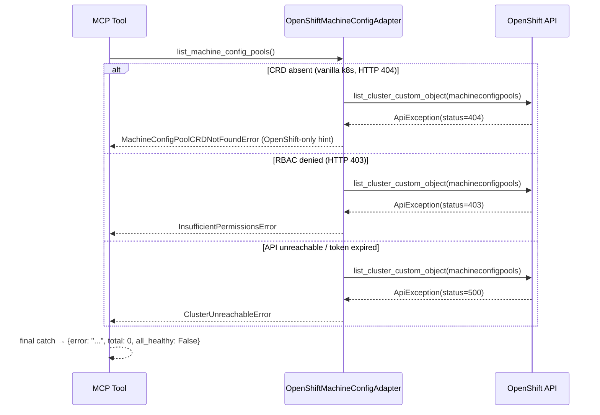
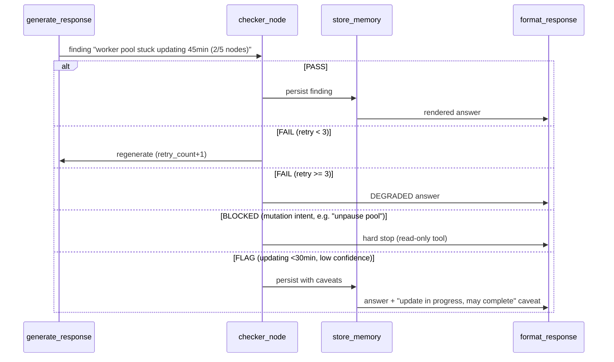
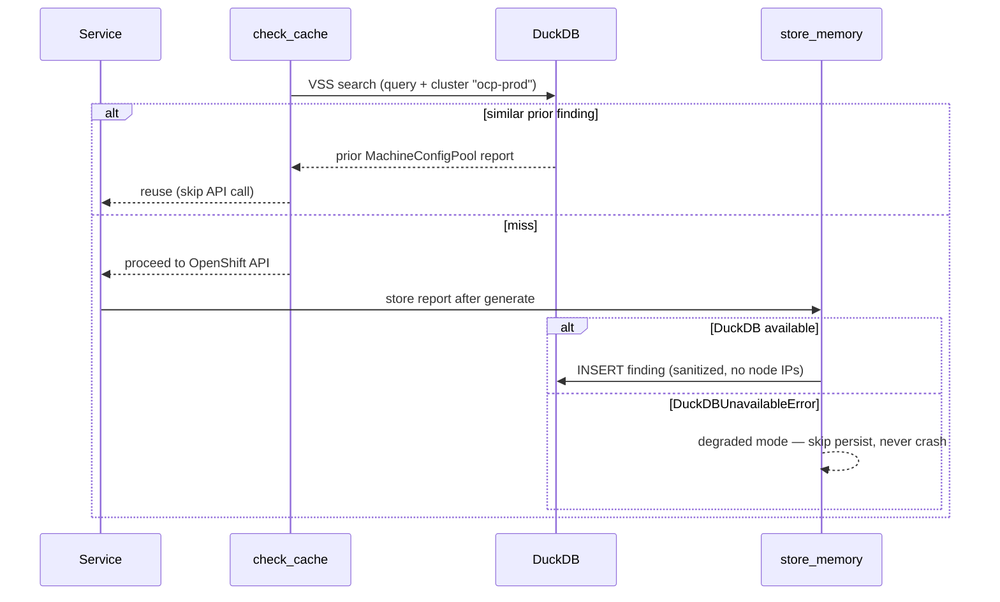

# Use Case 37 — Check OpenShift MachineConfigPool Status

Answers: *"What is the current status of all MachineConfigPools in the OpenShift
cluster — are any nodes stuck in an update or degraded state?"*

Lists every MachineConfigPool (`machineconfiguration.openshift.io/v1`) with its
derived state (ready / updating / degraded / degraded+updating / paused),
machine counts, current vs desired MachineConfig, degraded machine count and
reason, flags pools stuck updating for more than 30 minutes, and returns a
summary (total, healthy, degraded, updating, paused).

## Sample Questions

- "What is the current status of all MachineConfigPools in the cluster?"
- "Are any nodes stuck in an update or degraded MachineConfigPool state?"
- "Which MachineConfigPool is degraded, and what is the reason?"
- "Has the worker pool been updating for too long — is the rollout stuck?"
- "Give me a summary of MachineConfigPool health — how many pools are healthy versus degraded?"

---

## 1. Happy Path — Full Hexagonal Chain



---

## 2. Error Flows

Infrastructure exceptions never escape the secondary adapter — they are
translated to `HexawynError` subclasses. The MCP tool performs the final catch.



---

## 3. Checker Node



---

## 4. DuckDB Memory



---

## Key Points

- MachineConfigPool is OpenShift-only (`machineconfiguration.openshift.io/v1`);
  on vanilla k8s the tool returns a graceful `MachineConfigPoolCRDNotFoundError`
  with a hint.
- State precedence: `Paused > Degraded(+Updating) > Updating > Ready`. A paused
  pool (`spec.paused=true`) is an intentional operator action — never degraded.
- Stuck detection: updating for **> 30 minutes** → `is_stuck=True` with elapsed
  minutes (a manually cordoned node during update surfaces here).
- `config_mismatch` (current ≠ desired rendered MachineConfig) makes an in-flight
  or stalled rollout visible even without a timestamp.
- Degraded pools surface `degraded_machine_count` and the failure `reason`.
- Unhealthy pools are sorted first so the summary surfaces problems fast.

---

## Tests

Unit test stubs for the domain logic (pool status parsing, degraded detection,
summary aggregation). Implemented in
`tests/unit/test_machine_config_pool_status_service.py`.

```python
# ── Pool status parsing ──────────────────────────────────────
def test_degraded_pool_surfaces_reason_and_count():
    # Degraded=True → state "degraded", degraded_machine_count + reason preserved
    ...

def test_degraded_and_updating_combined_state():
    # Degraded=True AND Updating=True → state "degraded+updating"
    ...

def test_paused_pool_is_not_degraded():
    # spec.paused=true → state "paused", counted separately, degraded == 0
    ...

def test_config_mismatch_flagged():
    # current != desired rendered config → config_mismatch True
    ...

def test_empty_pool_zero_machine_count():
    # machineCount=0 → empty pool noted, state "ready"
    ...

# ── Degraded / stuck detection ───────────────────────────────
def test_updating_over_thirty_minutes_is_stuck():
    # updating_since 45 min ago → is_stuck True, duration == 45
    ...

def test_exactly_thirty_minutes_is_not_stuck():
    # boundary: 30 min → is_stuck False
    ...

def test_missing_or_malformed_updating_since_is_not_stuck():
    # None / "not-a-date" → duration 0, is_stuck False
    ...

# ── Summary aggregation ──────────────────────────────────────
def test_three_pools_master_ready_worker_updating_infra_degraded():
    # 3 pools → total=3, healthy=1, degraded=1, updating=1, all_healthy False
    ...

def test_all_ready_is_all_healthy():
    # every pool Ready → all_healthy True
    ...

def test_single_node_cluster_master_one_machine():
    # master pool with machineCount=1
    ...
```

| Test | Scenario | File | Status |
|---|---|---|---|
| `test_three_pools_master_ready_worker_updating_infra_degraded` | 3 pools summary | `test_machine_config_pool_status_service.py` | ✅ |
| `test_all_ready_is_all_healthy` | all Ready | `test_machine_config_pool_status_service.py` | ✅ |
| `test_updating_over_thirty_minutes_is_stuck` | stuck >30 min with elapsed | `test_machine_config_pool_status_service.py` | ✅ |
| `test_degraded_pool_surfaces_reason_and_count` | degraded reason surfaced | `test_machine_config_pool_status_service.py` | ✅ |
| `test_single_node_cluster_master_one_machine` | single-node cluster | `test_machine_config_pool_status_service.py` | ✅ |
| `test_empty_pool_zero_machine_count` | 0 machineCount edge case | `test_machine_config_pool_status_service.py` | ✅ |
| `test_paused_pool_is_not_degraded` | spec.paused=true | `test_machine_config_pool_status_service.py` | ✅ |
| `test_not_found_raises_crd_not_found` | vanilla k8s (CRD absent) | `test_openshift_machine_config_adapter.py` | ✅ |
| `test_forbidden_raises_insufficient_permissions` | RBAC blocked | `test_openshift_machine_config_adapter.py` | ✅ |
| `test_handles_crd_absent_gracefully` | MCP graceful error | `test_check_machine_config_pool_status_mcp.py` | ✅ |

---

## Related Files

- `src/hexawyn/domain/models/machine_config_pool_health.py`
- `src/hexawyn/domain/services/machine_config_pool_status/machine_config_pool_status_service.py`
- `src/hexawyn/application/ports/driven/machine_config_pool_port.py`
- `src/hexawyn/application/ports/driving/check_machine_config_pool_status/`
- `src/hexawyn/application/service/check_machine_config_pool_status_service.py`
- `src/hexawyn/application/use_case/check_machine_config_pool_status/check_machine_config_pool_status_use_case.py`
- `src/hexawyn/adapters/secondary/openshift/openshift_machine_config_adapter.py`
- `src/hexawyn/mcp/tools/check_machine_config_pool_status.py`
- `src/hexawyn/mcp/server.py` (`build_machine_config_pool_adapter`)
