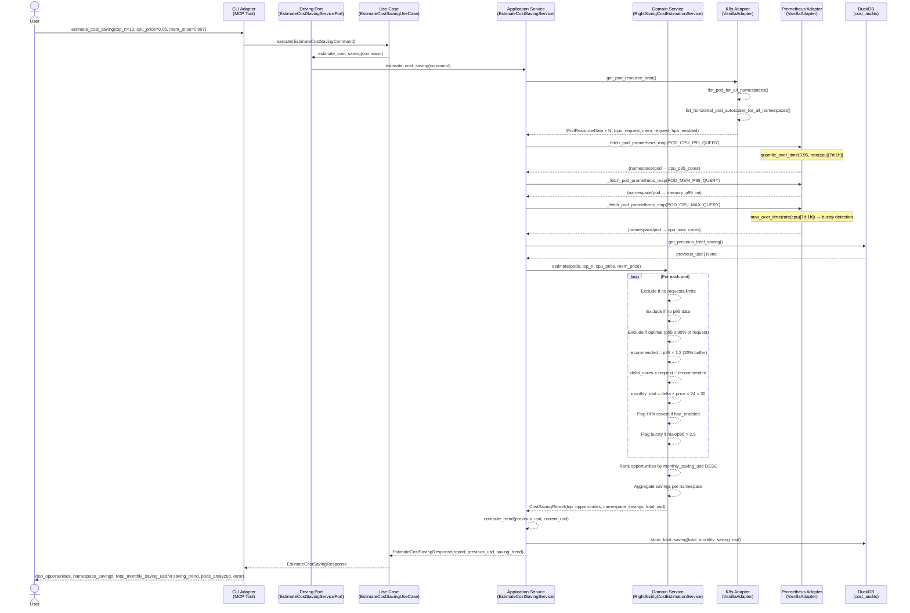

# Use Case 64 — Estimate Cloud Cost Savings from Right-Sizing Over-Provisioned Pods

## Sample Questions

- "What is my estimated cloud cost saving if I right-size all over-provisioned pods to match their actual usage?"
- "Which pods waste the most CPU and memory, and how much could I save per month?"
- "Give me the top 10 cost-saving opportunities by right-sizing with $0.05/core/hour pricing."
- "How much money am I wasting in the production namespace from over-provisioned pods?"
- "Has my cluster waste grown since last month?"

---

## Sequence Diagram



---

## Hexagonal Architecture Layers

| Layer | Component | Responsibility |
|---|---|---|
| **CLI Adapter (Primary)** | `mcp/tools/estimate_cost_saving.py` | Receives MCP call, builds adapter, formats response |
| **Driving Port** | `EstimateCostSavingServicePort` | Abstract contract for the use case entry point |
| **Use Case** | `EstimateCostSavingUseCase` | Thin shell — delegates to service port |
| **Application Service** | `EstimateCostSavingService` | Orchestrates driven ports + domain service |
| **Domain Service** | `RightSizingCostEstimationService` | Pure right-sizing logic, no I/O |
| **Driven Port** | `CostSavingEstimationPort` | Contract for K8s + Prometheus + DuckDB |
| **Secondary Adapter** | `VanillaAdapter` | Implements port: K8s API + Prometheus queries + DuckDB history |

---

## Tests

### Unit Test Stubs — Domain Logic

```python
# test_estimate_cost_saving_use_case.py

class TestRightSizingCostEstimationService:

    def test_recommends_p95_plus_20pct_buffer():
        """recommended_cpu = p95 * 1.2 — buffer must always be applied."""
        # pod: cpu_req=4.0, p95=0.4 → recommended=0.48 (not 0.4)
        ...

    def test_monthly_saving_formula_delta_times_price_times_720h():
        """monthly_saving = delta_cores * cpu_price * 24 * 30"""
        # delta=3.52, price=0.05 → saving=$126.72
        # Common mistake: using 30 days without hours (gives $5.28)
        ...

    def test_10_pods_total_saving_sums_correctly():
        """10 over-provisioned pods → total_saving = Σ individual savings"""
        ...

    def test_optimal_pod_excluded():
        """Pod with p95/request ≥ 0.9 for all resources → excluded from report"""
        # p95_cpu=0.92*req AND p95_mem=0.98*req → excluded
        ...

    def test_no_requests_pod_excluded():
        """Pod with no CPU and no memory request → excluded (can't compute delta)"""
        ...

    def test_no_pricing_configured_no_usd_savings():
        """Without pricing config → monthly_saving_usd=None, delta in cores/GB only"""
        ...

    def test_ranking_descending_by_monthly_saving():
        """Opportunities ranked by monthly_saving_usd DESC — not alphabetical"""
        # saving_A=200, saving_B=50, saving_C=150 → order: A, C, B
        ...

    def test_cloud_pricing_cpu_and_memory():
        """$0.05/core/h and $0.007/GB/h → saving includes both resource deltas"""
        ...

    def test_pod_with_limits_but_no_requests_uses_limit():
        """cpu_request=None, cpu_limit=4.0, p95=0.4 → delta based on limit"""
        ...

    def test_hpa_pod_includes_caveat():
        """hpa_enabled=True → caveat warns about HPA min_replicas adjustment"""
        ...

    def test_bursty_pod_includes_caveat():
        """max/p95 > 2.5 → is_bursty=True, caveat warns about OOM risk"""
        ...

    def test_top_n_limits_opportunities():
        """top_n=10 → at most 10 results returned regardless of pod count"""
        ...

    def test_namespace_savings_aggregated():
        """Two pods in ns-a + one in ns-b → ns_map[ns-a].pod_count==2"""
        ...

    def test_no_p95_data_pod_excluded():
        """Pod with cpu_p95=None and memory_p95=None → excluded (no right-size data)"""
        ...

    def test_saving_trend_increasing_flag():
        """previous=$300, current=$485 → saving_trend='increasing' (>10% increase)"""
        ...

    def test_saving_trend_decreasing():
        """previous=$485, current=$200 → saving_trend='decreasing'"""
        ...

    def test_saving_trend_stable():
        """previous=$100, current=$105 → saving_trend='stable' (<10% change)"""
        ...
```

### Checker Edge Cases

| Checker | Test Scenario | Expected |
|---|---|---|
| Buffer non appliqué | p95=0.4, recommended=0.4 (oubli du ×1.2) | FAIL — must be 0.48 |
| Formule mensuelle incorrecte | delta=3.5, saving=3.5×0.05×30=$5.25 (oubli ×24h) | FAIL — must be ×720h |
| HPA ignoré | HPA min=2, saving calculé sans caveat | FLAG — caveat doit mentionner HPA |
| Bursty sans caveat | max/p95=7.5, pas de mention OOM | FLAG — caveat requis |
| Ranking incorrect | saving B=$50 présenté avant A=$200 | FAIL — trié DESC |
| Prix non config + dollars inventés | pricing=None, saving=$126 quand même | FAIL — must be None |
| Trend DuckDB non mentionné | $300→$485 (+61%) sans mention | FLAG — tendance significative |
