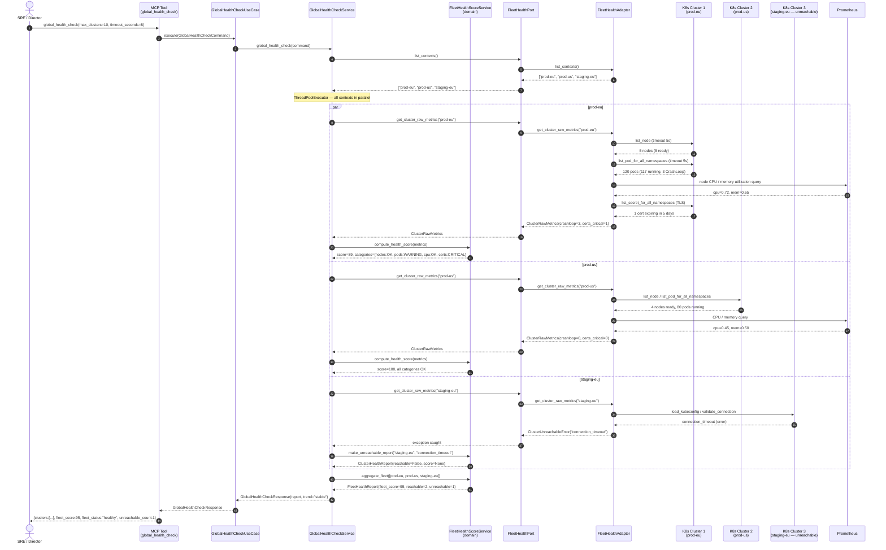

# Use Case 96 — Global Cluster Fleet Health Check

## Sample Questions

- "Give me a global health check of the cluster fleet — what is the overall status right now?"
- "Which cluster is the least healthy in my fleet?"
- "Are all my Kubernetes clusters reachable?"
- "What are the critical issues across all clusters?"
- "Is the fleet health improving or degrading compared to last week?"
- "Show me a breakdown by category — nodes, pods, CPU, certificates — for every cluster."

---

## Sequence Diagram



---

## Architecture Layers

| Layer | Component | Responsibility |
|---|---|---|
| Driving Port | `GlobalHealthCheckCommand` | Input: max_clusters, timeout_seconds, previous_fleet_score |
| Driving Port | `GlobalHealthCheckServicePort` | Abstract entry point |
| Use Case | `GlobalHealthCheckUseCase` | Thin shell — delegates to service |
| Application Service | `GlobalHealthCheckService` | Parallel execution via ThreadPoolExecutor, catch-per-cluster |
| Domain Service | `fleet_health_score_service` | Score formula, category logic, fleet aggregation |
| Domain Model | `ClusterRawMetrics`, `FleetHealthReport` | Pure value objects |
| Driven Port | `FleetHealthPort` | Abstract: list_contexts, get_cluster_raw_metrics |
| Adapter | `FleetHealthAdapter` | Per-context K8s API calls, Prometheus queries, cert parsing |
| MCP Tool | `global_health_check` | JSON serialization for LLM consumption |

---

## Health Score Formula

```python
def compute_health_score(metrics: ClusterRawMetrics) -> int:
    score = 100

    # Nodes
    score -= 20 * metrics.nodes_not_ready

    # Pods
    crash_ratio = metrics.pods_crashloop / max(metrics.pods_total, 1)
    score -= int(crash_ratio * 40)

    # CPU / Memory pressure
    if metrics.cpu_utilization > 0.90:   score -= 15
    elif metrics.cpu_utilization > 0.80: score -= 8

    if metrics.memory_utilization > 0.90:   score -= 15
    elif metrics.memory_utilization > 0.80: score -= 8

    # Certificates
    if metrics.certs_expiring_critical > 0: score -= 10
    elif metrics.certs_expiring_warning > 0: score -= 5

    # Security violations
    score -= min(metrics.security_violations * 3, 15)

    return max(score, 0)
```

---

## Tests

### Unit Test Stubs

```python
# Domain — score formula
def test_healthy_cluster_score_100(): ...
def test_3_crashloop_10_pods_deducts_12pts(): ...   # int(3/10 * 40) = 12
def test_node_not_ready_deducts_20_each(): ...
def test_cpu_over_90_deducts_15(): ...
def test_cert_critical_deducts_10(): ...
def test_security_violations_capped_at_15(): ...
def test_score_floored_at_zero(): ...
def test_empty_cluster_no_penalty(): ...

# Domain — category logic
def test_cpu_unknown_when_prometheus_down(): ...
def test_pod_warning_below_15pct_crashloop(): ...
def test_pod_critical_above_15pct_crashloop(): ...

# Domain — unreachable cluster
def test_unreachable_report_has_no_score(): ...
def test_unreachable_excluded_from_aggregate(): ...

# Domain — fleet aggregation
def test_fleet_score_avg_reachable_only(): ...
def test_all_unreachable_fleet_score_none(): ...
def test_worst_status_propagates_to_fleet(): ...

# Application service
def test_parallel_execution_returns_all_clusters(): ...
def test_max_clusters_limits_contexts(): ...
def test_trend_improving_when_score_rises(): ...
def test_trend_degrading_when_score_falls(): ...
```

### Checker Edge Cases

| Scenario | Expected behavior | Failure mode |
|---|---|---|
| 3 crashloop / 10 pods — score deduction | `int(3/10 * 40) = 12` pts deducted | LLM says "20 pts" → FAIL |
| Cluster unreachable | `unreachable_reason`, score=None | LLM reports score=0 → FAIL |
| Aggregate score includes unreachable | Only reachable in average | LLM divides by 3 instead of 2 → FAIL |
| Prometheus down → UNKNOWN | cpu/memory → `UNKNOWN`, not `OK` | LLM says "CPU OK" → FAIL |
| DuckDB trend — score was 85, now 72 | `fleet_score_trend = "degrading"` | LLM omits trend → FLAG |
| All clusters unreachable | `fleet_score = None`, status = `no_cluster_reachable` | LLM says fleet_score=0 → FAIL |
